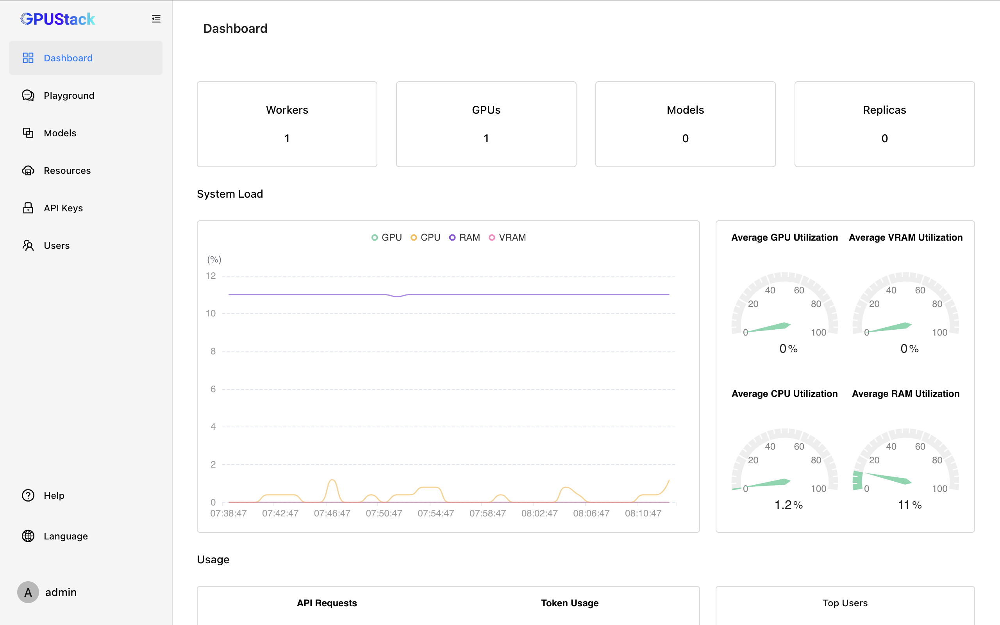
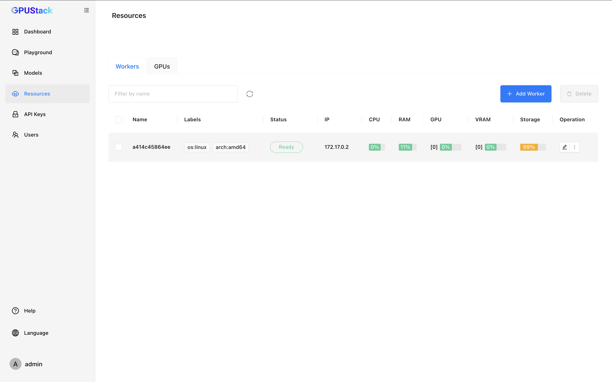
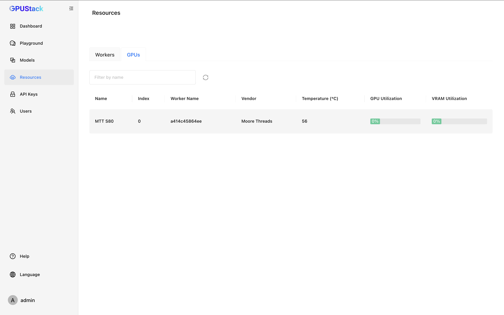

# Running Inference With Moore Threads GPUs

GPUStack supports running inference on Moore Threads GPUs. This tutorial provides a comprehensive guide to configuring your system for optimal performance.

## System and Hardware Support

| OS    | Architecture | Status  | Verified           |
| ----- | ------------ |-------- | ------------------ |
| Linux | x86_64       | Support | Ubuntu 20.04/22.04 |

| Device    | Status  | Verified |
| --------- | ------- | -------- |
| MTT S80   | Support | Yes      |
| MTT S3000 | Support | Yes      |
| MTT S4000 | Support | Yes      |

## Prerequisites

> The following instructions are applicable for `Ubuntu 20.04/22.04` systems with `x86_64` architecture.

### Configure the Container Runtime

Follow these links to install and configure the container runtime:

- Install Docker: [Docker Installation Guide](https://docs.docker.com/desktop/install/linux/)
- Install the latest drivers for MTT S80/S3000/S4000 (currently rc3.1.1): [MUSA SDK Download](https://developer.mthreads.com/sdk/download/musa)
- Install the MT Container Toolkits (currently v1.9.0): [MT CloudNative Toolkits Download](https://developer.mthreads.com/sdk/download/CloudNative)

### Verify Container Runtime Configuration

Ensure the output shows the default runtime as `mthreads`.

```bash
$ (cd /usr/bin/musa && sudo ./docker setup $PWD)
$ docker info | grep mthreads
 Runtimes: mthreads mthreads-experimental runc
 Default Runtime: mthreads
```

## Installing GPUStack

To set up an isolated environment for GPUStack, we recommend using Docker.

```bash
docker run -d --name gpustack-musa -p 9009:80 --ipc=host -v gpustack-data:/var/lib/gpustack \
    gpustack/gpustack:main-musa
```

This command will:

- Start a container with the GPUStack image.
- Expose the GPUStack web interface on port `9009`.
- Mount the `gpustack-data` volume to store the GPUStack data.

To check the logs of the running container, use the following command:

```bash
docker logs -f gpustack-musa
```

If the following message appears, the GPUStack container is running successfully:

```bash
2024-11-15T23:37:46+00:00 - gpustack.server.server - INFO - Serving on 0.0.0.0:80.
2024-11-15T23:37:46+00:00 - gpustack.worker.worker - INFO - Starting GPUStack worker.
```

Once the container is running, access the GPUStack web interface by navigating to `http://localhost:9009` in your browser.

After the initial setup for GPUStack, you should see the following screen:

### Dashboard



### Workers



### GPUs



## Running Inference

After installation, you can deploy models and run inference. Refer to the [model management](../user-guide/model-management.md) for detailed usage instructions.

Moore Threads GPUs support inference through the llama-box ([llama.cpp](https://github.com/ggerganov/llama.cpp)) backend. Most recent models are supported (e.g., llama3.2:1b, llama3.2-vision:11b, qwen2.5:7b, etc.).

Use `mthreads-gmi` to verify if the model is offloaded to the GPU.

```bash
root@a414c45864ee:/# mthreads-gmi
Sat Nov 16 12:00:16 2024
---------------------------------------------------------------
    mthreads-gmi:1.14.0          Driver Version:2.7.0
---------------------------------------------------------------
ID   Name           |PCIe                |%GPU  Mem
     Device Type    |Pcie Lane Width     |Temp  MPC Capable
                                         |      ECC Mode
+-------------------------------------------------------------+
0    MTT S80        |00000000:01:00.0    |98%   1339MiB(16384MiB)
     Physical       |16x(16x)            |56C   YES
                                         |      N/A
---------------------------------------------------------------

---------------------------------------------------------------
Processes:
ID   PID       Process name                         GPU Memory
                                                         Usage
+-------------------------------------------------------------+
0    120       ...ird_party/bin/llama-box/llama-box       2MiB
0    2022      ...ird_party/bin/llama-box/llama-box    1333MiB
---------------------------------------------------------------
```
