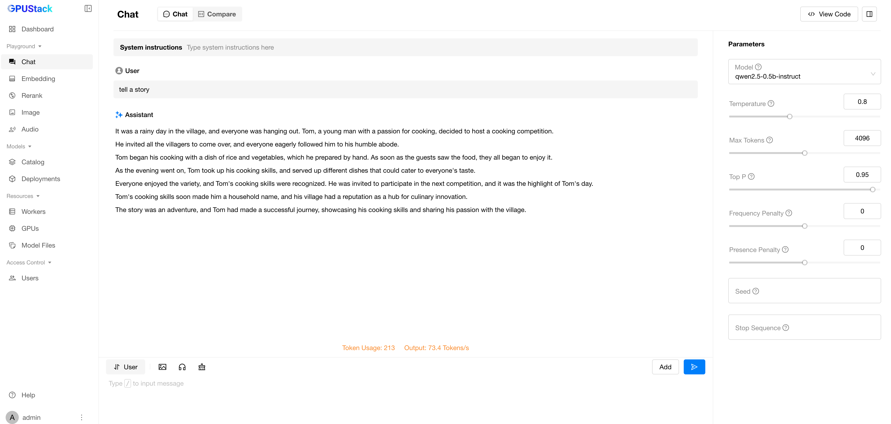

# Running Inference on Copilot+ PCs with Snapdragon X

GPUStack supports running on ARM64 Windows, enabling use on Snapdragon X-based Copilot+ PCs.

!!! note

    Only CPU-based inference is supported on Snapdragon X devices. GPUStack does not currently support GPU or NPU acceleration on this platform.

## Prerequisites

- A Copilot+ PC with Snapdragon X. In this tutorial, we use the Dell XPS 13 9345.
- Install **AMD64** Python (version 3.10 to 3.12). [See details](../installation/installation-requirements.md#supported-architectures)

## Installing GPUStack

Run PowerShell as administrator (avoid using PowerShell ISE), then run the following command to install GPUStack:

```powershell

Invoke-Expression (Invoke-WebRequest -Uri "https://get.gpustack.ai" -UseBasicParsing).Content

```

After installation, follow the on-screen instructions to obtain credentials and log in to the GPUStack UI.

## Deploying a Model

1. Navigate to the `Models` page in the GPUStack UI.
2. Click on the `Deploy Model` button and select `Ollama Library` from the dropdown.
3. Enter `llama3.2` in the `Name` field.
4. Select `llama3.2` from the `Ollama Model` dropdown.
5. Click `Save` to deploy the model.

Once deployed, you can monitor the model's status on the `Models` page.


## Running Inference

Navigate to the `Playground` page in the GPUStack UI, where you can interact with the deployed model.


