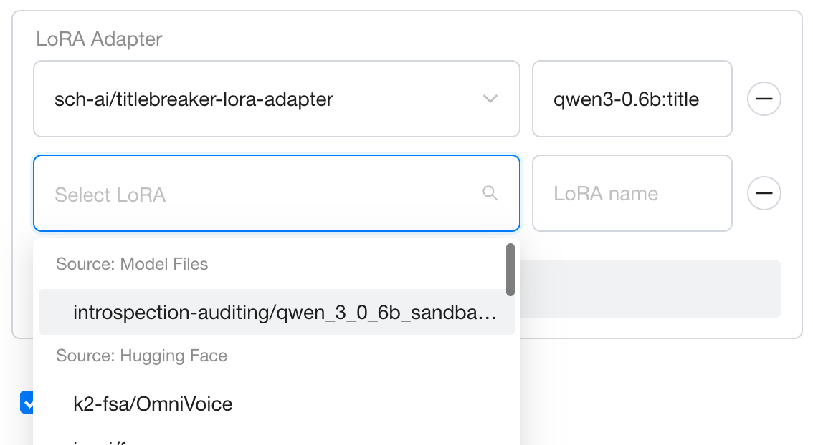
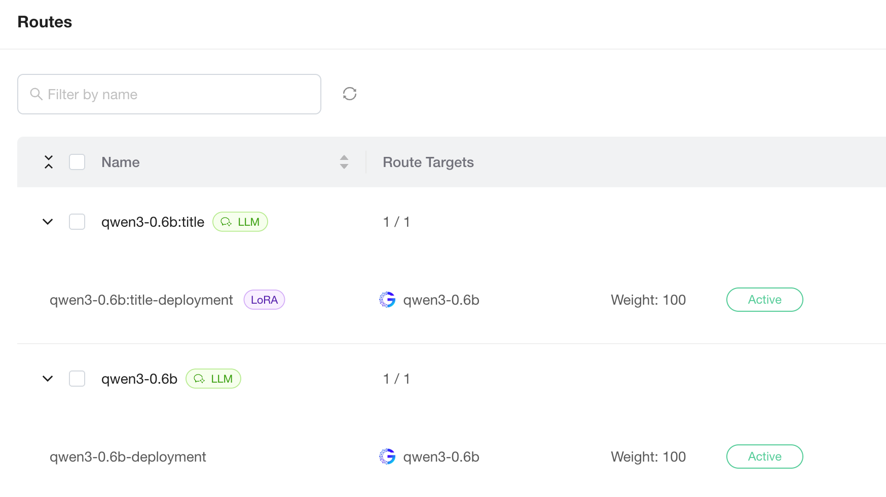
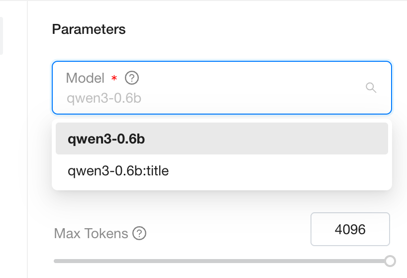

# Serving Models with LoRA Adapters

LoRA (Low-Rank Adaptation) is a parameter-efficient fine-tuning method that adapts a base model to a specific domain by loading small adapter files instead of retraining the full weights.

GPUStack lets you mount multiple LoRA adapters on a deployed base LLM and automatically creates one Model Route per adapter; callers switch adapters per request by setting the OpenAI-compatible `model` field to the corresponding route name, without dedicating a separate GPU to each fine-tune.

This tutorial shows how to attach multiple LoRA adapters to a single base model on the vLLM, SGLang, or Ascend MindIE backend, and how to invoke a specific adapter through the OpenAI-compatible API.

!!! note

    LoRA is currently supported only on the `vLLM`, `SGLang`, and `Ascend MindIE` backends. The `lora_list` configuration is ignored on other backends.

## Prerequisites

Before proceeding, ensure the following:

- GPUStack is installed and running.
- A Linux worker node with a GPU is available. This tutorial uses `Qwen/Qwen3-0.6B` as the base model and `sch-ai/titlebreaker-lora-adapter` from Hugging Face as the LoRA adapter.

## Step 1: Deploy the Base Model with LoRA Adapters

1. Navigate to the `Deployments` page and click `Deploy Model`.
2. Choose the base model source (`Hugging Face` / `ModelScope` / `Local Path`), fill in the repository ID or local path, and select `vLLM`, `SGLang`, or `Ascend MindIE` as the backend.
3. Expand the `Advanced` section, locate `LoRA Adapter`, and add adapters one by one:

   - Pick an adapter from the dropdown. The list supports search. If your adapter is not shown, first confirm on Hugging Face or ModelScope that the model actually provides one, then paste its repository ID into the search box to select it.
   - `LoRA name`: Must take the form `<base-model-name>:<suffix>`, for example `llama-3-8b:alpaca`. The `<suffix>` distinguishes adapters when invoking the model.
4. Click `Save` to finish the deployment.

## Step 2: Invoke a LoRA Adapter

After deployment, GPUStack automatically creates a Model Route for each LoRA adapter, named exactly after the adapter. Each LoRA route appears alongside the base model's own Model Route on the `Model Routes` page and is tagged with a `LoRA` badge for easy identification.

When you pick a model in `Playground`, the dropdown lists both the base model and every LoRA adapter; switching the option routes the request to the corresponding adapter. The same applies through the OpenAI-compatible API — set the `model` field to either the base model name or the adapter name. Under the hood, all adapters share the same GPU instance, so switching between them is far cheaper than swapping models.

## Step 3: Manage LoRA Adapters

You can adjust the LoRA configuration after the deployment is created:

- **Add an adapter**: Edit the deployed model and save. Instances already in the `Running` state must be restarted before the newly added adapter is mounted and served.
- **Remove an adapter**: Delete the corresponding entry from the deployed model. GPUStack automatically removes the matching Model Route once no `Running` instance is still using the adapter.
- **Name conflicts**: If two different base models add adapters whose names resolve to the same Model Route, submission is rejected with a conflict error. Rename one of the adapters to recover.

## Backend Compatibility & Limits

LoRA support varies across inference backends:

| Backend | LoRA startup arguments / configuration | Key limits |
| --- | --- | --- |
| `vLLM` | `--enable-lora`, `--max-loras`, `--lora-modules` | `--max-loras` is set automatically from the `lora_list` length. The adapter count is fixed once the base model starts; changes require an instance restart. |
| `SGLang` | `--enable-lora`, `--lora-paths name=path`, `--max-loras-per-batch` | The number of LoRAs activated simultaneously in one batch is limited by `--max-loras-per-batch`. |
| `Ascend MindIE` | `maxLoras` / `maxLoraRank` / `LoraModules` in the config file | `maxLoraRank` defaults to 64; adapters with a higher rank fail to start. `maxLoras=0` automatically equals the mounted adapter count. |

GPUStack injects these parameters automatically; you usually do not need to repeat them under `Backend Parameters`. Only override defaults (for example, raising `maxLoraRank`) by adding the flag under `Advanced` → `Backend Parameters`.

For full details and limits, see each backend's official documentation:

- vLLM: [LoRA Adapters](https://docs.vllm.ai/en/stable/features/lora/)
- SGLang: [LoRA Serving](https://docs.sglang.ai/backend/lora.html)
- Ascend MindIE: [Multi-LoRA (Chinese only)](https://www.hiascend.com/document/detail/zh/mindie/300/mindiellm/llmdev/user_guide/feature/multi_lora.md)
