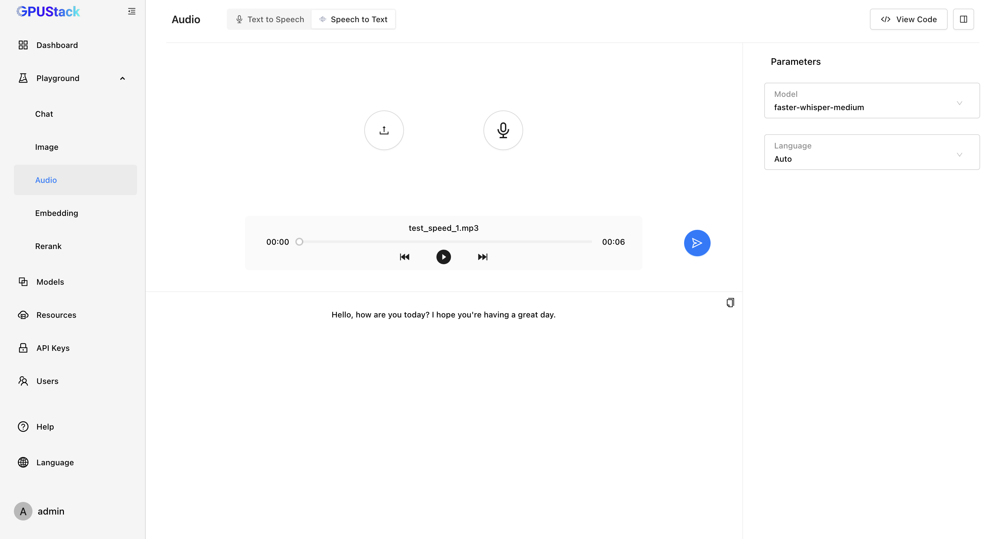

# Using Audio Models

GPUStack supports running both speech-to-text and text-to-speech models. Speech-to-text models convert audio inputs in various languages into written text, while text-to-speech models transform written text into natural and expressive speech.

In this tutorial, we will walk you through deploying and using speech-to-text and text-to-speech models in GPUStack.

## Prerequisites

Before you begin, ensure that you have the following:

- A Linux system with AMD architecture or macOS.
- Access to Hugging Face for downloading the model files.
- GPUStack is installed and running. If not, refer to the [Quickstart Guide](../quickstart.md).

## Running Speech-to-Text Model

### Step 1: Deploy Speech-to-Text Model

Follow these steps to deploy the model from Hugging Face:

1. Navigate to the `Models` page in the GPUStack UI.
2. Click the `Deploy Model` button.
3. In the dropdown, select `Hugging Face` as the source for your model.
4. Use the search bar in the top left to search for the model name `Systran/faster-whisper-medium`.
5. Leave everything as default and click the `Save` button to deploy the model.

After deployment, you can monitor the model's status on the `Models` page.

### Step 2: Interact with Speech-to-Text Model Models

1. Navigate to the `Playground` > `Audio` page in the GPUStack UI.
2. Select the `Speech to Text` Tab.
3. Select the deployed model from the top-right dropdown.
4. Click the `Upload` button to upload audio file or click the `Microphone` button to record audio.
5. Click the `Generate Text Content` button to generate the text.

## Running Text-to-Speech Model

### Step 1: Deploy Text-to-Speech Model

Follow these steps to deploy the model from Hugging Face:

1. Navigate to the `Models` page in the GPUStack UI.
2. Click the `Deploy Model` button.
3. In the dropdown, select `Hugging Face` as the source for your model.
4. Use the search bar in the top left to search for the model name `FunAudioLLM/CosyVoice-300M`.
5. Leave everything as default and click the `Save` button to deploy the model.

After deployment, you can monitor the model's status on the `Models` page.

### Step 2: Interact with Text to Speech Model Models

1. Navigate to the `Playground` > `Audio` page in the GPUStack UI.
2. Select the `Text to Speech` Tab.
3. Choose the deployed model from the dropdown menu in the top-right corner. Then, configure the voice and output audio format.
4. Input the text to generate.
5. Click the `Submit` button to generate the text.

