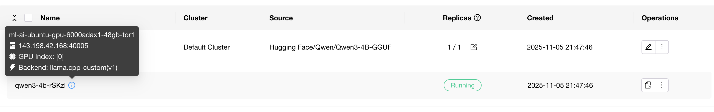
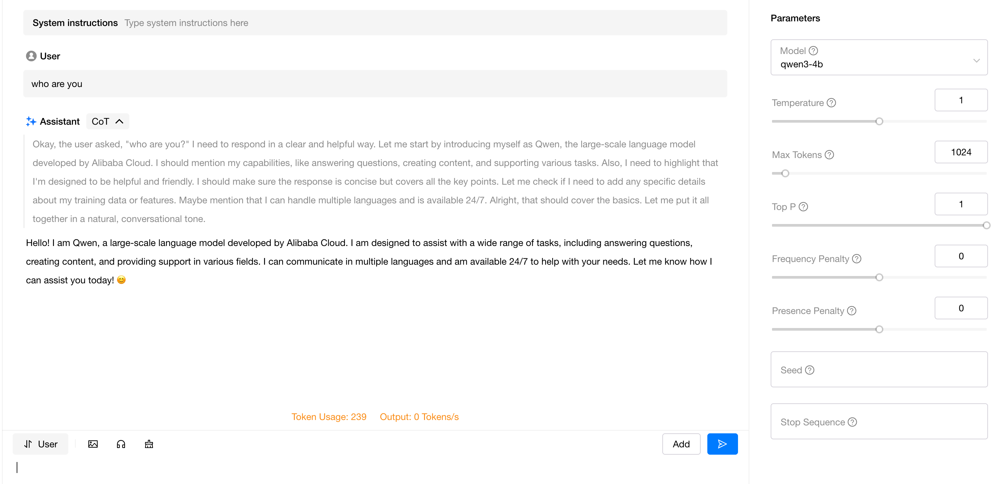
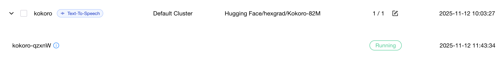
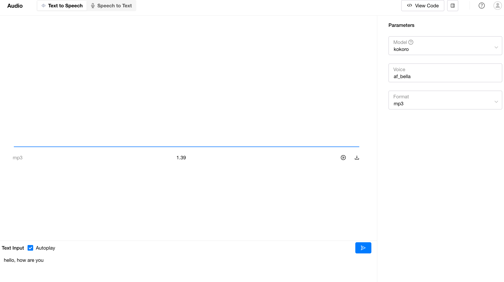

# Using Custom Inference Backend

This article demonstrates how to add a custom inference backend that is not built into GPUStack, using TensorRT-LLM as an example. Configuration methods for common inference backends are also provided at the end of the article.
For a description of each parameter, see the [User Guide](../user-guide/inference-backend-management.md).

## Core Steps
1. Prepare the Docker image for the required inference backend.
2. Understand the image's ENTRYPOINT or CMD to determine the inference backend startup command.
3. Add configuration in the Inference Backend page.
4. Deploy models in the Deployment page and select the newly added inference backend.

## Example
The following uses TensorRT-LLM as an example to illustrate how to add and use an inference backend.
> The following examples do not represent the optimal performance configuration and are for functional demonstration only. For better inference performance, please refer to the official documentation of each inference backend for tuning, or use GPUStack's Catalog.

1. Find the required image from the [release page](https://catalog.ngc.nvidia.com/orgs/nvidia/teams/tensorrt-llm/containers/release) mentioned in TensorRT-LLM documentation.
2. TensorRT-LLM images must launch the inference service using `trtllm-serve`; otherwise, it will start a regular bash session. The run_command supports {{model_path}} and {{port}} templates, which are automatically replaced with the actual model path and port number after scheduling.
3. Add configuration in Inference Backend page, supporting YAML import. Example:
```yaml
backend_name: TensorRT-LLM
default_version: 1.2.0rc0
version_configs:
  1.2.0rc0:
    image_name: nvcr.io/nvidia/tensorrt-llm/release:1.2.0rc0
    run_command: 'trtllm-serve {{model_path}} --host 0.0.0.0 --port {{port}}'
    custom_framework: cuda
```
!!! note

    You may see some inference backends labeled as Built-in (such as vLLM, MindIE) in the Inference Backend page. These are GPUStack's built-in inference backends. When using built-in backends, appropriate container images matching the worker environment are automatically obtained based on the runtime.
    You can also add custom versions to these Built-in inference backends and specify the image names you need.

4. In Deployment page, select the newly added inference backend and deploy the model.


**Result**

After the inference backend service starts, you can see the model_instance status becomes RUNNING.

You can engage in conversations in the Playground.


## Typical Examples

### Deploy GGUF Models with llama.cpp
1. Find the image name in the [documentation](https://github.com/ggml-org/llama.cpp/blob/master/docs/docker.md): `ghcr.io/ggml-org/llama.cpp:server` (ensure you select the variant that matches your worker platform).
2. Add the following backend configuration on the Inference Backend page:
    ```yaml
    backend_name: llama.cpp-custom
    default_run_command: '-m {{model_path}} --host 0.0.0.0 --port {{port}}'
    version_configs:
      v1-custom:
        image_name: ghcr.io/ggml-org/llama.cpp:server
        custom_framework: cpu
    default_version: v1-custom
    ```
3. On the Deployment page, locate a GGUF-format model, select `llama.cpp`, and deploy.

For more information, refer to the llama.cpp [GitHub repository](https://github.com/ggml-org/llama.cpp).

Screenshots:



### Fast Deploy GGUF Models with llama.cpp for all AMD GPU

1. Add the following backend configuration on the Inference Backend page:
    ```yaml
    backend_name: llama.cpp-custom
    default_run_command: '-m {{model_path}} --host 0.0.0.0 --port {{port}}'
    version_configs:
      v1-custom:
        image_name: docker.io/rocm/llama.cpp:llama.cpp-b6652.amd0_rocm7.0.0_ubuntu24.04_full
        custom_framework: rocm
    default_version: v1-custom
    ```
   old gpu use docker.io/rocm/llama.cpp:llama.cpp-b6356_rocm6.4.3_ubuntu22.04_full
2. On the Deployment page, locate a GGUF-format model, select `llama.cpp`, and deploy.
3. More install use [rocm.docs.amd.com]([https://github.com/ggml-org/llama.cpp](https://rocm.docs.amd.com/projects/install-on-linux/en/latest/install/3rd-party/previous-versions/llama-cpp-install-v25.9.html#build-llama-cpp-docker-image)). 

   

### Use Kokoro-FastAPI
1. Find the image name in the [documentation](https://github.com/remsky/Kokoro-FastAPI?tab=readme-ov-file#get-started), and choose the variant that matches your worker platform:
   - `ghcr.io/remsky/kokoro-fastapi-cpu:latest`
   - `ghcr.io/remsky/kokoro-fastapi-gpu:latest`

!!! warning

    This image includes a built-in model, so the model you select on the Deployment page may be ignored. To avoid unexpected errors, choose a model consistent with the one bundled in the image.
    The kokoro-fastapi image uses the [Kokoro-82M](https://huggingface.co/hexgrad/Kokoro-82M) model.

2. Add the following backend configuration on the Inference Backend page:
   ```yaml
   backend_name: kokoro-custom
   version_configs:
     v1:
       image_name: ghcr.io/remsky/kokoro-fastapi-gpu:latest
       custom_framework: cuda
   default_run_command: python -m uvicorn api.src.main:app --host 0.0.0.0 --port {{port}} --log-level debug
   ```
3. On the Deployment page, select the Kokoro-82M model, choose `kokoro` as the backend, and set `Name` to `kokoro`.


!!! warning "Known Limitations for Name"

    In kokoro-fastapi, the `model_name` is restricted to the keys below; other values will result in an "unsupported" error.

    ```
    "models": {
        "tts-1": "kokoro-v1_0",
        "tts-1-hd": "kokoro-v1_0",
        "kokoro": "kokoro-v1_0"
    }
    ```

    Therefore, restrict the `Name` during deployment to one of these supported keys.


Screenshots:



