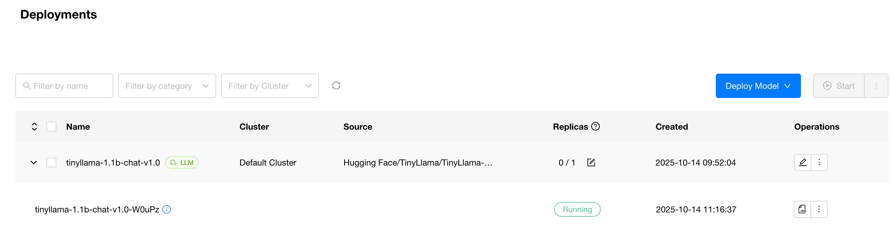
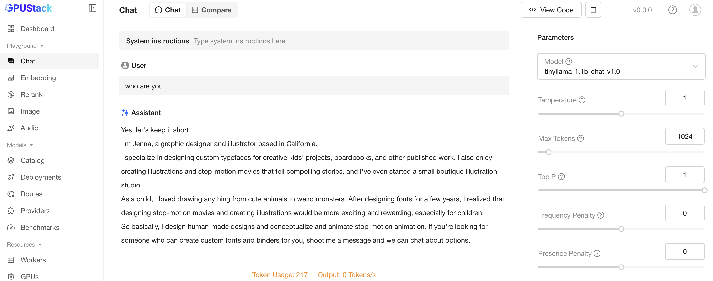

# Using Custom Inference Backends

This guide explains how to add custom inference backends in GPUStack, including using verified community configurations and creating your own from scratch.

For parameter descriptions, see the [User Guide](../user-guide/inference-backend-management.md).

## Backend Types

GPUStack supports three types of inference backends:

- **Built-in**: Pre-configured backends (vLLM, MindIE, VoxBox, SGLang...) maintained by GPUStack, automatically optimized for different hardware.
- **Community**: Pre-verified custom backend configurations. These are essentially CustomBackends labeled "community" to simplify manual setup.
- **Custom**: Backends you configure yourself with custom Docker images and commands.

## Using Community Backends

Community backends provide the fastest way to add popular inference engines.

**Steps:**

1. Navigate to Inference Backend page → Click "Add Backend"
2. Select "Community" option
3. Browse the "Community Backend Marketplace" and enable the backends you need

## Creating Custom Backends

### Core Steps
1. Prepare the Docker image for the required inference backend
2. Understand the image's ENTRYPOINT or CMD to determine the startup command
3. Add configuration on the Inference Backend page
4. Deploy models and select the newly added backend

### Example: TensorRT-LLM
The following uses TensorRT-LLM as an example to illustrate how to add and use an inference backend.
> These examples are functional demonstrations, not performance-optimized configurations. For better performance, consult each backend’s official documentation for tuning.

1. Find the required image from the [release page](https://catalog.ngc.nvidia.com/orgs/nvidia/teams/tensorrt-llm/containers/release) linked from the TensorRT-LLM documentation.
2. TensorRT-LLM images must launch the inference service using `trtllm-serve`; otherwise, they start an interactive shell session. The `run_command` supports placeholders such as `{{model_path}}` and `{{port}}` (and optionally `{{model_name}}`, `{{worker_ip}}`), which are automatically replaced with the actual values when the deployment is scheduled to a worker.
3. Add configuration on the Inference Backend page; YAML import is supported. Example:
```yaml
backend_name: TensorRT-LLM-custom
default_version: 1.2.0rc0
version_configs:
  1.2.0rc0:
    image_name: nvcr.io/nvidia/tensorrt-llm/release:1.2.0rc0
    run_command: 'trtllm-serve {{model_path}} --host 0.0.0.0 --port {{port}}'
    custom_framework: cuda
```

4. On the Deployments page, select the newly added backend and deploy the model.


**Result**

After the inference backend service starts, you can see the model_instance status becomes RUNNING.

You can engage in conversations in the Playground.


## Advanced Configuration

### Using Environment Variables

Environment variables provide flexible configuration without hardcoding values in commands:

```yaml
backend_name: advanced-backend-custom
default_env:
  CACHE_DIR: /models/cache
  LOG_LEVEL: info
version_configs:
  v1:
    image_name: my-backend:v1
    custom_framework: cuda
    run_command: 'serve {{model_path}} --cache {{CACHE_DIR}} --log-level {{LOG_LEVEL}} --port {{port}}'
    env:
      LOG_LEVEL: debug  # Override for this version
```

In this example:
- `CACHE_DIR` and `LOG_LEVEL` are defined at the backend level
- Version `v1` overrides `LOG_LEVEL` to `debug`
- Both variables are referenced in the command using `{{VAR_NAME}}` syntax

### Custom Entrypoint

Override the container's default entrypoint when the image requires custom initialization. You can set entrypoints at both backend and version levels:

```yaml
backend_name: custom-entry-backend-custom
default_entrypoint: /usr/local/bin/default-init
version_configs:
  v1:
    image_name: my-backend:v1
    custom_framework: cuda
    run_command: 'serve {{model_path}} --port {{port}}'
  v2:
    image_name: my-backend:v2
    custom_framework: cuda
    entrypoint: /usr/local/bin/v2-init  # Version-specific entrypoint overrides default
    run_command: 'serve {{model_path}} --port {{port}}'
```
