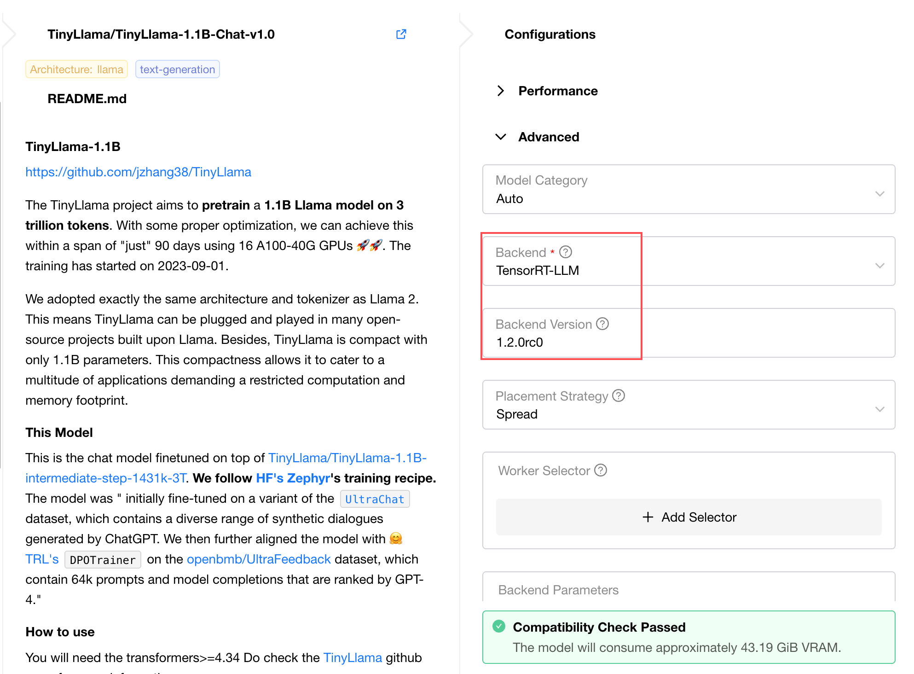
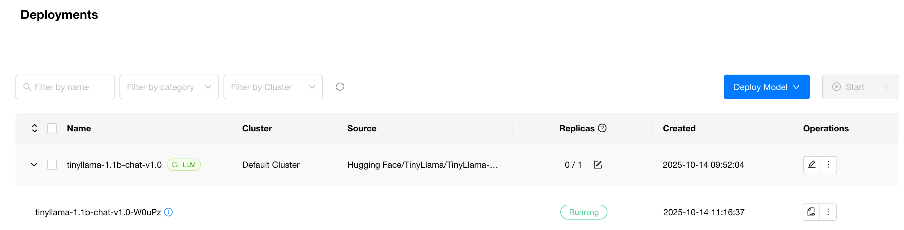
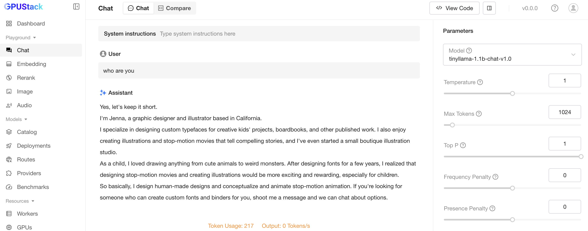

# Using Custom Inference Backends

This guide explains how to add custom inference backends in GPUStack, including using verified community configurations and creating your own from scratch.

For parameter descriptions, see the [User Guide](../user-guide/inference-backend-management.md).

## Backend Types

GPUStack supports three types of inference backends:

- **Built-in**: Pre-configured backends (vLLM, MindIE, VoxBox, SGLang...) maintained by GPUStack, automatically optimized for different hardware.
- **Community**: Pre-verified custom backend configurations. These are essentially CustomBackends labeled "community" to simplify manual setup.
- **Custom**: Backends you configure yourself with custom Docker images and commands.

## Using Community Backends

Community backends provide the fastest way to add popular inference engines.

**Steps:**

1. Navigate to Inference Backend page → Click "Add Backend"
2. Select "Community" option
3. Browse the "Community Backend Marketplace" and enable the backends you need

## Creating Custom Backends

### Core Steps
1. Prepare the Docker image for the required inference backend
2. Understand the image's ENTRYPOINT or CMD to determine the startup command
3. Add configuration on the Inference Backend page
4. Deploy models and select the newly added backend

### Example: TensorRT-LLM
The following uses TensorRT-LLM as an example to illustrate how to add and use an inference backend.
> These examples are functional demonstrations, not performance-optimized configurations. For better performance, consult each backend’s official documentation for tuning.

1. Find the required image from the [release page](https://catalog.ngc.nvidia.com/orgs/nvidia/teams/tensorrt-llm/containers/release) linked from the TensorRT-LLM documentation.
2. TensorRT-LLM images must launch the inference service using `trtllm-serve`; otherwise, they start an interactive shell session. The `run_command` supports placeholders such as `{{model_path}}` and `{{port}}` (and optionally `{{model_name}}`, `{{worker_ip}}`, `{{gpu_count}}`, `{{gpu_ids}}`), which are automatically replaced with the actual values when the deployment is scheduled to a worker. `{{gpu_count}}` and `{{gpu_ids}}` reflect the GPUs assigned on the scheduled worker (custom backends run on a single worker).
3. Add configuration on the Inference Backend page; YAML import is supported. Example:
```yaml
backend_name: TensorRT-LLM-custom
default_version: 1.2.0rc0
version_configs:
  1.2.0rc0:
    image_name: nvcr.io/nvidia/tensorrt-llm/release:1.2.0rc0
    run_command: 'trtllm-serve {{model_path}} --host 0.0.0.0 --port {{port}}'
    custom_framework: cuda
```

4. On the Deployments page, select the newly added backend and deploy the model.


**Result**

After the inference backend service starts, you can see the model_instance status becomes RUNNING.

You can engage in conversations in the Playground.


### Example: TokenSpeed

[TokenSpeed](https://lightseek.org/tokenspeed/) is an OpenAI-compatible inference engine
with hybrid linear-attention support and MTP speculative decoding. It publishes no
official serving image, so build one from the runner image first, then register it as a
custom backend.

1. Build the image. The upstream `lightseekorg/tokenspeed-runner` image is a development
   base: it ships the CUDA/PyTorch toolchain and prebuilt kernel wheels, but not the
   TokenSpeed source. Install the three packages into it and commit the result:

```bash
docker run -itd --gpus all --name tokenspeed lightseekorg/tokenspeed-runner:latest /bin/bash
docker exec -it tokenspeed bash

export PIP_BREAK_SYSTEM_PACKAGES=1
git clone https://github.com/lightseekorg/tokenspeed.git /opt/tokenspeed
cd /opt/tokenspeed
pip install -e "./python" --no-build-isolation
pip install -e tokenspeed-kernel/python/ --no-build-isolation          # Blackwell (sm_100a/sm_103a)
# On Hopper, build for sm_90a instead:
# TOKENSPEED_CUDA_ARCH=90a pip install -e tokenspeed-kernel/python/ --no-build-isolation
pip install -e tokenspeed-scheduler/
chmod -R a+rX /opt/tokenspeed
```

   Two things matter for GPUStack specifically:

   - **Build for the right GPU architecture.** `tokenspeed-kernel` does not detect the
     local GPU. Its default architecture list is `("100a", "103a")`, so a plain
     `pip install` produces a **Blackwell-only** build — correct for B200/B300, but on
     Hopper every locally compiled kernel then fails at runtime with
     `no kernel image is available for execution on the device`. Hopper builds must set
     `TOKENSPEED_CUDA_ARCH=90a`. Keep one image per architecture and encode the
     architecture in the tag.
   - **Keep the install readable by non-root users.** GPUStack may run the container as a
     non-root UID. An editable install under `/root` is unreachable (`/root` is mode
     `700`), which surfaces as
     `PermissionError: /root/tokenspeed/python/tokenspeed/__init__.py`. Install under
     `/opt` as shown above, and point `HOME` at a writable directory so libraries that
     write to `~/.cache` (flashinfer, Triton) do not fail on import.

2. Add the configuration on the Inference Backend page. YAML import is supported:

```yaml
backend_name: tokenspeed-custom
description: TokenSpeed custom backend
default_version: 0.1.3-sm90
health_check_path: /v1/models
default_backend_param:
parameter_format: space
common_parameters:
  - --gpu-memory-utilization
  - --max-model-len
default_run_command: "{{model_path}} --port {{port}} --host {{worker_ip}} --served-model-name {{model_name}}"
default_env:
  HOME: /opt/ts-home
  FLASHINFER_CACHE_DIR: /opt/ts-cache/flashinfer
  TRITON_CACHE_DIR: /opt/ts-cache/triton
version_configs:
  0.1.3-sm90:
    image_name: swr.cn-north-4.myhuaweicloud.com/yiminghub/tokenspeed:0.1.3-sm90-cu130-20260815
    entrypoint: "tokenspeed serve"
    run_command: "{{model_path}} --port {{port}} --host {{worker_ip}} --served-model-name {{model_name}} --world-size {{gpu_count}} --attention-backend fa3 --drafter-attention-backend fa3 --chunked-prefill-size 8192 --max-num-seqs 128 --disable-kvstore"
    custom_framework: cuda
    env:
  0.1.3-sm100:
    image_name: swr.cn-north-4.myhuaweicloud.com/yiminghub/tokenspeed:0.1.3-cu130-20260815-fix
    entrypoint: "tokenspeed serve"
    run_command: "{{model_path}} --port {{port}} --host {{worker_ip}} --served-model-name {{model_name}} --world-size {{gpu_count}} --attention-backend trtllm --moe-backend flashinfer_trtllm --chunked-prefill-size 8192 --max-num-seqs 128 --disable-kvstore"
    custom_framework: cuda
    env:
```

   Because the executable is supplied through `entrypoint`, `run_command` must contain
   arguments only — do not repeat `tokenspeed serve` there.

   The two versions differ only in kernel backends. TokenSpeed's `trtllm` attention
   backend uses TensorRT-LLM's trtllm-gen kernels, which are Blackwell-only and abort
   with `TllmGenFmhaRunner: Unsupported architecture` on Hopper. Use `fa3` on Hopper
   (`0.1.3-sm90`) and `trtllm` on Blackwell (`0.1.3-sm100`). `--drafter-attention-backend`
   defaults to the main attention backend, so set it explicitly whenever speculative
   decoding is enabled.

3. On the Deployments page, select the newly added backend and choose the version matching
   the worker's GPU architecture. Add model-specific flags such as `--max-model-len`,
   `--kv-cache-dtype`, `--reasoning-parser`, and the `--speculative-*` group in the
   deployment's backend parameters rather than in `run_command`, so one backend version
   can serve several models.

!!! note
    TokenSpeed captures CUDA graphs for both decode batch sizes and prefill buckets at
    startup, which takes a few minutes on the first launch of a large model. Allow enough
    startup time before treating a deployment as failed. The engine is ready once the log
    prints `TokenSpeed gRPC health status -> SERVING`.

This configuration has been verified serving Qwen3.8-27B-FP8 on both an H20-3e
(141 GB, sm_90) node and a B300 node.


## Advanced Configuration

### Using Environment Variables

Environment variables provide flexible configuration without hardcoding values in commands:

```yaml
backend_name: advanced-backend-custom
default_env:
  CACHE_DIR: /models/cache
  LOG_LEVEL: info
version_configs:
  v1:
    image_name: my-backend:v1
    custom_framework: cuda
    run_command: 'serve {{model_path}} --cache {{CACHE_DIR}} --log-level {{LOG_LEVEL}} --port {{port}}'
    env:
      LOG_LEVEL: debug  # Override for this version
```

In this example:
- `CACHE_DIR` and `LOG_LEVEL` are defined at the backend level
- Version `v1` overrides `LOG_LEVEL` to `debug`
- Both variables are referenced in the command using `{{VAR_NAME}}` syntax

### Custom Entrypoint

Override the container's default entrypoint when the image requires custom initialization. You can set entrypoints at both backend and version levels:

```yaml
backend_name: custom-entry-backend-custom
default_entrypoint: /usr/local/bin/default-init
version_configs:
  v1:
    image_name: my-backend:v1
    custom_framework: cuda
    run_command: 'serve {{model_path}} --port {{port}}'
  v2:
    image_name: my-backend:v2
    custom_framework: cuda
    entrypoint: /usr/local/bin/v2-init  # Version-specific entrypoint overrides default
    run_command: 'serve {{model_path}} --port {{port}}'
```
