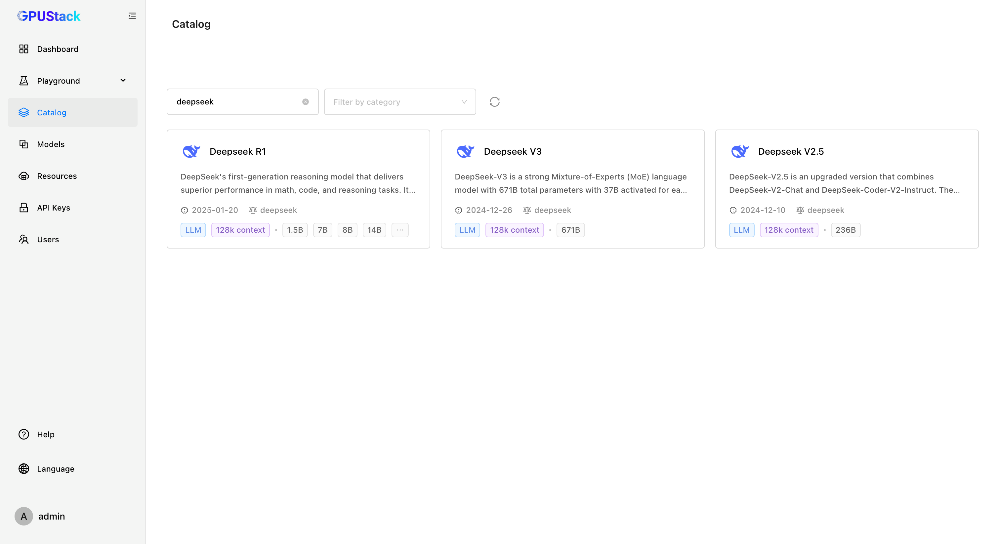
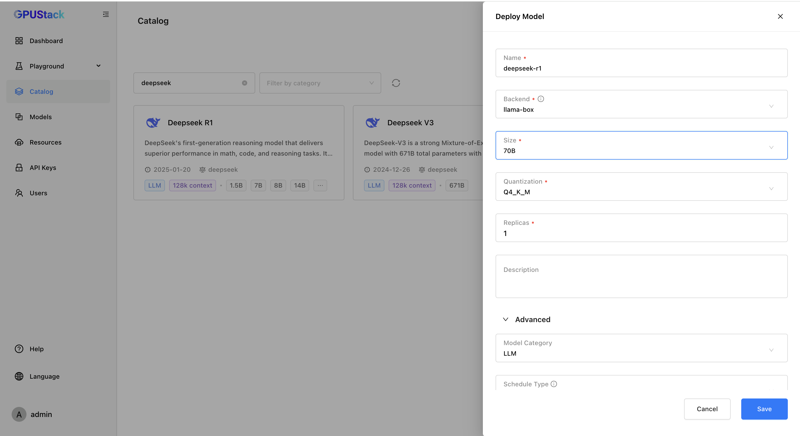
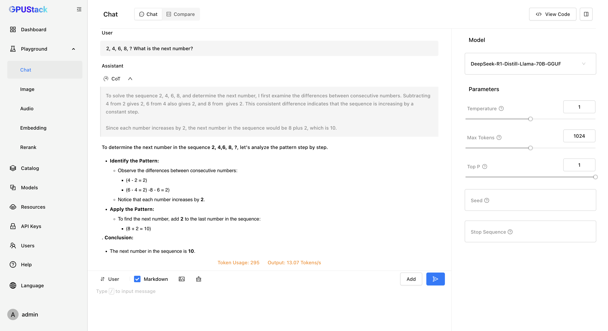

# Deploying and Using DeepSeek R1 in GPUStack

GPUStack supports deploying and running powerful DeepSeek models.

In this tutorial, we will guide you through deploying and using DeepSeek R1 in GPUStack.

## Prerequisites

Before you begin, ensure that you have the following:

- One or more GPUs with sufficient VRAM.
- Access to Hugging Face or ModelScope for downloading the model files.
- GPUStack installed and running. If not, refer to the [Quickstart Guide](../quickstart.md).

## Step 1: Deploy the DeepSeek R1

Follow these steps to deploy the model from Catalog:

1. Navigate to the `Models` page in the GPUStack UI.
2. Click the `Deploy Model` button.
3. In the dropdown, select `Catalog` as the source for your model.
4. In the catalog list page, use the search bar in the top left to search for the model keyword `DeepSeek`.
5. Review the model description, maximum context length and supported sizes.



6. Select the `Deepseek R1`, configure the model deployment details and click the `Save` button to deploy the model.



After deployment, you can monitor the model's status on the `Models` page and wait for it to start running.

## Step 2: Use the DeepSeek R1 for Text Generation

1. Navigate to the `Playground` > `Text` page in the GPUStack UI.
2. Verify that the deployed model is selected from the top-right `Model` dropdown.
3. Provide a prompt for the text generation. For example:

```
2, 4, 6, 8, > What is the next number?
```

4. Adjust the `Parameters` on the right based on your needs.
5. Check the `Markdown` option to view a well-formatted result.
6. Click the `Submit` button to generate the text.

The generated chain of thought and result will be displayed in the UI.



By following these steps, you can leverage DeepSeek R1 for AI-powered text generation and natural language tasks in GPUStack. Experiment with different prompts and settings to explore the full capabilities of DeepSeek!
