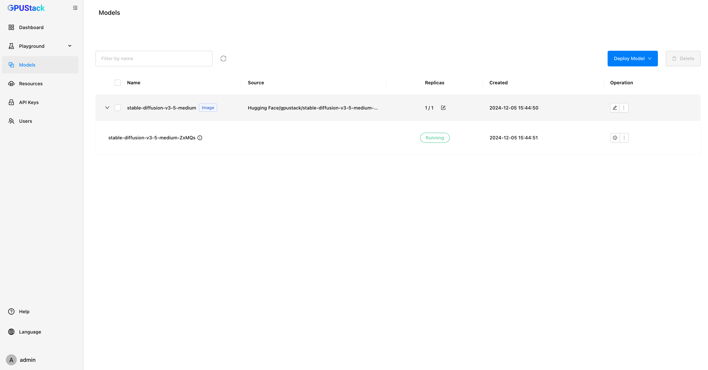
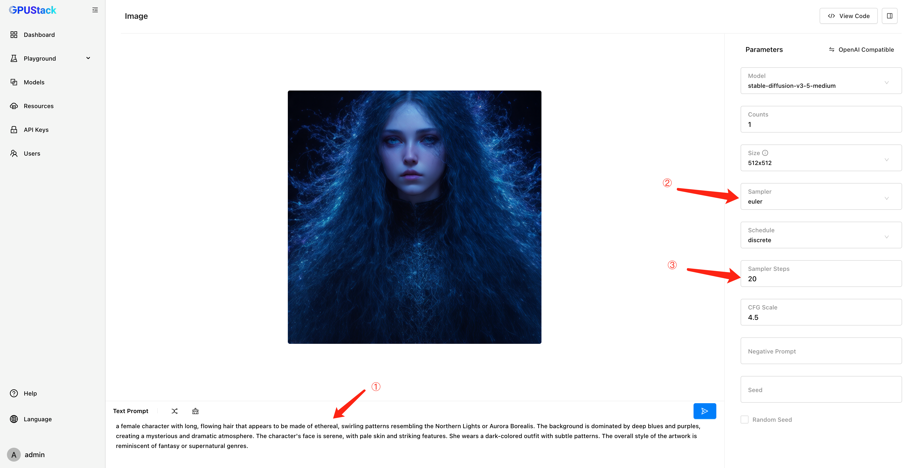
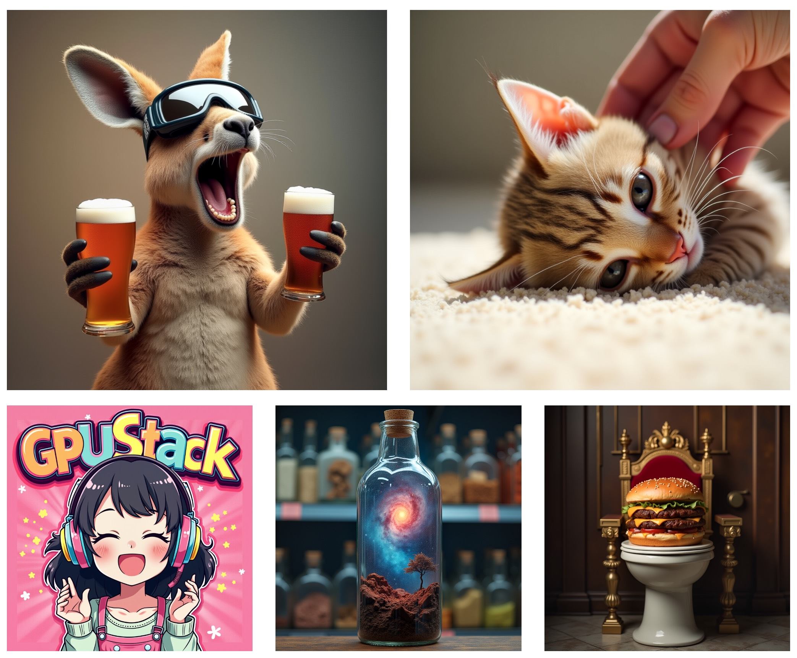
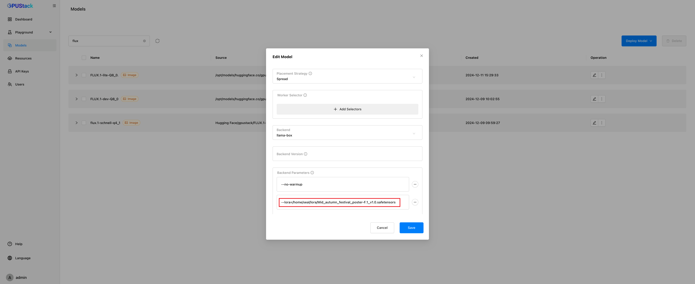
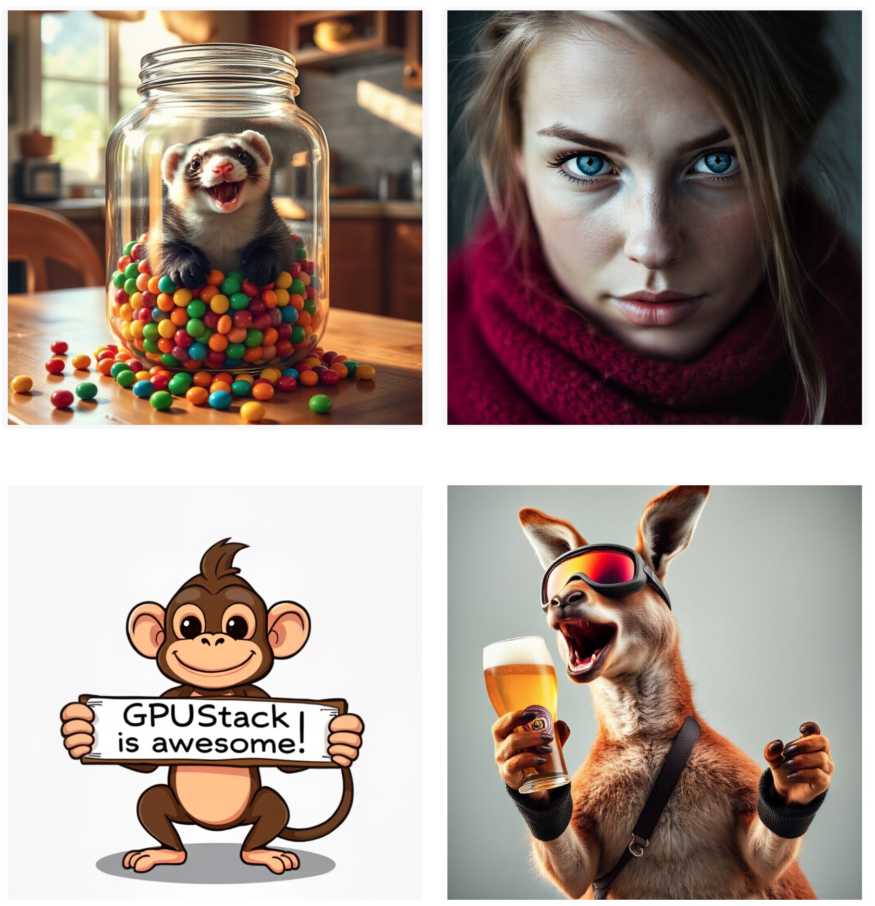
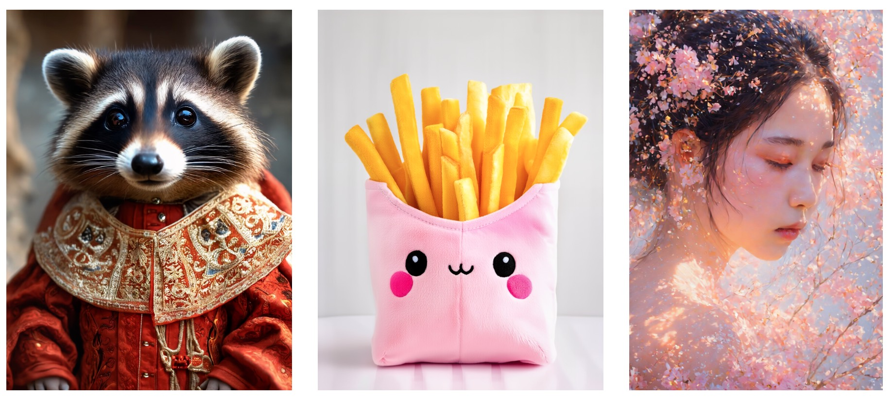
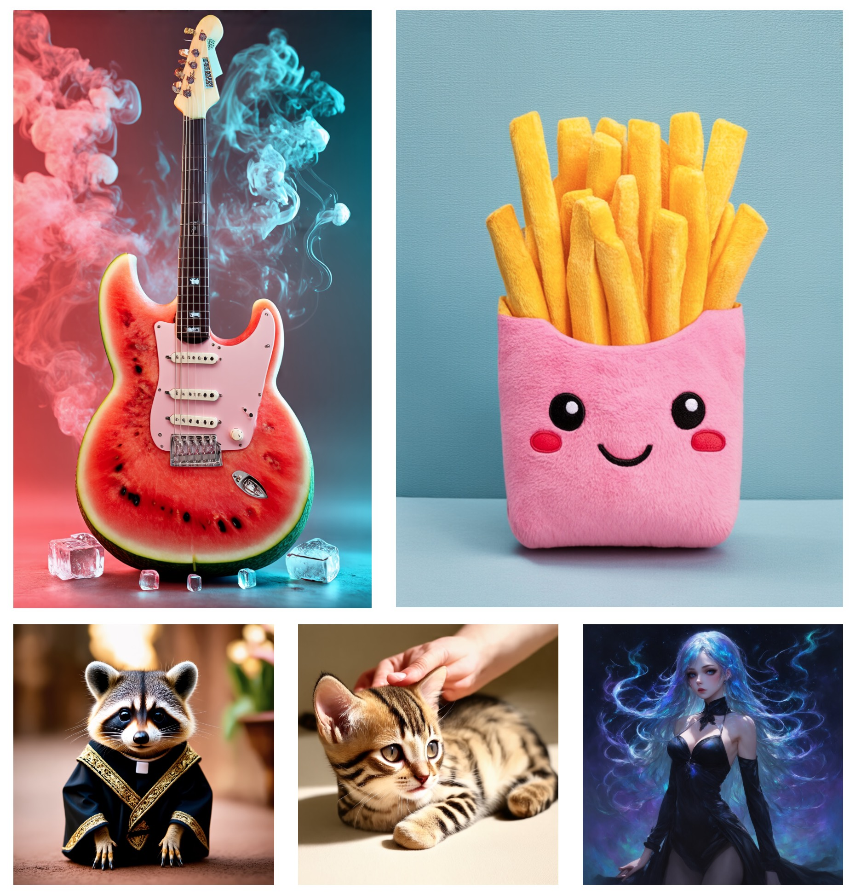
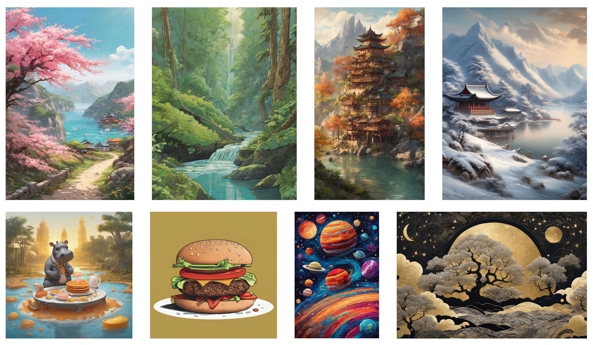
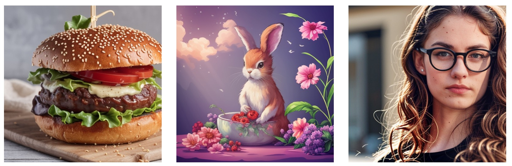

# Using Image Generation Models

GPUStack supports deploying and running state-of-the-art image generation models. These models allow you to generate stunning images from textual descriptions, enabling applications in design, content creation, and more.

In this tutorial, we will walk you through deploying and using image generation models in GPUStack.

## Prerequisites

Before you begin, ensure that you have the following:

- A GPU that has at least 12 GB of VRAM.
- Access to Hugging Face for downloading the model files.
- GPUStack is installed and running. If not, refer to the [Quickstart Guide](../quickstart.md).

## Step 1: Deploy the Stable Diffusion Model

Follow these steps to deploy the model from Hugging Face:

1. Navigate to the `Models` page in the GPUStack UI.
2. Click the `Deploy Model` button.
3. In the dropdown, select `Hugging Face` as the source for your model.
4. Use the search bar in the top left to search for the model name `gpustack/stable-diffusion-v3-5-medium-GGUF`.
5. In the `Available Files` section, select the `stable-diffusion-v3-5-medium-Q4_0.gguf` file.
6. Leave everything as default and click the `Save` button to deploy the model.


After deployment, you can monitor the model's status on the `Models` page.



## Step 2: Use the Model for Image Generation

1. Navigate to the `Playground` > `Image` page in the GPUStack UI.
2. Verify that the deployed model is selected from the top-right `Model` dropdown.
3. Enter a prompt describing the image you want to generate. For example:

```
a female character with long, flowing hair that appears to be made of ethereal, swirling patterns resembling the Northern Lights or Aurora Borealis. The background is dominated by deep blues and purples, creating a mysterious and dramatic atmosphere. The character's face is serene, with pale skin and striking features. She wears a dark-colored outfit with subtle patterns. The overall style of the artwork is reminiscent of fantasy or supernatural genres.
```

4. Select `euler` in the `Sampler` dropdown.
5. Set the `Sample Steps` to `20`.
6. Click the `Submit` button to create the image.

The generated image will be displayed in the UI. Your image may look different given the seed and randomness involved in the generation process.



## Extensions

GPUStack currently does not support GGUF image models that are not all-in-one (base model, text encoder, and VAE combined). Please refer to the supported model list for details:

● [Hugging Face](https://huggingface.co/collections/gpustack/image-672dafeb2fa0d02dbe2539a9)

● [Model Scope](https://modelscope.cn/collections/Image-fab3d241f8a641)

### Basic Configuration Guide

The core parameters of image generation models are key to achieving desired outputs. These include `Prompt`, `Seed`, `Resolution`, `Sampler`, `Scheduler`, `Sampling Steps` and `CFG scale`.
Different models may have variations in parameter settings. In order to quickly get started and generate satisfying images, the following section is going to provide some reference values for parameter configurations.

#### FLUX.1-dev

For FLUX models, it is recommended to disable CFG (CFG=1) for better results.

Reference settings:

| Parameter | Value     |
|-----------|-----------|
| Size      | 1024x1024 |
| Sampler   | euler     |
| Scheduler | discrete  |
| Steps     | 20        |
| CFG       | 1.0       |

Recommended samplers: euler, heun, ipndm, ipndm_v

Recommended scheduler: discrete

✏️**Try it out!**
```text
Prompt: A kangaroo holding a beer,wearing ski goggles and passionately singing silly songs.
Size: 1024x1024
Sampler: euler
Scheduler: discrete
Steps: 20
CFG: 1.0
Seed: 838887451
```



##### Using LoRA

**Configuration**: Edit model -> Advanced -> Backend Parameters -> Add `--lora=<path/to/your/lora_file>`



The top row shows the original images, while the bottom row displays the corresponding images generated using LoRA.


!!! note

    LoRA is currently an experimental feature. Not all models or LoRA files are compatible.


#### FLUX.1-schnell

For FLUX models, it is recommended to disable CFG (CFG=1) for better results.

Reference settings:

| Parameter | Value     |
|-----------|-----------|
| Size      | 1024x1024 |
| Sampler   | euler     |
| Scheduler | discrete  |
| Steps     | 2-4       |
| CFG       | 1.0       |

Recommended samplers: euler, dpm++2mv2, ipndm_v

Recommended scheduler: discrete

✏️**Try it out!**
```text
Prompt: A mischievous ferret with a playful grin squeezes itself into a large glass jar, surrounded by colorful candy. The jar sits on a wooden table in a cozy kitchen, and warm sunlight filters through a nearby window
Size: 1024x1024
Sampler: euler
Scheduler: discrete
Steps: 3
CFG: 1.0
Seed: 1565801500
```



#### Stable-Diffusion-v3-5-Large

Reference settings:

| Parameter | Value     |
|-----------|-----------|
| Size      | 1024x1024 |
| Sampler   | euler     |
| Scheduler | discrete  |
| Steps     | 25        |
| CFG       | 4.5       |

Recommended samplers: dpm++2m, ipndm, ipndm_v, dpm++2mv2, eluer, heun, dpm2

Recommended scheduler: discrete

✏️**Try it out!**
```text
Prompt: Lucky flower pop art style with pink color scheme,happy cute girl character wearing oversized headphones and smiling while listening to music in the air with her eyes closed,vibrant colorful Japanese anime cartoon illustration with bold outlines and bright colors,colorful text "GPUStack" on top of background,high resolution,detailed,
Size: 1024x1024
Sampler: dpm++2m
Scheduler: discrete
Steps: 25
CFG: 5
Seed: 3520225659
```


#### Stable-Diffusion-v3-5-Large-Turbo

For turbo models, it is recommended to disable CFG (CFG=1) for better results.

Reference settings:

| Parameter | Value                |
|-----------|----------------------|
| Size      | 1024x1024            |
| Sampler   | euler/dpm++2m        |
| Scheduler | discrete/exponential |
| Steps     | 5/15-20              |
| CFG       | 1.0                  |

Recommended samplers: euler, ipndm, ipndm_v, dpm++2mv2, heun, dpm2, dpm++2m

Recommended scheduler: discrete, karras, exponential

✏️**Try it out!**
```text
Prompt: This dreamlike digital art captures a vibrant, kaleidoscopic bird in a lush rainforest
Size: 768x1024
Sampler: heun
Scheduler: karras
Steps: 15
CFG: 1.0
Seed: 2536656539
```


#### Stable-Diffusion-v3-5-Medium

Reference settings:

| Parameter | Value    |
|-----------|----------|
| Size      | 768x1024 |
| Sampler   | euler    |
| Scheduler | discrete |
| Steps     | 28       |
| CFG       | 4.5      |

Recommended samplers: euler, ipndm, ipndm_v, dpm++2mv2, heun, dpm2, dpm++2m

Recommended scheduler: discrete

✏️**Try it out!**
```text
Prompt: Plush toy, a box of French fries, pink bag, long French fries, smiling expression, round eyes, smiling mouth, bright colors, simple composition, clean background, jellycat style,
Negative Prompt: ng_deepnegative_v1_75t,(badhandv4:1.2),EasyNegative,(worst quality:2)
Size: 768x1024
Sampler: euler
Scheduler: discrete
Steps: 28
CFG: 4.5
Seed: 3353126565
```



#### Stable-Diffusion-v3-Medium

Reference settings:

| Parameter | Value     |
|-----------|-----------|
| Size      | 1024x1024 |
| Sampler   | euler     |
| Scheduler | discrete  |
| Steps     | 25        |
| CFG       | 4.0       |

Recommended samplers: euler, ipndm, ipndm_v, dpm++2mv2, heun, dpm2, dpm++2m

Recommended scheduler: discrete

✏️**Try it out!**
```text
Prompt: A guitar crafted from a watermelon, realistic, close-up, ultra-HD, digital art, with smoke and ice cubes, soft lighting, dramatic stage effects of light and shadow, pastel aesthetic filter, time-lapse photography, macro photography, ultra-high resolution, perfect design composition, surrealism, hyper-imaginative, ultra-realistic, ultra-HD quality
Size: 768x1280
Sampler: euler
Scheduler: discrete
Steps: 30
CFG: 5.0
Seed: 1937760054
```

!!! tip

    The default maximum image height is 1024. To increase it, edit the model and add the backend parameter --image-max-height=1280 in the advanced settings.




#### SDXL-base-v1.0

Reference settings:

| Parameter | Value     |
|-----------|-----------|
| Size      | 1024x1024 |
| Sampler   | dpm++2m   |
| Scheduler | karras    |
| Steps     | 25        |
| CFG       | 5.0       |

Recommended samplers: euler, ipndm, ipndm_v, dpm++2mv2, heun, dpm2, dpm++2m

Recommended scheduler: discrete, karras, exponential

✏️**Try it out!**
```text
Prompt: Weeds blowing in the wind,By the seaside,Ultra-realistic,Majestic epic scenery,excessively splendid ancient rituals,vibrant,beautiful Eastern fantasy,bright sunshine,pink peach blossoms,daytime perspective.
Negative Prompt: ng_deepnegative_v1_75t,(badhandv4:1.2),EasyNegative,(worst quality:2),
Size: 768x1280
Sampler: dpm++2m
Scheduler: exponential
Steps: 30
CFG: 5.0
Seed: 3754742591
```



#### Stable-Diffusion-v2-1-Turbo

For turbo models, it is recommended to disable CFG (CFG=1) for better results.

Reference settings:

| Parameter | Value  |
|-----------|--------|
| Size      | 512x512 |
| Sampler   | euler_a |
| Scheduler | discrete |
| Steps     | 6      |
| CFG       | 1.0    |

Recommended samplers: eluer_a, dmp++2s, lcm

Recommended scheduler: discrete, karras, exponential, ays, gits

✏️**Try it out!**
```text
Prompt: A burger patty, with the bottom bun and lettuce and tomatoes.
Size: 512x512
Sampler: euler_a
Scheduler: discrete
Steps: 6
CFG: 1.0
Seed: 1375548153
```




!!! note

    The parameters above are for reference only. The ideal settings may vary depending on the specific situation and should be adjusted accordingly.


## Conclusion

Congratulations! You’ve successfully deployed and used an image generation model in GPUStack. With this setup, you can generate unique and visually compelling images from textual prompts. Experiment with different prompts and settings to push the boundaries of what’s possible.
