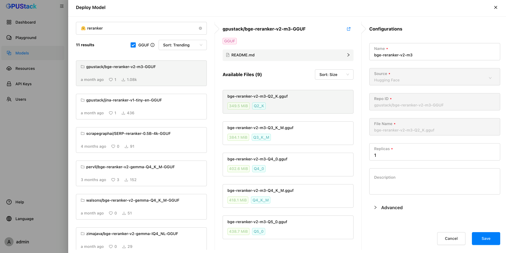

# Using Reranker Models

Reranker models are specialized models designed to improve the ranking of a list of items based on relevance to a given query. They are commonly used in information retrieval and search systems to refine initial search results, prioritizing items that are more likely to meet the user’s intent. Reranker models take the initial document list and reorder items to enhance precision in applications such as search engines, recommendation systems, and question-answering tasks.

In this tutorial, we will guide you through deploying and using reranker models in GPUStack.

## Prerequisites

Before you begin, ensure that you have the following:

- GPUStack is installed and running. If not, refer to the [Quickstart Guide](../quickstart.md).
- Access to Hugging Face for downloading the model files.

## Step 1: Deploy the Model

Follow these steps to deploy the model from Hugging Face:

1. Navigate to the `Models` page in the GPUStack UI.
2. Click the `Deploy Model` button.
3. In the dropdown, select `Hugging Face` as the source for your model.
4. Enable the `GGUF` checkbox to filter models by GGUF format.
5. Use the search bar in the top left to search for the model name `gpustack/bge-reranker-v2-m3-GGUF`.
6. Leave everything as default and click the `Save` button to deploy the model.



After deployment, you can monitor the model's status on the `Models` page.


## Step 2: Generate an API Key

We will use the GPUStack API to generate text embeddings, and an API key is required:

1. Navigate to the `API Keys` page in the GPUStack UI.
2. Click the `New API Key` button.
3. Enter a name for the API key and click the `Save` button.
4. Copy the generated API key. You can only view the API key once, so make sure to save it securely.

## Step 3: Reranking

With the model deployed and an API key, you can rerank a list of documents via the GPUStack API. Here is an example script using `curl`:

```bash
export SERVER_URL=<your-server-url>
export GPUSTACK_API_KEY=<your-api-key>
curl $SERVER_URL/v1/rerank \
    -H "Content-Type: application/json" \
    -H "Authorization: Bearer $GPUSTACK_API_KEY" \
    -d '{
        "model": "bge-reranker-v2-m3",
        "query": "What is a panda?",
        "top_n": 3,
        "documents": [
            "hi",
            "it is a bear",
            "The giant panda (Ailuropoda melanoleuca), sometimes called a panda bear or simply panda, is a bear species endemic to China."
        ]
    }' | jq
```

Replace `<your-server-url>` with the URL of your GPUStack server and `<your-api-key>` with the API key you generated in the previous step.

Example response:

```json
{
  "model": "bge-reranker-v2-m3",
  "object": "list",
  "results": [
    {
      "document": {
        "text": "The giant panda (Ailuropoda melanoleuca), sometimes called a panda bear or simply panda, is a bear species endemic to China."
      },
      "index": 2,
      "relevance_score": 1.951932668685913
    },
    {
      "document": {
        "text": "it is a bear"
      },
      "index": 1,
      "relevance_score": -3.7347371578216553
    },
    {
      "document": {
        "text": "hi"
      },
      "index": 0,
      "relevance_score": -6.157620906829834
    }
  ],
  "usage": {
    "prompt_tokens": 69,
    "total_tokens": 69
  }
}
```
