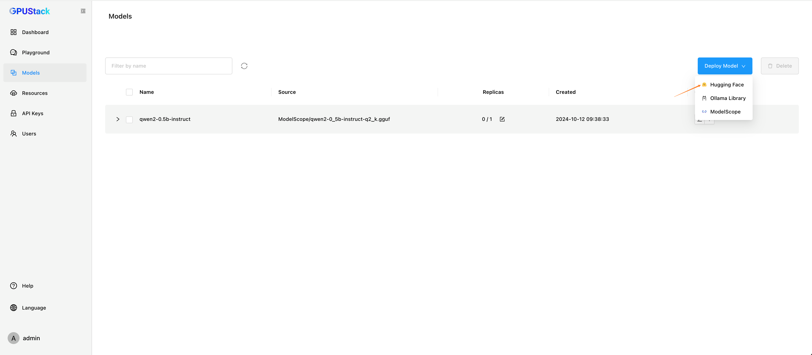
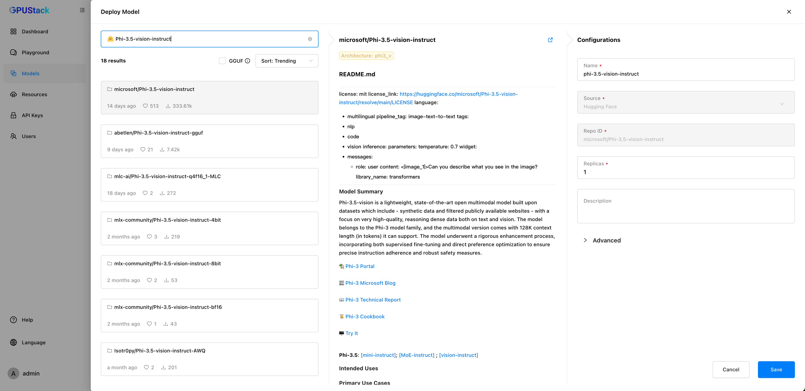
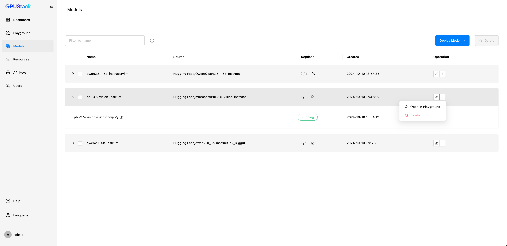
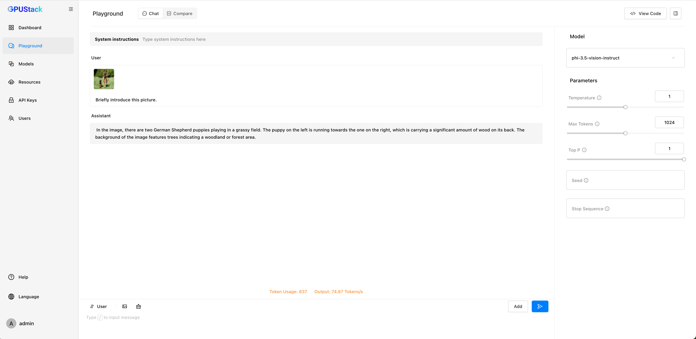

# Deploy Vision Model

Instructions for Deploying and Testing the `Phi-3.5-vision-instruct` Model on Hugging Face.

1. In the model list, choose **Hugging Face** as the source for your model.

2. Use the search bar to look for the model`Phi-3.5-vision-instruct`.
3. From the search results, locate and select the model `microsoft/Phi-3.5-vision-instruct`.

4. After selecting the model, click the `Save` button to finalize your selection.
5. In the model list, confirm that `Phi-3.5-vision-instruct` appears and its status is `Running`.
6. Once the model is running, click `Open in Playground` to interact with the model.

7. In the Playground, send a message to test.

