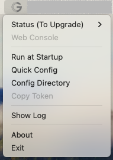
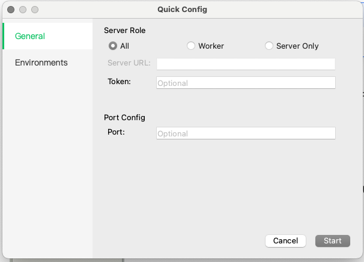
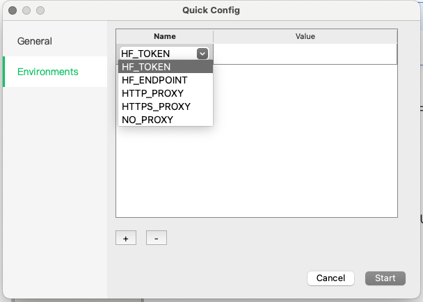
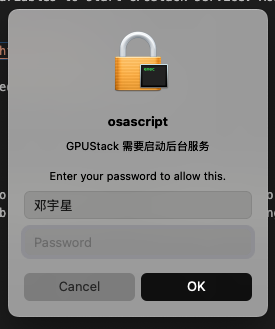

# Desktop Setup

!!! note

    Supported since v0.7.0

On macOS and Windows, installing GPUStack via installer is supported. The **GPUStackHelper**, which is a system tray application for managing GPUStack, will be installed. Follow the [Desktop Installer](../installation/desktop-installer.md) guide to complete the installation.

## GPUStackHelper

GPUStackHelper provides the following functions to configure and manage GPUStack.

- **Status** - Shows the current state of the GPUStack instance. In the Status submenu, Start/Stop/Restart operations are supported.
- **Web Console** - If the GPUStack instance is running, the Web Console will open the GPUStack portal in the default browser.
- **Run At Startup** - Configure whether the GPUStack instance will run at boot.
- **Quick Config** - Open the [Quick Config Dialog](#quick-config-dialog).
- **Config Directory** - Open the location of the GPUStack configuration file `config.yaml`. Configurations not available in `Quick Config` can be set in this file.
- **Copy Token** - If the GPUStack instance is running, click to copy the active token.
- **Show Log** - Open the console/notepad to view GPUStack logs.
- **About** - Show version information.

## Configuration

There are several methods to configure GPUStack via GPUStackHelper. It's recommended to use the config file instead of command line arguments or environment variables. Several GPUStack arguments are fixed and managed by the helper and should not be modified manually.

For example, in the launchd configuration of GPUStack `/Library/LaunchDaemons/ai.gpustack.plist`:

    <?xml version="1.0" encoding="UTF-8"?>
    <!DOCTYPE plist PUBLIC "-//Apple//DTD PLIST 1.0//EN" "http://www.apple.com/DTDs/PropertyList-1.0.dtd">
    <plist version="1.0">
    <dict>
        <key>EnableTransactions</key>
        <true/>
        <key>EnvironmentVariables</key>
        <dict>
            <key>HOME</key>
            <string>/Library/Application Support/GPUStack/root</string>
        </dict>
        <key>KeepAlive</key>
        <true/>
        <key>Label</key>
        <string>ai.gpustack</string>
        <key>ProgramArguments</key>
        <array>
            <string>/Applications/GPUStack.app/Contents/MacOS/gpustack</string>
            <string>start</string>
            <string>--config-file=/Library/Application Support/GPUStack/config.yaml</string>
            <string>--data-dir=/Library/Application Support/GPUStack</string>
        </array>
        <key>RunAtLoad</key>
        <false/>
        <key>StandardErrorPath</key>
        <string>/var/log/gpustack.log</string>
        <key>StandardOutPath</key>
        <string>/var/log/gpustack.log</string>
    </dict>
    </plist>

- **ProgramArguments** specifies the fixed arguments for GPUStack such as `--config-file` and `--data-dir`. Similar fixed configurations are in nssm service on Windows. Check it via `nssm dump gpustack` after GPUStack is installed and started on Windows.
- The `HOME` in **EnvironmentVariables** is fixed to prevent the GPUStack service from using the root user directory as the cache directory. This setting is only applicable on macOS.

### Quick Config Dialog

The **General** page contains commonly used configurations. Refer to the [config-file](../cli-reference/start.md#config-file) documentation for details.

- Server Role - Refers to the `disable_worker` configuration.
  - Server - If the Server role is selected, the Server URL and Token must also be provided.
  - Worker
  - Server Only
- Server URL - Refers to the `server_url` configuration.
- Token - Refers to the `token` configuration.
- Port - Refers to the `port` configuration.

The **Environment** page is used to configure environment variables for starting the GPUStack service. The most common environment variables are listed in the key options:

- HF_ENDPOINT - Hugging Face Hub endpoint, e.g., `https://hf-mirror.com`.
- HF_TOKEN - Hugging Face token.
- HTTP_PROXY, HTTPS_PROXY and NO_PROXY are proxy-related environment variables.

Manual input of variable keys is also supported.

!!! note

    Configuring GPUStack via `GPUSTACK_` environment variables is also supported, but it's recommended to use the config file. If `GPUSTACK_PORT` is configured, it won't be read by the `Web Console` function, which will cause the browser to open with the default port or the port specified in the config file.

## Status and Start

The GPUStack status values are as follows:

- Stopped
- Running
- To Upgrade - This state indicates that GPUStack should be upgraded from script installation.
- To Restart|Running - This state indicates that GPUStack should be restarted as the configuration changed.

On Windows, GPUStackHelper requires UAC (User Account Control) to start because it needs privileges to operate the GPUStack service.  
On macOS, GPUStackHelper runs in the background for the logged-in user and prompts for root privileges when starting/stopping/restarting the GPUStack service.

