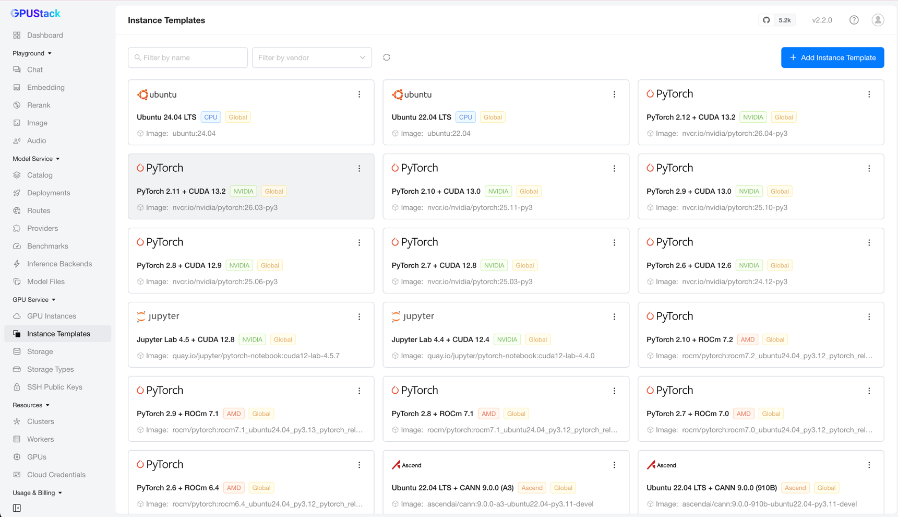
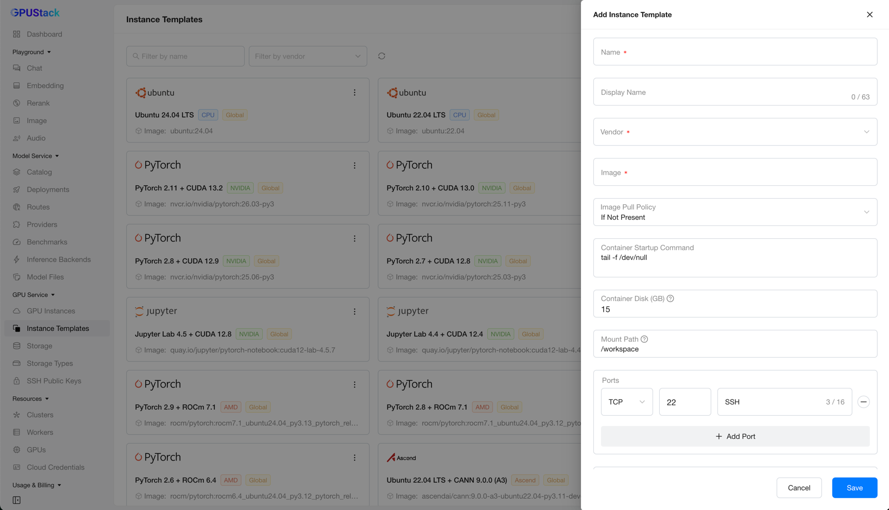
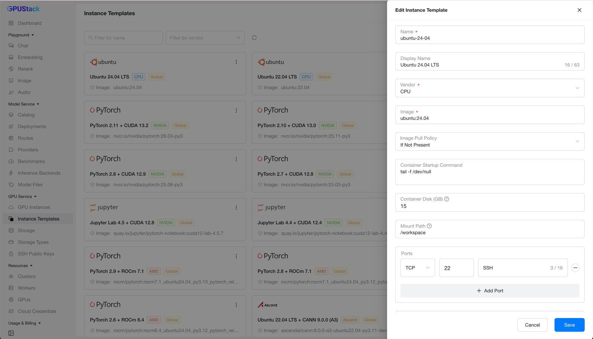

# GPU Service Instance Templates

GPU Service Instance Templates let you define reusable templates for GPU Service Instances.

A template captures common configuration once — image, command, ports, environment variables, and so on — so you can create multiple instances with the same settings.

## Browse Templates

Navigate to the `GPU Service` > `Instance Templates` page to browse all available templates and their details.

You can filter templates by name or vendor.

## Adding a Template

On the `Instance Templates` page, click `Add Instance Template` to open the creation form.

!!! note

    A GPU Service Instance is essentially a Pod running on a Kubernetes cluster, so its configuration follows the rules for running containers.

A template lets you specify the following properties:

- **Name**: A unique identifier for the template. It is set on creation and cannot be changed afterward.
- **Display Name**: A user-friendly name for the template.
- **Vendor**: The GPU vendor (for example, `NVIDIA`), or `CPU` for CPU-based instances.
- **Image**: A valid container image used by instances created from this template.
- **Image Pull Policy**: The policy for pulling the container image (`Always`, `IfNotPresent`, or `Never`).
- **Container Startup Command**: The command run when the container starts.
- **Container Disk**: The disk capacity allocated for the container root filesystem.
- **Mount Path**: The path inside the container where the working directory is mounted.
- **Ports**: The network ports exposed by the container.
- **Environment Variables**: The environment variables set in the container.

After filling in the required fields, click `Save` to create the template.

## Generated Value Placeholders

When creating an instance, GPUStack resolves `{{generated_*}}` placeholders found in the startup command and in port access parameters, generating one value per instance and persisting it in the instance spec — so the value stays the same across instance stop/start. Currently supported:

- `{{generated_token}}`: a random 32-character hex token. For example, the built-in JupyterLab templates use `--ServerApp.token={{generated_token}}` as the startup command and carry the same placeholder in the JUPYTER port's access parameters, so the web access link shown in the `Connect` column includes the token as a `?token=` query parameter for automatic login.

Placeholders and port access parameters can be set through the API (`spec.command` and `spec.ports[].accessParams`); the template form does not expose them yet.

## Editing a Template

Click `Edit` on a template card to open its configuration, make your changes, and click `Save`.

## Deleting a Template

Click `Delete` on a template card and confirm. The template is then removed from the list.

## Deploying from Templates

Once your templates are defined, you can deploy instances from them on the [GPU Service Instances](gpuservice-instances.md) page.
