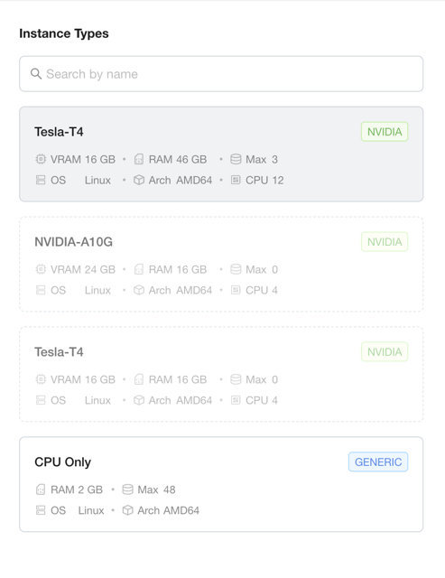
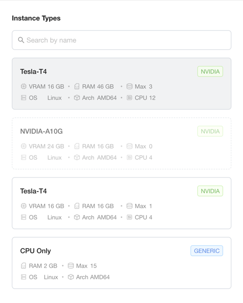
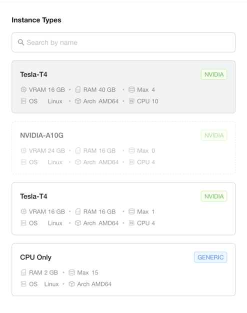
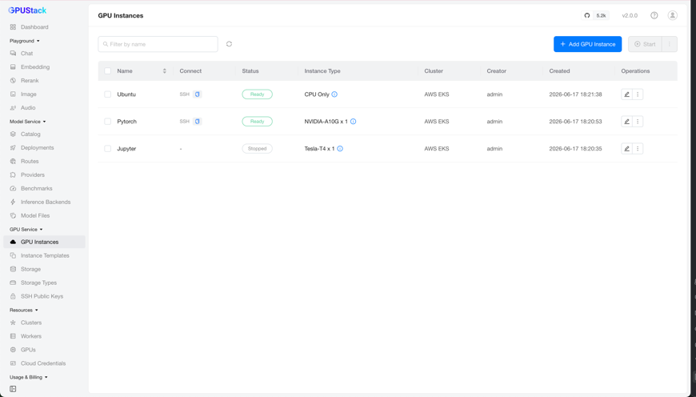

# GPU Service Instance Types

GPU Service Instance Types describe the compute shapes — CPU-only or accelerator-backed — that [GPU Service Instances](gpuservice-instances.md) can be created from.

Unlike the other GPU Service resources, instance types are not created by hand. The [GPUStack Operator](https://github.com/gpustack/gpustack-operator) discovers the hardware of every node in a cluster and generates the instance types automatically. They appear as the cards in the leftmost column of the *Add GPU Instance* form.

There is no dedicated UI page to edit instance types. Instead, you tune them as an administrator with `kubectl`, by editing each node's `NodeFeature` resource on the target Kubernetes cluster (detailed below). This page covers those operations.

## How Instance Types Are Generated

For every node, the Operator derives two kinds of capacity views:

- A **general (CPU-only)** view, shared by all nodes of the same OS and architecture. Its key is `generic-ln-x64` here (`ln` = Linux, `x64` = amd64). It backs the CPU-only instance type.
- One **accelerator** view per distinct device model on the node — for example `nvidia-tesla-t4` or `nvidia-a10g`. Each backs an instance type for that model.

Each view reports the node's resources through labels — `.cpu`, `.ram`, and `.storage` — and those values drive the generated instance type. The Operator also writes derived `z-flavor`, `z-queue`, and `z-cohort` labels; you do not set those.

!!! warning

    Every view reports the node's **full** CPU, RAM, and storage. A node that has accelerators therefore advertises its whole machine to its CPU-only view **and** to each accelerator view at the same time. This is intentional — it lets you pack a CPU-only instance and a GPU instance onto the same node — but it means a node's capacity is offered more than once, so the totals across instance types can be over-subscribed. [Right-Size a Node](#right-size-a-node-to-avoid-over-subscription) shows how to bound this.

## Inspecting Instance Types

List the instance types generated across the cluster:

```bash
kubectl get instancetypes -o wide
```

```
NAME                                                   ACCELERATOR   CPU     RAM           LOCAL-STORAGE   PHASE    AGE
gpustack--generic-ln-x64-12c-46g--nvidia-tesla-t4-1d   3/3           36/36   140Gi/140Gi   83Gi/83Gi       Active   5h53m
gpustack--generic-ln-x64-1c-2g                         0/0           48/71   96Gi/142Gi    98Gi/377Gi      Active   5h53m
gpustack--generic-ln-x64-4c-16g--nvidia-a10g-1d        0/0           0/0     0/0           0/83Gi          Active   5h53m
gpustack--generic-ln-x64-4c-16g--nvidia-tesla-t4-1d    1/1           4/4     16Gi/16Gi     98Gi/98Gi       Active   5h53m
```

- **NAME** encodes the general key, the per-instance unit (`12c-46g` = 12 CPU and 46 Gi RAM per device), the accelerator key, and the device count per instance (`1d`). A name without an accelerator segment (`…-1c-2g`) is the CPU-only type.
- **ACCELERATOR**, **CPU**, **RAM**, and **LOCAL-STORAGE** are shown as `largest single request / remaining`.
- **PHASE** is `Active`, `Activating`, or `Inactive`. A draining type reports `Inactive` and zero capacity.

The Operator publishes each node's capacity labels in a `NodeFeature` resource named `<node-name>-gpustack-worker` in the `gpustack-system` namespace; [Node Feature Discovery](https://github.com/kubernetes-sigs/node-feature-discovery) mirrors them onto the node, and the scheduling chain reads them from there. This `NodeFeature` is also where you tune a node (see [Tuning Instance Types](#tuning-instance-types)).

Inspect the labels of a node — for example, the node with four Tesla T4 devices:

```bash
kubectl -n gpustack-system get nodefeature ip-172-31-2-137.ec2.internal-gpustack-worker \
  -o jsonpath='{.spec.labels}' | jq -S .
```

```json
{
  "acceleratable.feature.gpustack.ai/nvidia-tesla-t4.cpu": "48",
  "acceleratable.feature.gpustack.ai/nvidia-tesla-t4.ram": "186Gi",
  "acceleratable.feature.gpustack.ai/nvidia-tesla-t4.storage": "98Gi",
  "acceleratable.feature.gpustack.ai/nvidia-tesla-t4.z-cohort": "12c-46g-1d",
  "acceleratable.feature.gpustack.ai/nvidia-tesla-t4.z-flavor": "48c-186g-98g-4d",
  "acceleratable.feature.gpustack.ai/nvidia-tesla-t4.z-queue": "12c-46g-1d",
  "general.feature.gpustack.ai/generic": "true",
  "general.feature.gpustack.ai/generic-ln-x64": "true",
  "general.feature.gpustack.ai/generic-ln-x64.cpu": "48",
  "general.feature.gpustack.ai/generic-ln-x64.ram": "96Gi",
  "general.feature.gpustack.ai/generic-ln-x64.storage": "98Gi",
  "general.feature.gpustack.ai/generic-ln-x64.z-cohort": "1c-2g",
  "general.feature.gpustack.ai/generic-ln-x64.z-flavor": "48c-96g-98g",
  "general.feature.gpustack.ai/generic-ln-x64.z-queue": "1c-2g",
  "gpustack.ai/managed": "true"
}
```

This node exposes both a general view (`generic-ln-x64`, claiming the full 48 CPU / 96 Gi) and a Tesla T4 view (`nvidia-tesla-t4`, claiming the full 48 CPU / 186 Gi across its 4 devices) — the over-subscription described above. The labels you edit are `gpustack.ai/managed` and each view's `.cpu`, `.ram`, and `.storage`. The `.z-flavor`, `.z-queue`, `.z-cohort`, and `=true` marker labels are derived by the Operator — leave them alone.

## Tuning Instance Types

You tune instance types by editing the `spec.labels` of a node's `<node-name>-gpustack-worker` `NodeFeature`. The Operator reads your `gpustack.ai/managed`, `.cpu`, `.ram`, and `.storage` values, recomputes the affected instance types, and re-publishes them.

!!! note

    Edit the `NodeFeature`, not the node. Node Feature Discovery owns these labels on the node and reverts any change made there directly.

A few rules apply to the values you set:

- Setting any of a view's `.cpu`, `.ram`, or `.storage` to `0` removes that view's instance type from the node entirely.
- RAM is rounded **up** to an integer number of Gi and is never set below the CPU count.
- Storage is rounded **down** to an even number of Gi.

!!! warning

    Changing a node's labels reshapes or removes the instance types it backs. When an instance type is removed (or drained to zero capacity), GPUStack evicts the GPU Service Instances running under it and marks them `Stopped`. Stopped instances are **not** restarted automatically — you start them again from the [GPU Service Instances](gpuservice-instances.md) page once a matching instance type is available. An instance's `Type` itself cannot be changed yet; reconfiguring the `Type` of a Stopped instance is planned for a future release. Apply these changes during a maintenance window.

### Exclude a Node

Set `gpustack.ai/managed` to `false` to take a node out of GPU Service entirely. The Operator stops generating instance types from it, so no new instances are scheduled there, and any instance already running on the node is stopped.

```bash
kubectl -n gpustack-system patch nodefeature ip-172-31-2-89.ec2.internal-gpustack-worker \
  --type merge -p '{"spec":{"labels":{"gpustack.ai/managed":"false"}}}'
```

After the Operator reconciles, the instance types backed solely by this node drop to zero capacity, and any pooled type (such as the CPU-only type) loses this node's share:

```
NAME                                                   ACCELERATOR   CPU     RAM           LOCAL-STORAGE   PHASE    AGE
gpustack--generic-ln-x64-12c-46g--nvidia-tesla-t4-1d   3/3           36/36   140Gi/140Gi   83Gi/83Gi       Active   6h15m
gpustack--generic-ln-x64-1c-2g                         0/0           48/67   96Gi/134Gi    98Gi/279Gi      Active   6h15m
gpustack--generic-ln-x64-4c-16g--nvidia-a10g-1d        0/0           0/0     0/0           0/83Gi          Active   6h15m
gpustack--generic-ln-x64-4c-16g--nvidia-tesla-t4-1d    0/0           0/0     0/0           0/0             Active   6h15m
```

Node `ip-172-31-2-89` was the only node backing `…-4c-16g--nvidia-tesla-t4-1d`, so that type now reports `0/0` capacity: in the *Add GPU Instance* form its **Tesla-T4** card (16 GB RAM, 4 CPU) shows **Max 0** and can no longer be selected. The CPU-only type (`…-1c-2g`) keeps running but drops from 71 to 67 CPU as this node leaves the shared pool.



To bring the node back, set the label to `true` again:

```bash
kubectl -n gpustack-system patch nodefeature ip-172-31-2-89.ec2.internal-gpustack-worker \
  --type merge -p '{"spec":{"labels":{"gpustack.ai/managed":"true"}}}'
```

### Disable the CPU-Only Type on a Node

A node with accelerators also offers a CPU-only instance type by default. To stop a node from offering CPU-only instances — for example, to reserve a GPU node for GPU workloads only — set its general `.cpu` to `0`:

```bash
kubectl -n gpustack-system patch nodefeature ip-172-31-2-137.ec2.internal-gpustack-worker \
  --type merge -p '{"spec":{"labels":{"general.feature.gpustack.ai/generic-ln-x64.cpu":"0"}}}'
```

The CPU-only type is pooled across every node, so it stays available — it just loses this node's share. Node `ip-172-31-2-137` contributed 48 CPU and 96 Gi to the pool, so the type's remaining capacity drops by exactly that much (CPU `71` → `23`, RAM `142Gi` → `46Gi`), and the largest CPU-only instance you can launch shrinks because the 48-CPU node left the pool:

```
NAME                                                   ACCELERATOR   CPU     RAM           LOCAL-STORAGE   PHASE    AGE
gpustack--generic-ln-x64-12c-46g--nvidia-tesla-t4-1d   3/3           36/36   140Gi/140Gi   83Gi/83Gi       Active   6h32m
gpustack--generic-ln-x64-1c-2g                         0/0           15/23   30Gi/46Gi     83Gi/279Gi      Active   6h32m
gpustack--generic-ln-x64-4c-16g--nvidia-a10g-1d        0/0           0/0     0/0           0/83Gi          Active   6h32m
gpustack--generic-ln-x64-4c-16g--nvidia-tesla-t4-1d    1/1           4/4     16Gi/16Gi     98Gi/98Gi       Active   6h32m
```

In the *Add GPU Instance* form, the **CPU Only** card's **Max** drops from `48` to `15`.

!!! note

    A CPU-only instance already running on the node keeps running — opting the node out only stops **new** CPU-only instances from landing there. Running instances are stopped only when a type is removed entirely and drains to zero.



Revert by removing the override; the Operator restores the discovered value:

```bash
kubectl -n gpustack-system patch nodefeature ip-172-31-2-137.ec2.internal-gpustack-worker \
  --type merge -p '{"spec":{"labels":{"general.feature.gpustack.ai/generic-ln-x64.cpu":null}}}'
```

### Right-Size a Node to Avoid Over-Subscription

Because every view reports the node's full machine, a node's CPU-only type and each of its accelerator types all advertise the whole node. If you run a CPU-only instance and a GPU instance on the same node, their combined requests can exceed what the node actually has.

When you want a node split between CPU and GPU along a plan of your own — or want it used for GPU instances only — set explicit `.cpu`, `.ram`, and `.storage` on each view so their sums stay within the machine. The ratio is yours to choose. For node `ip-172-31-2-137` (48 CPU, 186 Gi RAM, 98 Gi disk), this reserves a small slice for CPU-only instances and the rest for the four T4 devices:

```bash
kubectl -n gpustack-system patch nodefeature ip-172-31-2-137.ec2.internal-gpustack-worker --type merge -p '{"spec":{"labels":{
  "general.feature.gpustack.ai/generic-ln-x64.cpu":"8",
  "general.feature.gpustack.ai/generic-ln-x64.ram":"16Gi",
  "general.feature.gpustack.ai/generic-ln-x64.storage":"40Gi",
  "acceleratable.feature.gpustack.ai/nvidia-tesla-t4.cpu":"40",
  "acceleratable.feature.gpustack.ai/nvidia-tesla-t4.ram":"160Gi",
  "acceleratable.feature.gpustack.ai/nvidia-tesla-t4.storage":"56Gi"
}}}'
```

The sums (48 CPU, 176 Gi, 96 Gi) now fit the machine. The Tesla T4 type is reshaped from `12c-46g` to `10c-40g` per device (40 CPU / 160 Gi split across the 4 devices), and the node's CPU-only contribution shrinks to 8 CPU / 16 Gi:

```
NAME                                                   ACCELERATOR   CPU     RAM           LOCAL-STORAGE   PHASE    AGE
gpustack--generic-ln-x64-10c-40g--nvidia-tesla-t4-1d   4/4           40/40   160Gi/160Gi   56Gi/56Gi       Active   24s
gpustack--generic-ln-x64-1c-2g                         0/0           15/31   30Gi/62Gi     83Gi/319Gi      Active   6h37m
gpustack--generic-ln-x64-4c-16g--nvidia-a10g-1d        0/0           0/0     0/0           0/83Gi          Active   6h37m
gpustack--generic-ln-x64-4c-16g--nvidia-tesla-t4-1d    1/1           4/4     16Gi/16Gi     98Gi/98Gi       Active   6h37m
```

The original `…-12c-46g--nvidia-tesla-t4-1d` type no longer matches any node, so it is removed — and because the `jupyter` instance was running under it, that instance is evicted and marked `Stopped`:

```
NAMESPACE          NAME      TYPE                                                   ACCESS          PORT(S)        PHASE
gpustack-default   jupyter   gpustack--generic-ln-x64-12c-46g--nvidia-tesla-t4-1d                                  Stopped
gpustack-default   pytorch   gpustack--generic-ln-x64-4c-16g--nvidia-a10g-1d        34.230.88.63    22:31025/TCP   Ready
gpustack-default   ubuntu    gpustack--generic-ln-x64-1c-2g                         100.58.100.48   22:30975/TCP   Ready
```





!!! tip

    To favor GPU workloads, give the accelerator view most of the machine and the general view a small slice (or `0`, as in the previous section, to dedicate the node to GPU instances). Only the per-view sums need to stay within the node.

Revert by removing the overrides:

```bash
kubectl -n gpustack-system patch nodefeature ip-172-31-2-137.ec2.internal-gpustack-worker --type merge -p '{"spec":{"labels":{
  "general.feature.gpustack.ai/generic-ln-x64.cpu":null,
  "general.feature.gpustack.ai/generic-ln-x64.ram":null,
  "general.feature.gpustack.ai/generic-ln-x64.storage":null,
  "acceleratable.feature.gpustack.ai/nvidia-tesla-t4.cpu":null,
  "acceleratable.feature.gpustack.ai/nvidia-tesla-t4.ram":null,
  "acceleratable.feature.gpustack.ai/nvidia-tesla-t4.storage":null
}}}'
```

Once the original type is back, start the stopped instance again from the [GPU Service Instances](gpuservice-instances.md) page.

### Disable a Specific Accelerator Model on a Node

This is the accelerator counterpart of [Disable the CPU-Only Type](#disable-the-cpu-only-type-on-a-node), and it is more surgical than [Exclude a Node](#exclude-a-node): it removes one accelerator model's instance type from a node while the node keeps serving its other types — the CPU-only type and any other accelerator models. Set the model's `.cpu` to `0`:

```bash
kubectl -n gpustack-system patch nodefeature ip-172-31-2-89.ec2.internal-gpustack-worker \
  --type merge -p '{"spec":{"labels":{"acceleratable.feature.gpustack.ai/nvidia-tesla-t4.cpu":"0"}}}'
```

Node `ip-172-31-2-89` was the only node backing `…-4c-16g--nvidia-tesla-t4-1d`, so that type drops to zero. Unlike excluding the node, its CPU-only contribution stays in the pool — the CPU-only type holds at `48/71`:

```
NAME                                                   ACCELERATOR   CPU     RAM           LOCAL-STORAGE   PHASE    AGE
gpustack--generic-ln-x64-12c-46g--nvidia-tesla-t4-1d   4/4           48/48   186Gi/186Gi   98Gi/98Gi       Active   2m24s
gpustack--generic-ln-x64-1c-2g                         0/0           48/71   96Gi/142Gi    98Gi/377Gi      Active   6h53m
gpustack--generic-ln-x64-4c-16g--nvidia-a10g-1d        0/0           0/0     0/0           0/83Gi          Active   6h53m
gpustack--generic-ln-x64-4c-16g--nvidia-tesla-t4-1d    0/0           0/0     0/0           0/0             Active   6h53m
```

On a node with several accelerator models, this removes only the targeted model and leaves the others untouched.

Revert by removing the override:

```bash
kubectl -n gpustack-system patch nodefeature ip-172-31-2-89.ec2.internal-gpustack-worker \
  --type merge -p '{"spec":{"labels":{"acceleratable.feature.gpustack.ai/nvidia-tesla-t4.cpu":null}}}'
```
