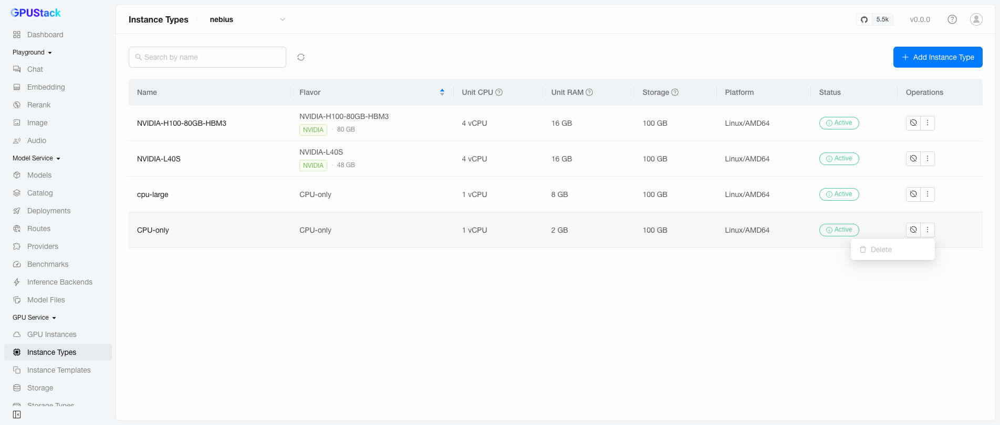
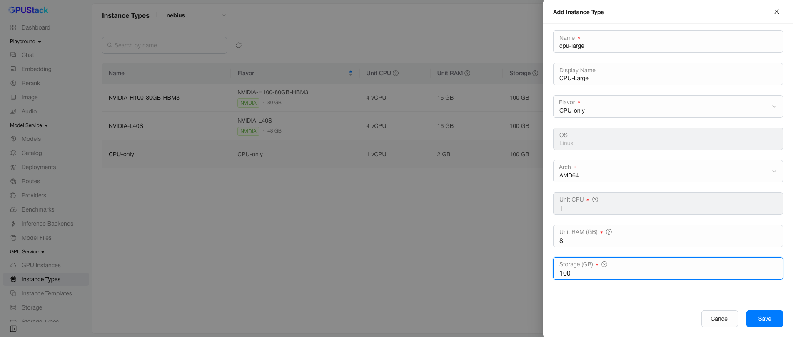
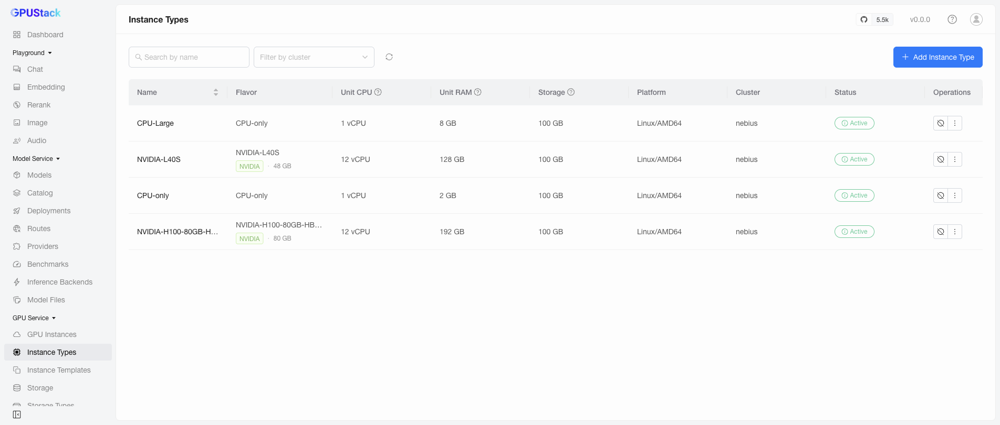
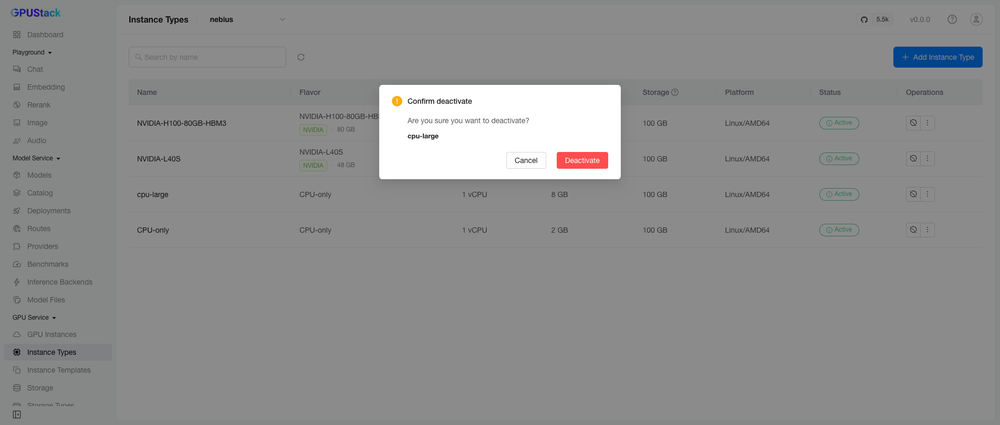
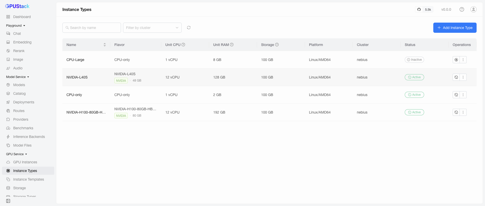
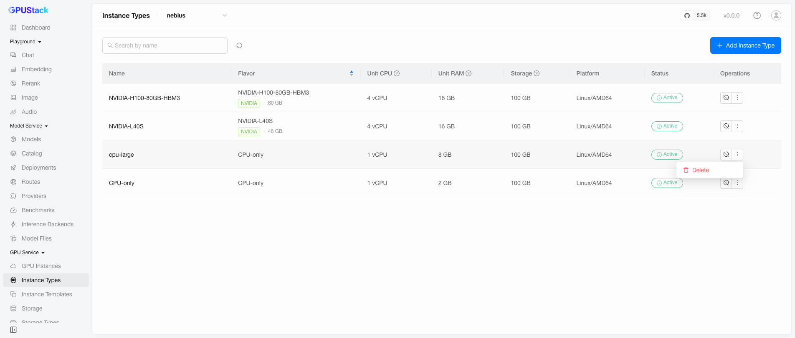
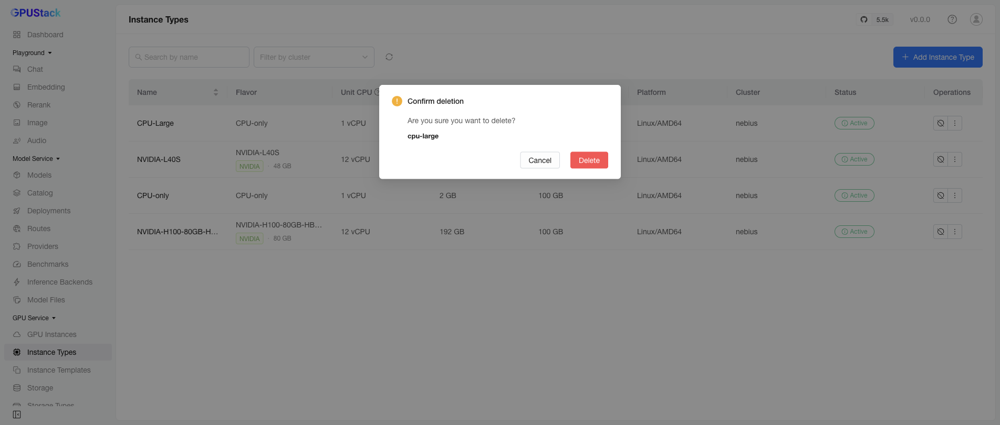

# GPU Service Instance Types

GPU Service Instance Types describe the compute shapes — CPU-only or accelerator-backed — that [GPU Service Instances](gpuservice-instances.md) are created from.

The [GPUStack Operator](https://github.com/gpustack/gpustack-operator) supports accelerators from multiple manufacturers — AMD, Ascend, Cambricon, Hygon, Iluvatar, MetaX, Moore Threads, NVIDIA, and T-Head. For each manufacturer, an accelerator can be allocated **exclusively** (a whole device), **shared**, or **logically sliced** (software splitting with independent VRAM and compute budgets). NVIDIA, T-Head, and Hygon additionally support **physical partitioning** (MIG), where the device is split by hardware. See the operator's [accelerator support matrix](https://github.com/gpustack/gpustack-operator#accelerator-support) for the per-manufacturer details.

## Browsing Instance Types

Open `GPU Service` > `Instance Types`. The page lists the instance types of every GPU Service cluster you can see, with the owning cluster named on each row:


- **Name / Flavor**: The type name (or its display name) and the flavor it belongs to — a device model such as `NVIDIA-H100-80GB-HBM3`, or `CPU-only`.
- **Unit CPU / Unit RAM / Storage**: The host resources granted per unit of this type. For an accelerator flavor, one unit is one whole device; logical slices and physical partitions are sized from these at creation time.
- **Platform**: The operating system and CPU architecture, useful when choosing a compatible image.
- **Cluster**: The cluster the type belongs to.
- **Status**: `Active` types can be selected in the *Add GPU Instance* form; `Inactive` ones cannot.

Use the `Filter by cluster` selector in the toolbar to narrow the list to a single cluster, and the search box to match types by display name or name — either value the `Name` column may show. Filtering, sorting, and pagination are all applied server-side, and sorting the `Name` column orders by the label it displays. Row actions — deactivate, activate, delete — always act on the cluster named in the row's Cluster column.

The list is a control-plane record rather than a live read from each cluster: while a cluster is unreachable, its rows read as last observed. The live capacity view below remains the authority for current remaining capacity.

You can also read the live capacity of each type with `kubectl`. The four accelerator views are **EX**clusive, **SH**ared, **SL**iced (logical), and **PT** (physically partitioned); the accelerator views and the `CPU` column alike read `onceMaxRequest/remaining`:

```bash
kubectl get instancetypes
```

```
NAME                                          ENTRANCE                          UNIT(CPU/RAM)/STORAGE   ACCELERATOR(EX/SH/SL/PT)   CPU     PHASE
gpustack--generic-linux-amd64                 gpustack-fnv64-3b93966fd73eb9ec   1/2Gi/100Gi             0/0 0/0 0/0 0/0            16/40   Active
gpustack--nvidia-h100-80gb-hbm3-linux-amd64   gpustack-fnv64-e4768a65ca0ce96b   12/192Gi/100Gi          1/1 10/10 100/100 1/7      0/0     Active
gpustack--nvidia-l40s-linux-amd64             gpustack-fnv64-a730f1dca9e26fca   12/128Gi/100Gi          1/1 10/10 100/100 0/0      0/0     Active
```

In this reading of a freshly added cluster, the H100 type offers one whole device exclusively (`EX 1/1`), ten shared slots (`SH 10/10`), a full logical-slice budget (`SL 100/100`), and seven MIG partition slots (`PT 1/7`, from a second H100 node with MIG enabled). The L40S type offers its single device the same way minus partitioning (`PT 0/0` — L40S has no MIG), and the generic CPU-only type carries no accelerator capacity at all.

## Derived Instance Types

When `Derive Instance Types from Nodes` is **Enabled** (the default) on a GPU Service cluster, the operator discovers every node's devices and authors the matching instance types automatically — one per accelerator model, plus a CPU-only type. The list above is such a derived set.

The unit CPU/RAM of a derived type comes from per-product presets maintained by the operator, documented in the [Instance Type Unit Resources reference](https://github.com/gpustack/gpustack-operator/blob/main/docs/reference/instance-type-unit-resources.md). Storage is always 100 GiB, and a derived CPU-only type is always 1 CPU / 2 GiB RAM.

Derived types are owned by the operator:

- **They cannot be deleted from the UI** — the `Delete` action is disabled for them:



- Deleting one with `kubectl` does not stick either: the operator re-authors it on its next reconcile. (Re-creating a derived type this way is in fact the supported way to re-size it after an operator upgrade, because unit resources are stamped once at creation.)

To remove a derived type permanently, set `Derive Instance Types from Nodes` to **Disabled** on the cluster first (see [Advanced Options](gpuservice-instances.md#advanced-options) of the cluster); the operator then stops authoring types, and the existing derived ones can be deleted.

## Adding an Instance Type

Add a custom instance type when the derived ones do not fit — for example, a larger CPU-only shape. Click `Add Instance Type` and fill in the form:



- **Cluster**: The cluster the type is created in.
- **Name**: The type name. Lowercase and Kubernetes-safe, since it becomes part of the underlying resource name. It must be unique within the cluster: reusing the name of an existing type — including a derived one — is rejected rather than overwriting it.
- **Display Name**: An optional friendly name shown in the UI.
- **Flavor**: `CPU-only`, or an accelerator flavor the selected cluster carries. The choices follow the Cluster field.
- **OS / Arch**: The platform the type targets.
- **Unit CPU / Unit RAM / Storage**: The host resources granted per unit.

Click `Save`. The new type appears in the list and in the *Add GPU Instance* form:



!!! note

    A custom instance type is never modified by the operator — the derivation only ever creates types, and never touches one it did not just create.

## Deactivating and Activating an Instance Type

Deactivate a type to stop new instances from being created from it, without deleting it. Click the deactivate action on the type's row and confirm:



The type turns `Inactive` and can no longer be selected in the *Add GPU Instance* form:



Click the same action again and confirm to activate it back:


## Deleting an Instance Type

Open the actions menu on the type's row and click `Delete`:



Confirm the deletion:



A custom type is removed permanently. Derived types cannot be deleted while derivation is enabled — see [Derived Instance Types](#derived-instance-types).

## Physical Partitioning (MIG)

A physically partitioned (MIG) device does not get its own instance type: its partitions appear as partition capacity (the `PT` view) on the device's instance type, and you pick a partition profile when [adding an instance](gpuservice-instances.md#instance-type-selection).

The operator supports MIG on NVIDIA, T-Head, and Hygon accelerators. MIG mode itself is a **per-node, administrator-managed** property — the operator observes it but never enables, disables, or reconfigures it. To offer partitions on a node, enable MIG on the node with the vendor's tooling and restart the operator's device manager there, for example on an NVIDIA node:

```bash
# On the node, per GPU or for all GPUs:
sudo nvidia-smi -i <id> -mig 1
# Then, from anywhere with cluster access:
kubectl -n gpustack-system rollout restart ds/gpustack-operator-device-manager-nvidia
```

See the operator's MIG operations runbooks for each vendor's full procedure, prerequisites, and limitations — including that MIG instances never survive a node reboot:

- [NVIDIA MIG operations](https://github.com/gpustack/gpustack-operator/blob/main/docs/operation/nvidia-mig.md)
- [T-Head MIG operations](https://github.com/gpustack/gpustack-operator/blob/main/docs/operation/thead-mig.md)
- [Hygon MIG operations](https://github.com/gpustack/gpustack-operator/blob/main/docs/operation/hygon-mig.md) — on Hygon the mode is node-wide, and a partitioned node serves only partitions.
