# GPU Service Instances

GPU Service Instances let you launch an SSH-accessible GPU instance within minutes.

This gives you a virtual-machine-like environment — containing a single device or multiple devices — for tasks such as learning, inference, testing, and fine-tuning.

Under the hood, each GPU Service Instance is backed by a Kubernetes Pod, so mixing GPU instances and CPU-only instances improves the resource utilization of the whole machine (VM or bare metal).

GPUStack manages multiple Kubernetes clusters and provides a unified interface for launching GPU Service Instances on any of them.

## Prerequisites

To use GPU Service Instances, you need at least one Kubernetes cluster.

The first time you open the `GPU Service` > `GPU Instances` page without any cluster added, you are prompted to add one.

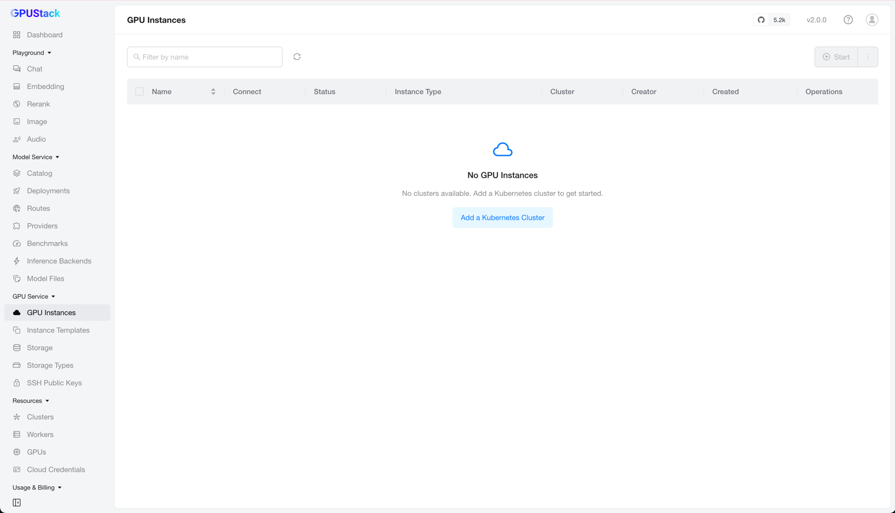

Click `Add a Kubernetes Cluster` to go to the `Resources` > `Clusters` page.

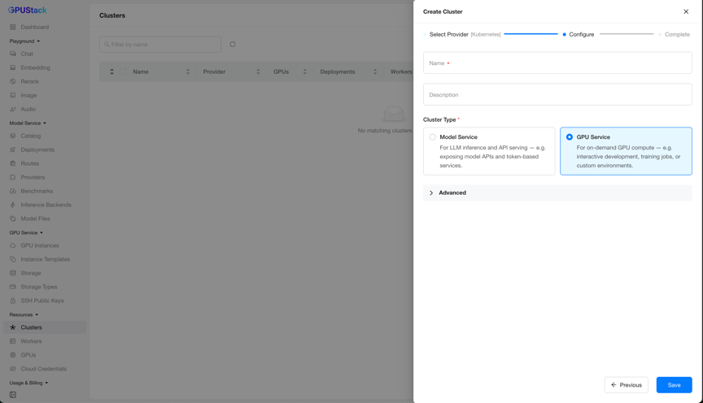

The Create Cluster wizard walks through `Select Provider` (choose `Kubernetes`) → `Configure` → `Complete`. On the `Configure` step, fill in the cluster `Name` and optional `Description`, select the `GPU Service` `Cluster Type`, then click `Save`.

!!! warning

    A Kubernetes cluster can serve a single purpose only — either `Model Service` or `GPU Service`.

### Advanced Options

When adding a cluster for `GPU Service`, expand the `Advanced` options to configure more settings.

#### Allow GPU Service Instances to Be Accessed

Usually all Kubernetes nodes sit behind a NAT or firewall, so the node IPs may not be reachable from outside the cluster:

```bash
$ kubectl get nodes -o wide
NAME                           STATUS   ROLES    AGE    VERSION               INTERNAL-IP    EXTERNAL-IP      OS-IMAGE                        KERNEL-VERSION                    CONTAINER-RUNTIME
ip-172-31-1-170.ec2.internal   Ready    <none>   125m   v1.34.8-eks-0de9cde   172.31.1.170                    Amazon Linux 2023.12.20260608   6.12.90-120.164.amzn2023.x86_64   containerd://2.2.4+unknown
ip-172-31-1-36.ec2.internal    Ready    <none>   125m   v1.34.8-eks-0de9cde   172.31.1.36                     Amazon Linux 2023.12.20260608   6.12.90-120.164.amzn2023.x86_64   containerd://2.2.4+unknown
ip-172-31-2-137.ec2.internal   Ready    <none>   119m   v1.34.8-eks-0de9cde   172.31.2.137                    Amazon Linux 2023.12.20260608   6.12.90-120.164.amzn2023.x86_64   containerd://2.2.4+unknown
ip-172-31-2-89.ec2.internal    Ready    <none>   125m   v1.34.8-eks-0de9cde   172.31.2.89                     Amazon Linux 2023.12.20260608   6.12.90-120.164.amzn2023.x86_64   containerd://2.2.4+unknown
```

In this case, set an address in `GPU Service Static Access Address` (for example, a LoadBalancer VIP) so the GPU Service Instances can be reached.

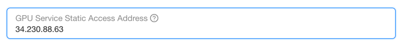

#### Ensure the GPUStack Worker Is Reachable

Most of the time, GPU Service needs to (reverse-)reach the Kubernetes cluster to manage instances — creating, deleting, and monitoring them.

If the GPUStack server is deployed outside the Kubernetes cluster, set `proxy_mode=tunnel` in the `Worker Configuration` to enable the GPUStack Worker **Tunnel** mode. This keeps a long-lived connection from the worker to the GPUStack server and provides a tunnel for GPU Service to reach the cluster.

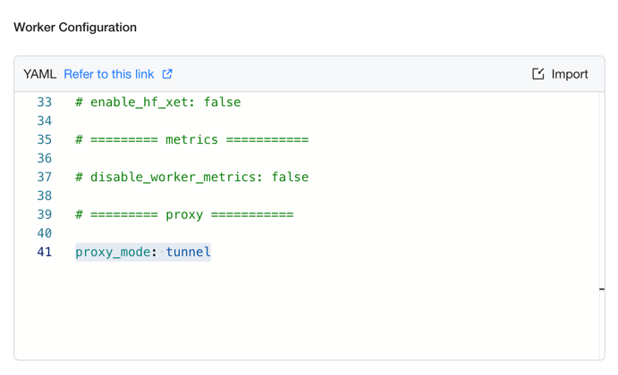

You can verify connectivity between the GPUStack server and worker on the `Resources` > `Workers` page by checking the worker's `Status` column.

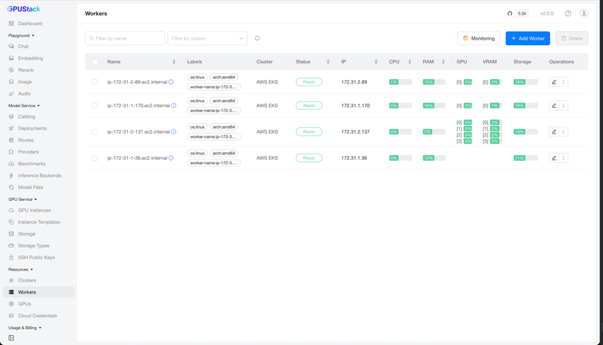

## Automatic Discovery of Instance Types

After you add a `GPU Service`-enabled Kubernetes cluster, the [GPUStack Operator](https://github.com/gpustack/gpustack-operator) automatically discovers the GPU devices in the cluster, gathers their information, and generates the corresponding instance types for GPU Service.

To manage instance types, see [GPU Service Instance Types](gpuservice-instance-types.md). The rest of this page covers deploying and managing instances.

## Adding an Instance

On the `GPU Service` > `GPU Instances` page, click `Add GPU Instance` to open the creation form.

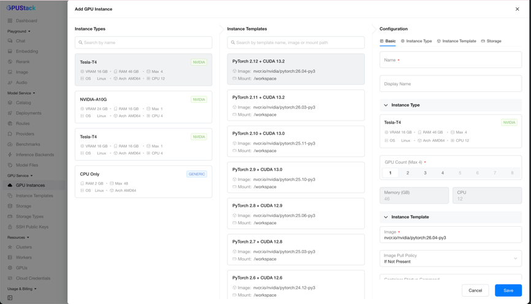

### Instance Type Selection

The leftmost `Instance Types` column lists all instance types discovered from the Kubernetes clusters.

Each instance type card shows the following information:

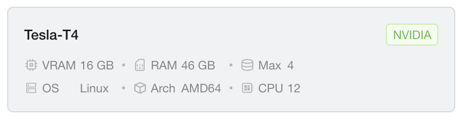

- **Name**: The product name of the instance type, such as `Tesla-T4`. Products that contain special characters are sanitized to be Kubernetes-safe.
- **Manufacturer/Vendor**: A top-right label showing the manufacturer or vendor (for example, `NVIDIA`, or `GENERIC` for CPU-only).
- **VRAM**: The device memory capacity, in GB.
- **Max**: The maximum number of devices you can select at once.
- **(Unit) RAM/CPU**: The resources of a single device.
- **OS**: The operating system, such as `Linux` — useful when choosing a compatible image.
- **Arch**: The CPU architecture, such as `AMD64` or `ARM64` — also useful when choosing a compatible image.

#### Unit Resources of an Instance Type

What are unit resources? Take the `Tesla-T4` card above: it is a Kubernetes node with 4 NVIDIA Tesla T4 devices (16 GB VRAM each), 192 GB RAM, and 48 CPU cores. After the node's reserved resources, the usable RAM is about 184 GB. The unit resources of one device are then:

- **(Unit) RAM** = 184 GB / 4 = 46 GB
- **(Unit) CPU** = 48 / 4 = 12 cores

#### Maximum Selectable Devices

A single Kubernetes node holds up to 4 devices in this example, so even across 10 nodes, **Max** is still 4 — you cannot select 8 devices in one operation.

**Max** decreases when the total remaining devices of an instance type drop below a single node's capacity.

When **Max** is 0, all devices of that instance type are allocated, and you cannot select it until some are released.

#### CPU-Only Instance Type

To improve overall resource utilization, GPU Service also supports CPU-only instance types.

Initially, the GPUStack Operator provides a fixed profile for the CPU-only instance type: `1 CPU + 2 GB RAM`. To customize it, see [GPU Service Instance Types](gpuservice-instance-types.md).

### Instance Template Selection

The middle `Instance Templates` column lists the available templates, and the list updates as you select different instance types.

Templates are managed on the `GPU Service` > `Instance Templates` page; see [GPU Service Instance Templates](gpuservice-instance-templates.md).

### Instance Configuration

The rightmost `Configuration` form lets you set the details of the new instance. It is divided into five sections: `Basic`, `Instance Type`, `Instance Template`, `Storage`, and `SSH Access`.

- **Basic**: The instance name and display name.
- **Instance Type**: The instance type and the number of devices to allocate.
- **Instance Template**: The template to inherit from (image, command, environment variables, and so on). You can still adjust the configuration after selecting a template.
- **Storage**: Either `Ephemeral` storage or [`Persistent` storage](gpuservice-storage.md).
- **SSH Access**: The [SSH public keys](gpuservice-ssh-public-keys.md) to assign to the instance, or the option to disable SSH access.

After completing the form, click `Save` to create the instance.

## Browse Instances

After creation, you return to the `GPU Service` > `GPU Instances` page, where all instances are listed with columns such as `Name` (display name if set), `Connect`, `Status`, `Instance Type`, `Cluster`, `Creator`, `Created`, and `Operations`.

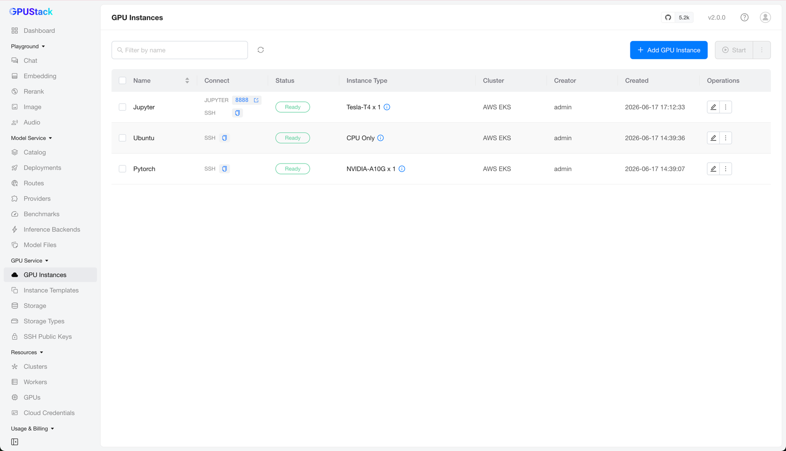

You can filter instances by name.

### Accessing an Instance

The `Connect` column shows the instance's access addresses — a copy-paste SSH command and/or clickable links to web pages — depending on the instance's port configuration.

For example, paste the SSH command into your terminal to connect to the instance directly.

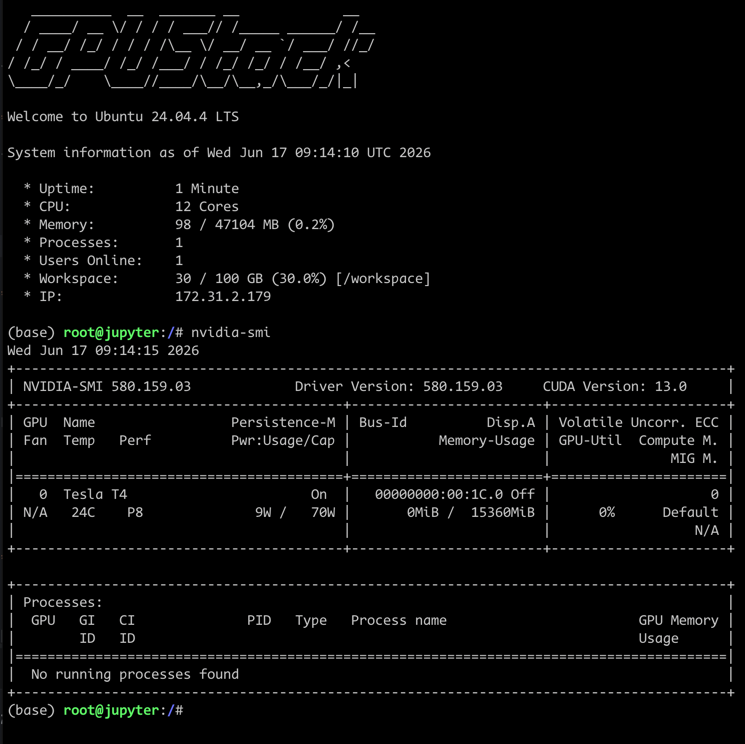

## Editing an Instance

Click `Edit` on an instance to open its configuration.

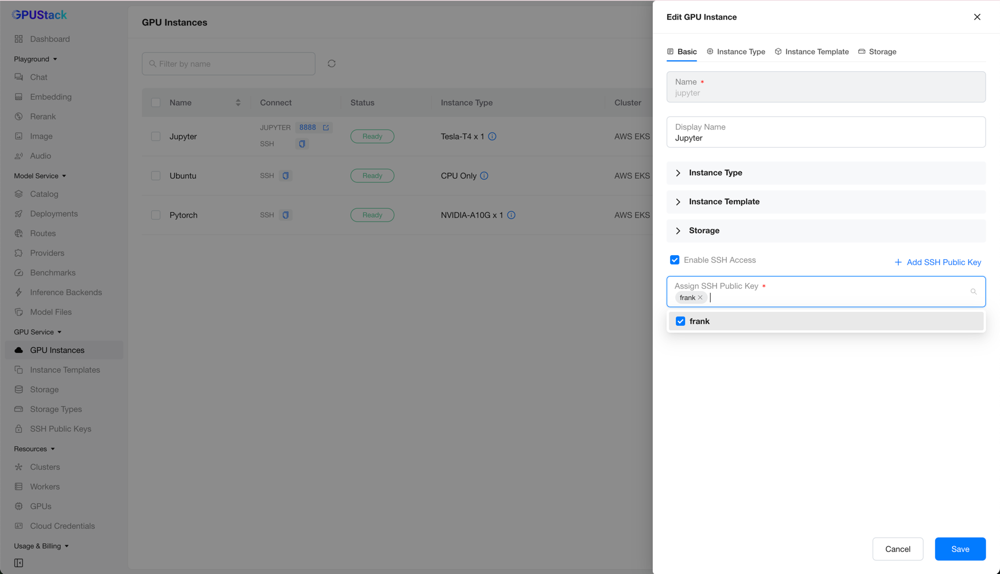

Most fields are not editable yet — only the display name and the SSH access configuration can be changed. You can add or remove SSH public keys, or disable SSH access.

!!! note

    Editing more of the instance configuration is planned for a future release.

## Operating an Instance

GPU Service provides several operations on instances: view logs, view events, stop/start, and delete.

### View Logs

Click `View Logs` to see the instance's logs. This is handy for watching the output of applications such as Jupyter Notebook or TensorBoard.

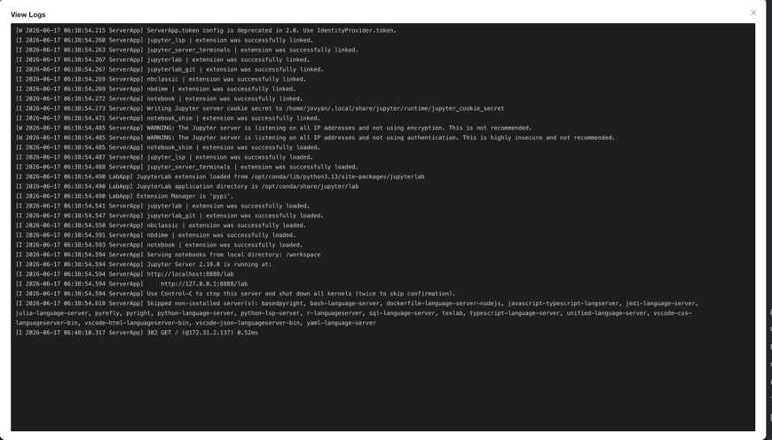

### View Events

Click `View Events` to see the instance's events. This helps you track status changes — for example, an instance stuck in `Pending`, `Running`, or `Failed`.

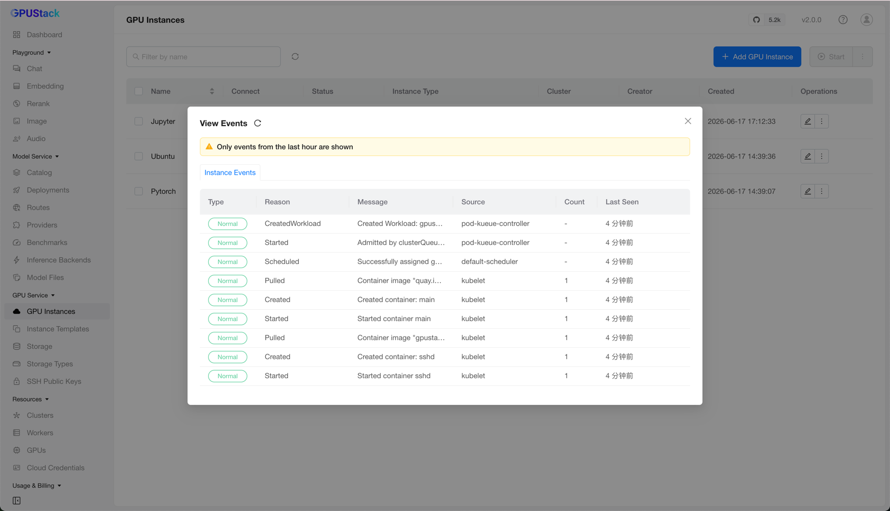

### Stop/Start/Delete

Click `Stop` to stop an instance and `Start` to start it again — useful for temporarily freeing resources and resuming work later.

!!! warning

    Stopping an instance releases its compute resources, and starting it re-creates the instance. The instance is then assigned a new IP address, and any data in ephemeral storage is lost.

Click `Delete` to delete an instance and release all of its resources.
