# GPU Service Instances

GPU Service Instances let you launch an SSH-accessible GPU instance within minutes.

This gives you a virtual-machine-like environment — containing a single device or multiple devices — for tasks such as learning, inference, testing, and fine-tuning.

Under the hood, each GPU Service Instance is backed by a Kubernetes Pod, so mixing GPU instances and CPU-only instances improves the resource utilization of the whole machine (VM or bare metal).

GPUStack manages multiple Kubernetes clusters and provides a unified interface for launching GPU Service Instances on any of them.

!!! note "Upgrading from GPUStack 2.2?"

    GPUStack 2.3 ships GPUStack Operator v0.8.5, which converges the in-place upgrade itself: the worker Deployment is replaced rather than overlapped (`Recreate`), the worker gets a 900s startup budget, and the worker adopts the legacy per-application Helm releases left behind by v0.5.x.

    After the upgraded worker is healthy, remove the orphaned v0.5.x scheduling objects with the operator's cleanup script:

    ```bash
    curl -sSLO https://raw.githubusercontent.com/gpustack/gpustack-operator/v0.8.5/docs/migration/cleanup-v0.5-orphans.sh
    bash cleanup-v0.5-orphans.sh --dry-run   # preview, changes nothing
    bash cleanup-v0.5-orphans.sh             # delete the orphans
    ```

    If an earlier upgrade attempt already wedged (Kueue CRDs stuck `Terminating`, the worker never becoming Ready), see the operator's [migration troubleshooting](https://github.com/gpustack/gpustack-operator/blob/main/docs/migration/troubleshooting.md). For the full procedure, follow the operator's [migration guide](https://github.com/gpustack/gpustack-operator/blob/main/docs/migration/from-v0.5.md).

## Prerequisites

To use GPU Service Instances, you need at least one Kubernetes cluster.

The first time you open the `GPU Service` > `GPU Instances` page without any cluster added, you are prompted to add one.

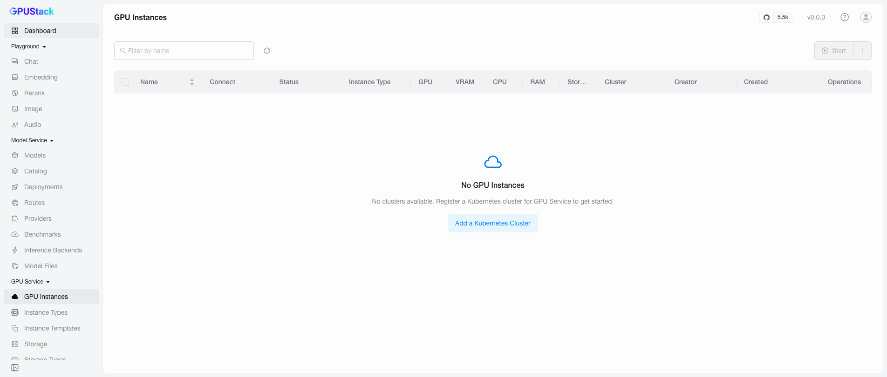

Click `Add a Kubernetes Cluster` to go to the `Resources` > `Clusters` page.

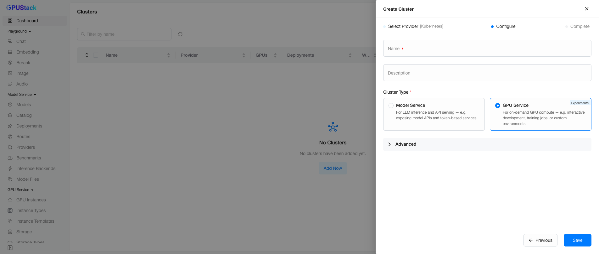

The Create Cluster wizard walks through `Select Provider` (choose `Kubernetes`) → `Configure` → `Complete`. On the `Configure` step, fill in the cluster `Name` and optional `Description`, select the `GPU Service` `Cluster Type`, then click `Save`.

!!! warning

    A Kubernetes cluster can serve a single purpose only — either `Model Service` or `GPU Service`.

### Advanced Options

When adding a cluster for `GPU Service`, expand the `Advanced` options to configure more settings.

#### Derive Instance Types from Nodes

Enabled by default. The operator discovers every node's devices and derives the matching instance types automatically — one per accelerator model, plus a CPU-only type — with per-product unit CPU/RAM presets. Set it to `Disabled` if you prefer to author every instance type yourself; the operator then stops creating types, and the derived ones can be deleted permanently.


See [GPU Service Instance Types](gpuservice-instance-types.md) for managing the derived types.

#### Allow Mixed Instance Types on a Node

Enabled by default. It lets a node serve different instance types at the same time — for example, a GPU node can host both GPU instances and CPU-only instances. Set it to `Disabled` to dedicate each node to a single instance type.


#### Allow GPU Service Instances to Be Accessed

Usually all Kubernetes nodes sit behind a NAT or firewall, so the node IPs may not be reachable from outside the cluster:

```bash
$ kubectl get nodes -o wide
NAME                                 STATUS   ROLES    AGE   VERSION   INTERNAL-IP   EXTERNAL-IP   OS-IMAGE              KERNEL-VERSION         CONTAINER-RUNTIME
computeinstance-e00agjsc8n3yhxqkh6   Ready    <none>   2h    v1.33.7   10.0.51.32    <none>        Ubuntu 24.04.4 LTS   6.11.0-1016-nvidia     containerd://1.7.34
computeinstance-e00bemd340vg9ypxrv   Ready    <none>   2h    v1.33.7   10.0.51.13    <none>        Ubuntu 24.04.4 LTS   6.11.0-1016-nvidia     containerd://1.7.34
computeinstance-e00g7g0y04ga384xj7   Ready    <none>   2h    v1.33.7   10.2.0.0      <none>        Ubuntu 24.04.4 LTS   6.11.0-1016-nvidia     containerd://1.7.34
computeinstance-e00prd70dh2mne0ajb   Ready    <none>   2h    v1.33.7   10.0.0.57     <none>        Ubuntu 24.04.4 LTS   6.11.0-1016-nvidia     containerd://1.7.34
```

In this case, set an address in `GPU Service Static Access Address` (for example, a LoadBalancer VIP) so the GPU Service Instances can be reached.

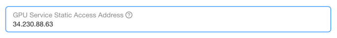

#### Ensure the GPUStack Worker Is Reachable

Most of the time, GPU Service needs to (reverse-)reach the Kubernetes cluster to manage instances — creating, deleting, and monitoring them.

If the GPUStack server is deployed outside the Kubernetes cluster, set `proxy_mode=tunnel` in the `Worker Configuration` to enable the GPUStack Worker **Tunnel** mode. This keeps a long-lived connection from the worker to the GPUStack server and provides a tunnel for GPU Service to reach the cluster.

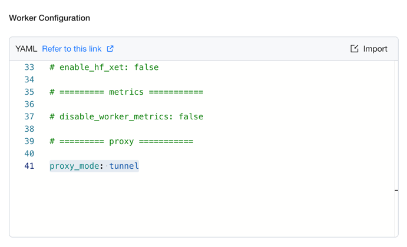

You can verify connectivity between the GPUStack server and worker on the `Resources` > `Workers` page by checking the worker's `Status` column.

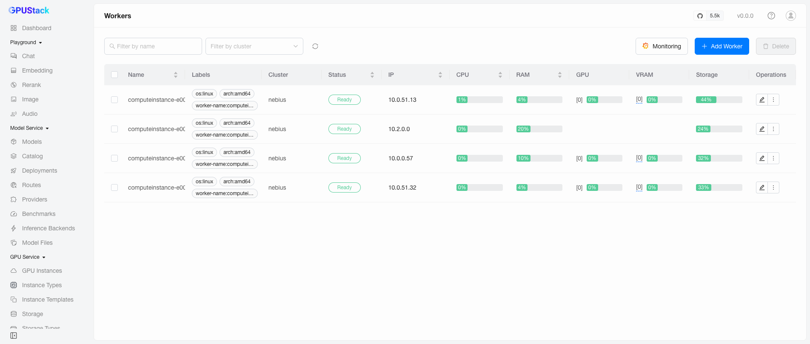

## Automatic Discovery of Instance Types

After you add a `GPU Service`-enabled Kubernetes cluster, the [GPUStack Operator](https://github.com/gpustack/gpustack-operator) automatically discovers the GPU devices in the cluster, gathers their information, and generates the corresponding instance types for GPU Service.

To manage instance types, see [GPU Service Instance Types](gpuservice-instance-types.md). The rest of this page covers deploying and managing instances.

## Adding an Instance

On the `GPU Service` > `GPU Instances` page, click `Add GPU Instance` to open the creation form.

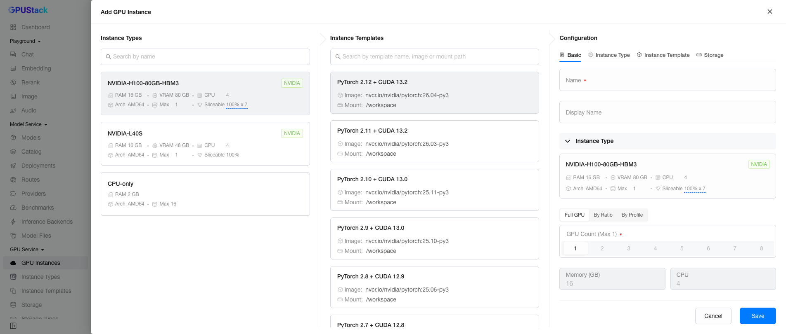

### Instance Type Selection

The leftmost `Instance Types` column lists all instance types discovered from the Kubernetes clusters.

Each instance type card shows the following information:

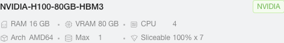

- **Name**: The product name of the instance type, such as `NVIDIA-H100-80GB-HBM3`. Products that contain special characters are sanitized to be Kubernetes-safe.
- **Manufacturer/Vendor**: A top-right label showing the manufacturer or vendor (for example, `NVIDIA`, or `GENERIC` for CPU-only).
- **RAM/VRAM/CPU**: The host RAM, device memory capacity, and CPU cores granted per unit of this type.
- **Arch**: The CPU architecture, such as `AMD64` or `ARM64` — useful when choosing a compatible image.
- **Max**: The maximum number of devices you can select at once. When **Max** is 0, all devices of that instance type are allocated, and you cannot select it until some are released.
- **Sliceable**: How the devices of this type can be split — the logical-slice budget (as a percentage) and, on partition-capable devices, the number of hardware partitions still available.

#### Unit Resources of an Instance Type

The unit resources are the host CPU and RAM granted per unit of a type — for an accelerator type, per whole device. Types derived from nodes are sized from per-product presets maintained by the operator (see the [unit resources reference](https://github.com/gpustack/gpustack-operator/blob/main/docs/reference/instance-type-unit-resources.md)); a logical slice or physical partition is then sized from the preset by its VRAM share. You can also [author your own types](gpuservice-instance-types.md#adding-an-instance-type) with custom unit resources.

#### Selecting a Whole, Sliced, or Partitioned Device

For an accelerator type, the `Configuration` panel offers up to three allocation modes:

- **Full GPU** — exclusive use of the whole device.
- **By Ratio** — a logical slice: pick a `VRAM Percentage` and a `Compute Percentage`. The device stays whole and serves other slices at the same time, each budget enforced at runtime.

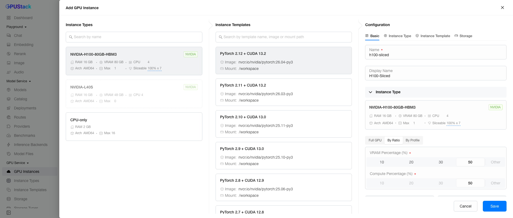

- **By Profile** — a physical partition of a MIG-enabled device: pick a `Partition Profile` (for example `1g.10gb` on an H100). The operator materializes the MIG instance for you. This tab appears only when a node in the cluster has MIG enabled; enabling MIG is a per-node administrator operation, see [GPU Service Instance Types](gpuservice-instance-types.md#physical-partitioning-with-nvidia-mig).

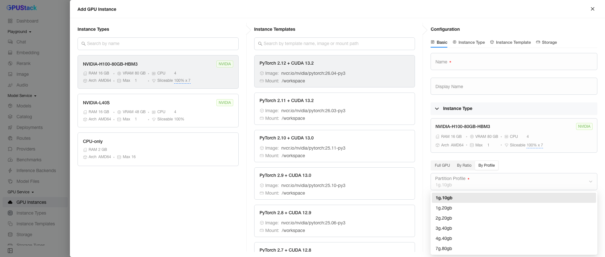

#### CPU-Only Instance Type

To improve overall resource utilization, GPU Service also supports CPU-only instance types.

Initially, the GPUStack Operator provides a fixed profile for the CPU-only instance type: `1 CPU + 2 GB RAM`. To customize it, see [GPU Service Instance Types](gpuservice-instance-types.md).

### Instance Template Selection

The middle `Instance Templates` column lists the available templates, and the list updates as you select different instance types.

Templates are managed on the `GPU Service` > `Instance Templates` page; see [GPU Service Instance Templates](gpuservice-instance-templates.md).

### Instance Configuration

The rightmost `Configuration` form lets you set the details of the new instance. It is divided into five sections: `Basic`, `Instance Type`, `Instance Template`, `Storage`, and `SSH Access`.

- **Basic**: The instance name and display name.
- **Instance Type**: The instance type and the allocation mode — whole device, logical slice, or physical partition.
- **Instance Template**: The template to inherit from (image, command, environment variables, and so on). You can still adjust the configuration after selecting a template.
- **Storage**: Either `Ephemeral` storage or [`Persistent` storage](gpuservice-storage.md).
- **SSH Access**: The [SSH public keys](gpuservice-ssh-public-keys.md) to assign to the instance, or the option to disable SSH access.

After completing the form, click `Save` to create the instance.

## Browse Instances

After creation, you return to the `GPU Service` > `GPU Instances` page, where all instances are listed with columns such as `Name` (display name if set), `Connect`, `Status`, `Instance Type`, `GPU`, `VRAM`, `CPU`, `RAM`, `Storage`, `Cluster`, `Creator`, `Created`, and `Operations`.

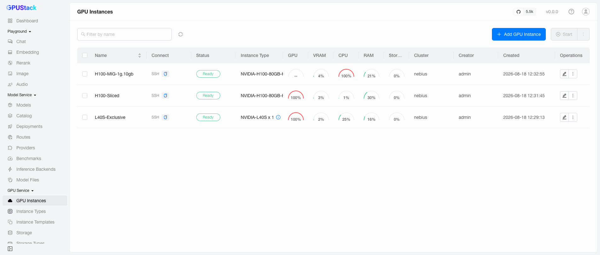

You can filter instances by name.

### Accessing an Instance

The `Connect` column shows the instance's access addresses — a copy-paste SSH command and/or clickable links to web pages — depending on the instance's port configuration.

For example, paste the SSH command into your terminal to connect to the instance directly.

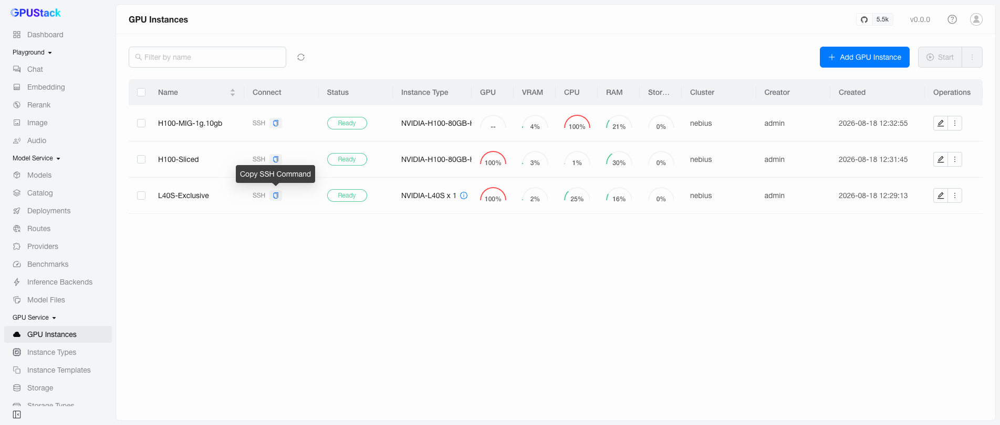

### Metrics

The `GPU`, `VRAM`, `CPU`, `RAM`, and `Storage` columns show live utilization gauges for each running instance, refreshed every few seconds while the page is visible. Each gauge reports the instance's **own** usage against its **own** quota, whatever the allocation mode: an exclusive instance reads the whole device, a slice reads its share, and a physical partition reads the partition's own capacity.

A figure that cannot be measured is shown as empty rather than zero — for example, a MIG partition reports no GPU core utilization (the driver cannot measure it), so its `GPU` gauge stays `--` while its `VRAM` gauge still works.

The figures come from the operator's instance metrics subresource and node exporter; see the [Instance Metrics reference](https://github.com/gpustack/gpustack-operator/blob/main/docs/reference/instance-metrics.md) for every field, its source, and its limits.

!!! note "About the gauges above"

    The list screenshot shows three demo instances under an artificial load: each ran a Python/PyTorch loop allocating host RAM plus repeating an 8192×8192 matrix multiplication on its device (`a = a @ a` in a loop). That is why the `GPU` gauge reads 100% on the exclusive L40S and on the 50%-sliced H100 (a slice saturating its own compute allowance reads 100%), and why the MIG instance's `GPU` gauge shows `--` while its `CPU` reads 100%.

## Editing an Instance

Click `Edit` on an instance to open its configuration.

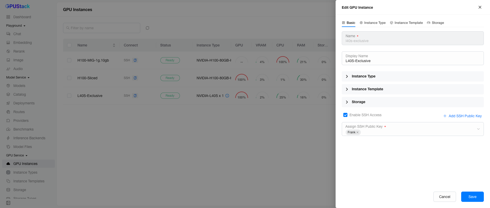

Most fields are not editable yet — only the display name and the SSH access configuration can be changed. You can add or remove SSH public keys, or disable SSH access.

!!! note

    Editing more of the instance configuration is planned for a future release.

## Operating an Instance

GPU Service provides several operations on instances: view logs, view events, stop/start, and delete.

### View Logs

Click `View Logs` to see the instance's logs. This is handy for watching the output of applications such as Jupyter Notebook or TensorBoard.

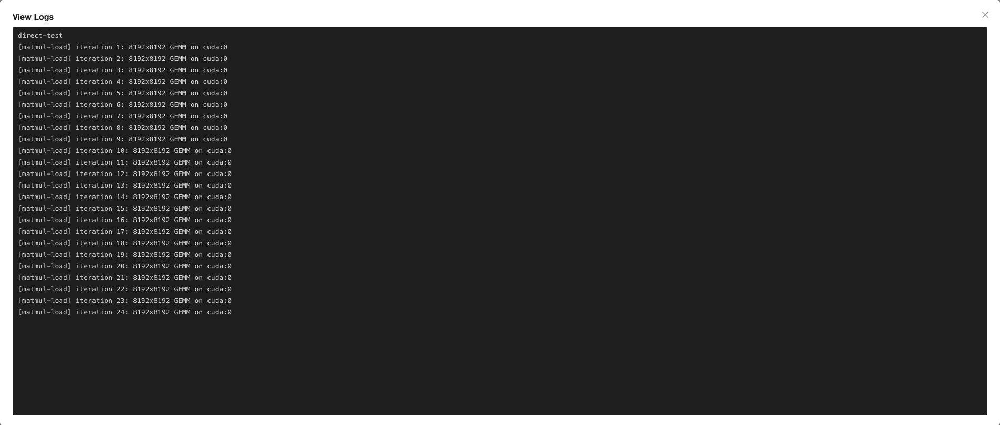

### View Events

Click `View Events` to see the instance's events. This helps you track status changes — for example, an instance stuck in `Pending`, `Running`, or `Failed`.

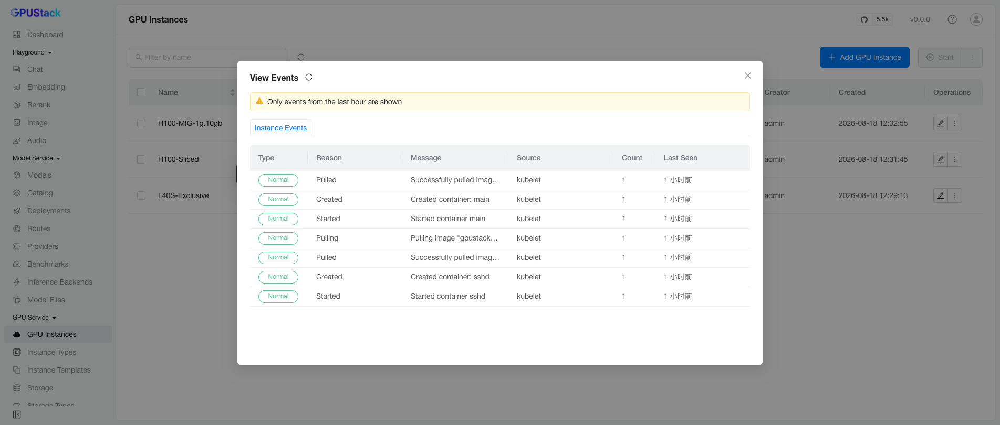

### Stop/Start/Delete

Click `Stop` to stop an instance and `Start` to start it again — useful for temporarily freeing resources and resuming work later.

!!! warning

    Stopping an instance releases its compute resources, and starting it re-creates the instance. The instance is then assigned a new IP address, and any data in ephemeral storage is lost.

Click `Delete` to delete an instance and release all of its resources.
