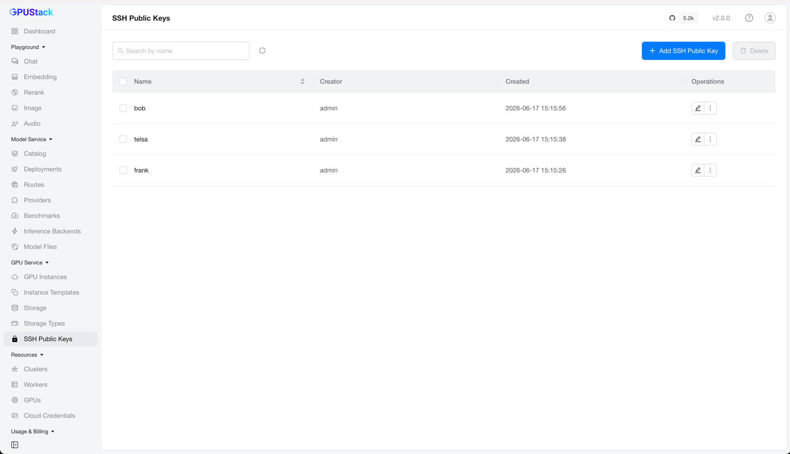
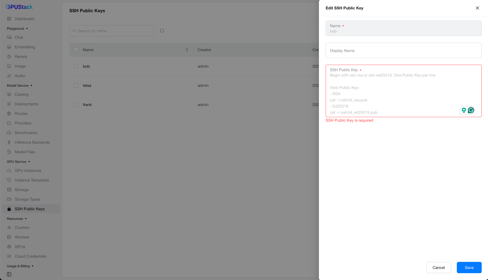

# GPU Service SSH Public Keys

GPU Service SSH Public Keys let you manage the SSH public keys used to access GPU Service Instances, enabling secure, password-free access.

You assign these keys to an instance under its `SSH Access` configuration; see [GPU Service Instances](gpuservice-instances.md).

## Browse SSH Public Keys

Navigate to the `GPU Service` > `SSH Public Keys` page to browse all registered keys.

You can filter SSH public keys by name.

## Adding an SSH Public Key

On the `SSH Public Keys` page, click `Add SSH Public Key` to open the creation form.

Fill in a `Name`, then paste your key into the `SSH Public Key` field. Each key must begin with `ssh-` and you can register several keys by entering one per line. Click `Save` to finish.

!!! tip

    To print your public key, run `cat ~/.ssh/id_rsa.pub` (RSA) or `cat ~/.ssh/id_ed25519.pub` (Ed25519).

## Editing an SSH Public Key

Click `Edit` on a key to open its configuration, update the settings, and click `Save`.

## Deleting an SSH Public Key

Click `Delete` on a key and confirm. The key is then removed from the list.

!!! note

    If the SSH public key is already in use by a GPU Service Instance, deleting it here does not remove it from that instance. Its content has already been synced to the worker-side cluster, and a single entry cannot be stripped from there retroactively. To revoke the key from a running instance, open that instance, click `Edit`, and deselect the key under its `SSH Access` configuration.
