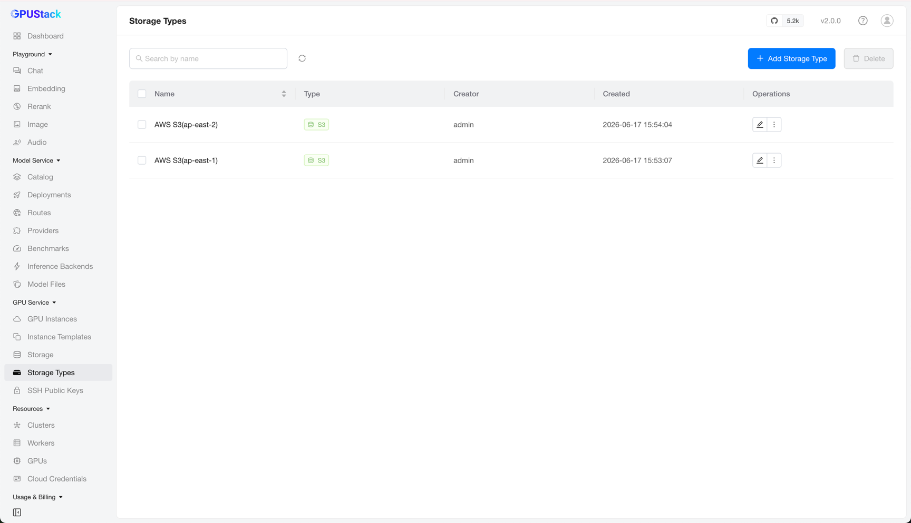
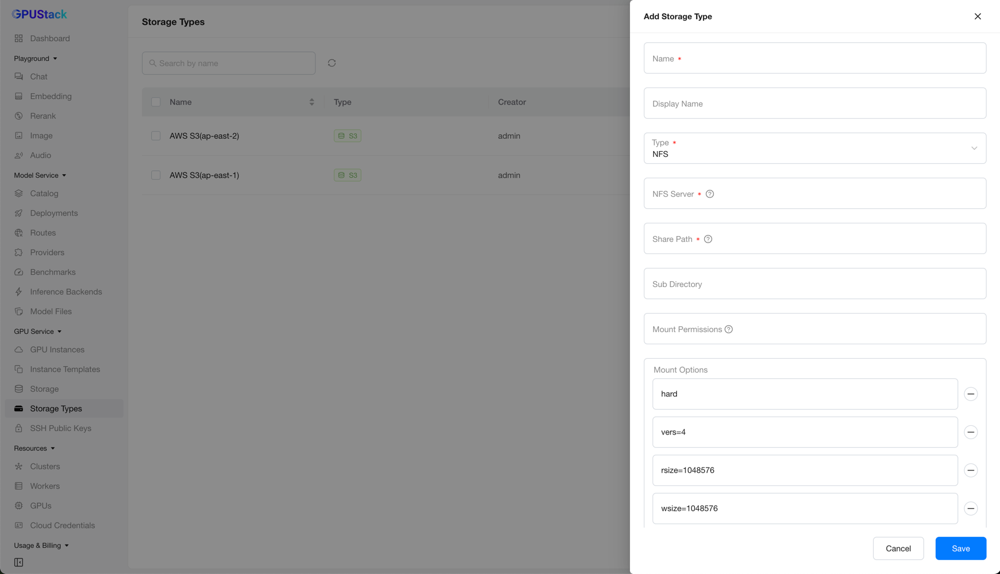

# GPU Service Storage Types

GPU Service Storage Types let you define shared file-system storage backends — NFS or S3 — for GPU Service Instances.

This helps administrators manage storage definitions across multiple Kubernetes clusters. Once defined, a storage type can be selected when creating [GPU Service Storage](gpuservice-storage.md).

Under the hood, each storage type is realized as a Kubernetes `StorageClass` on the target cluster.

## Browse Storage Types

Navigate to the `GPU Service` > `Storage Types` page to browse all storage types and their details.

You can filter storage types by name.

## Adding a Storage Type

On the `Storage Types` page, click `Add Storage Type` to open the creation form.

Fill in a `Name`, optionally a `Display Name`, then choose a `Type`. The remaining fields depend on the type you select.

**NFS** — mount an exported share from an NFS server:

- **NFS Server** (required): The hostname or IP address of the NFS server.
- **Share Path** (required): The exported share path on the NFS server.
- **Sub Directory**: A sub-directory within the share to use for the volume. If left empty, the root of the share is used.
- **Mount Permissions**: Permissions applied to the mounted directory, such as `0777`. Defaults to `0`, which respects the permissions configured on the NFS server.
- **Mount Options**: NFS mount options, added as individual entries. Defaults to `hard`, `vers=4`, `rsize=1048576`, `wsize=1048576`, `noatime`, and `nodiratime`.

**S3** — mount an S3-compatible object storage bucket:

- **Endpoint** (required): The S3-compatible storage endpoint URL.
- **Region**: The region of the S3 storage, if applicable.
- **Bucket**: The bucket name to use. If left empty, a default bucket named `gpu-instance-pv-{id}` is created.
- **Access Key** (required): The access key used to authenticate with the storage.
- **Secret Key** (required): The secret key used to authenticate with the storage. It is write-only and is never returned in API responses.
- **Insecure**: Skip TLS/SSL certificate verification when connecting to the endpoint. Disabled by default.
- **Mount Options**: Mount options for the underlying [GeeseFS](https://github.com/yandex-cloud/geesefs) driver, added as individual entries. The default values follow the **Intensive writing for large files** preset, which suits most workloads.

S3 volumes are mounted with [GeeseFS](https://github.com/yandex-cloud/geesefs), and the `Mount Options` are passed to it directly. Pick the preset that matches your access pattern, and append the **Non-Yandex S3-compatible service** options when your endpoint is not Yandex Object Storage.

??? note "Common GeeseFS Mount Options presets"

    | Use case | Mount options |
    | --- | --- |
    | Intensive writing for large files (default) | `--no-checksum` `--memory-limit=4000` `--max-flushers=32` `--max-parallel-parts=32` `--part-sizes=25` |
    | Sequential reading for large files | `--read-ahead-large=200000` `--large-read-cutoff=10240` `--read-ahead-parallel=40000` `--memory-limit=8000` |
    | Random reading for small files | `--read-ahead-small=64` `--small-read-cutoff=64` `--read-ahead=1024` `--stat-cache-ttl=300s` `--entry-limit=200000` |
    | High availability for writing | `--sdk-max-retries=10` `--read-retry-attempts=5` `--fsync-on-close` `--cache=/mnt/disk-cache` |
    | Non-Yandex S3-compatible service | `--list-type=2` `--no-specials` |

After filling in the required fields, click `Save` to create the storage type.

## Editing a Storage Type

After creation, only the display name can be changed.

!!! note

    Editing more of the storage type configuration is planned for a future release.

## Deleting a Storage Type

Click `Delete` on a storage type and confirm. The storage type is then removed from the list.

!!! warning

    - Before deleting a storage type, first delete any [GPU Service Storage](gpuservice-storage.md) created from it.
    - Deletion of the cluster-side `StorageClass` is currently deferred. After deleting a storage type, avoid recreating one with the same `Name` (not `Display Name`); a leftover `StorageClass` could otherwise overwrite the new definition. This limitation will be addressed in a future release.
