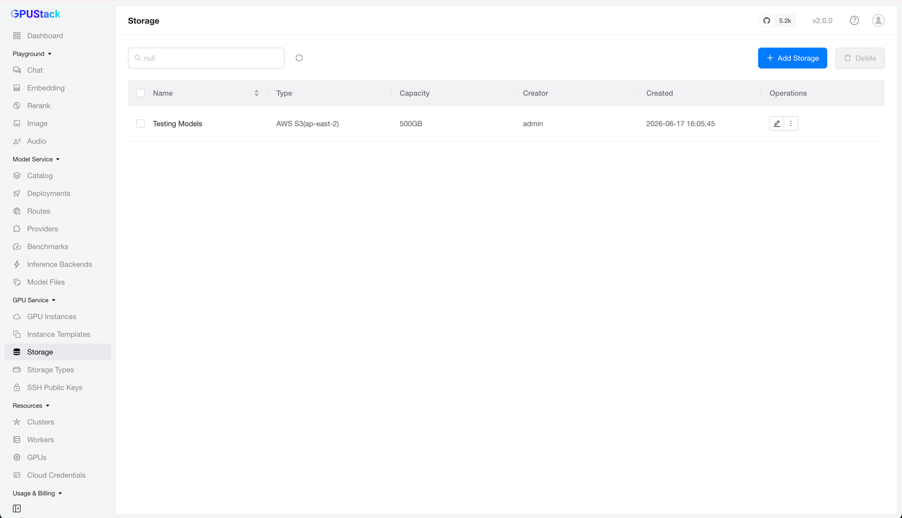
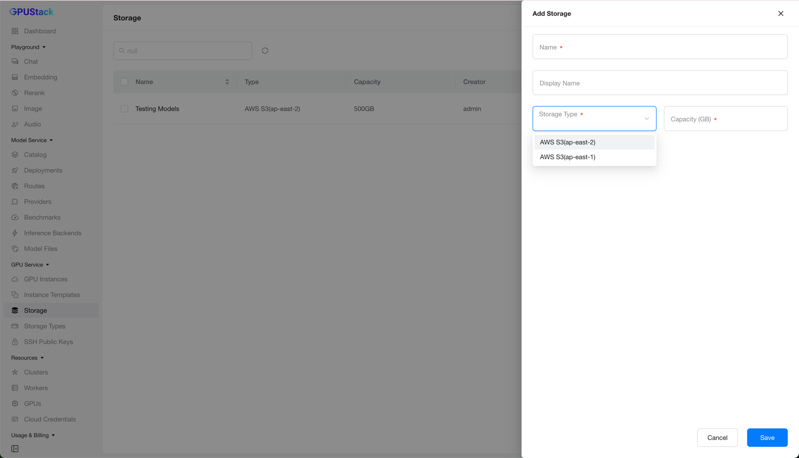

# GPU Service Storage

Based on [GPU Service Storage Types](gpuservice-storage-types.md), GPU Service Storage lets you allocate persistent storage and mount it across multiple GPU Service Instances.

This is useful for data, models, and other files that need to be shared between instances.

GPUStack manages multiple Kubernetes clusters and provides a unified interface for sharing GPU Service Storage across them.

Under the hood, each storage item is realized as a Kubernetes `PersistentVolumeClaim` on the target cluster.

## Browse Storage

Navigate to the `GPU Service` > `Storage` page to browse all storage and its details.

You can filter storage by name.

## Adding Storage

On the `Storage` page, click `Add Storage` to open the creation form.

Fill in a `Name`, select a `Storage Type` (defined on the [GPU Service Storage Types](gpuservice-storage-types.md) page), and set the `Capacity (GB)`. Then click `Save`.

## Editing Storage

After creation, only the display name can be changed.

!!! note

    Editing more of the storage configuration is planned for a future release.

## Deleting Storage

Click `Delete` on a storage item and confirm. The storage is then removed from the list.

!!! note

    If the storage is still attached to a GPU Service Instance, its cluster-side `PersistentVolumeClaim` is not removed right away. Because deletion follows a deferred policy, the `PersistentVolumeClaim` is retained until the associated instance is deleted, and only then is it cleaned up.

!!! warning

    Deletion of the cluster-side `PersistentVolumeClaim` is currently deferred. After deleting a storage item, avoid recreating one with the same `Name` (not `Display Name`); a leftover `PersistentVolumeClaim` could otherwise overwrite the new definition. This limitation will be addressed in a future release.
