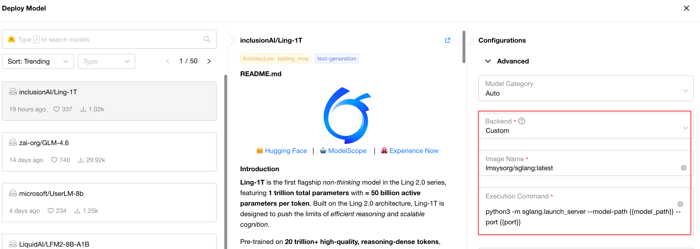

# Inference Backend Management
GPUStack allows admins to configure inference backends and backend versions.

This article serves as an operations guide for the Inference Backend page. For supported built-in backends and their capabilities, see [Built-in Inference Backends](built-in-inference-backends.md).

For guidelines on configuring custom backends and example for custom backends verified as functional, see [Custom Inference Backends](../tutorials/using-custom-backends.md).

## Parameter Description

| Parameter Name             | Description                                                                                                                                                                                                                                                                                                                                                                                              | Required |
|----------------------------|----------------------------------------------------------------------------------------------------------------------------------------------------------------------------------------------------------------------------------------------------------------------------------------------------------------------------------------------------------------------------------------------------------|----------|
| Name                       | Inference backend name                                                                                                                                                                                                                                                                                                                                                                                   | Yes      |
| Health Check Path          | Health check path used to verify if the inference backend has started and is running properly. Default value is /v1/models (OpenAI API specification)                                                                                                                                                                                                                                                    | No       |
| Default Execution Command  | Execution command passed as `args` when the inference backend container starts. For example, for vllm backend, this would be `vllm serve {{model_path}} --port {{port}} --served-model-name {{model_name}} --host {{worker_ip}}`. Note that this command supports {{model_path}}, {{model_name}}, {{port}}, {{worker_ip}} templates, allowing automatic substitution of model path and port number and model name(optional) after scheduling | No       |
| Default Backend Parameters | Default backend parameters used to pre-fill Advanced-Backend Parameters during deployment for convenient deployment and adjustment                                                                                                                                                                                                                                                                       | No       |
| Description                | Description                                                                                                                                                                                                                                                                                                                                                                                              | No       |
| Version Configs            | Inference backend version configurations, used to add inference backend versions                                                                                                                                                                                                                                                                                                                         | Yes      |
| Default Version            | Dropdown option used to pre-fill during deployment. If no version is selected during deployment, the image corresponding to Default Version will be used                                                                                                                                                                                                                                                 | No       |

Version Configs parameter description:

| Parameter Name                  | Description                                         | Required |
|---------------------------------|-----------------------------------------------------|----------|
| Version                         | Version name, displayed in BackendVersion options during deployment | Yes      |
| Image Name                      | Inference backend image name                         | Yes      |
| Framework (custom_framework) | Inference backend framework. Deployment and scheduling will filter based on supported Frameworks | Yes      |
| Execution Command               | Execution command for this version. If not set, uses Default Execution Command | No       |

## Add Custom Inference Backend
1. Click the "Add Backend" button in the top-right corner.
2. You can add a custom inference backend by completing the form or by pasting a YAML definition. Refer to the parameter descriptions above for field meanings.
3. The backend name cannot be modified after creation. Custom backend names must end with "-custom" (pre-filled in the form).
4. Click "Save" to submit.

## Edit Inference Backend or Add Custom Version
1. On the Inference Backend page, locate the target backend. From the card's top-right dropdown menu, choose "Edit".
2. Modify backend properties (the name cannot be changed), or add a new version.
3. For built-in backends, custom versions must end with "-custom" (pre-filled in the form).
4. Click "Save" to submit.

## Delete Custom Inference Backend
1. On the Inference Backend page, locate the target backend and select "Delete" from the card's top-right dropdown menu.
2. Built-in backends cannot be deleted.
3. Click "Delete" in the confirmation dialog.

## List Versions of Inference Backend
On the Inference Backend page, click the blank area of the backend card to open a modal where you can browse all built-in and custom-added versions.

## Flexible Testing Deployment
For quick and flexible verification or adjustment of the image and startup command.

1. Navigate to the Deployments page, click the "Deploy Model" button, and choose any model source.
2. In the Basic tab, click "Backend" and select "Custom" under the built-in category from the dropdown.
3. Two new input fields will appear to specify custom `image_name` and `run_command`.
4. After completing the inputs, confirm other required deployment settings and click the submit button.

