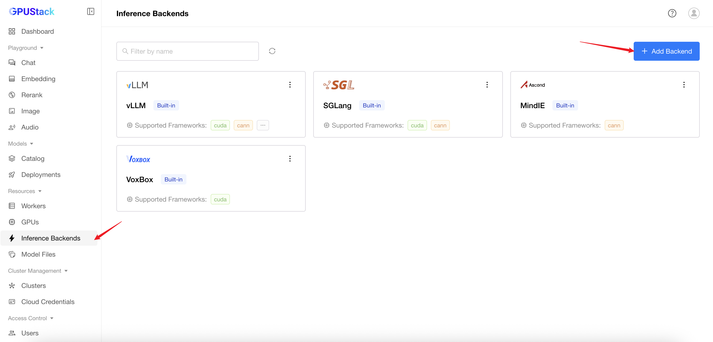
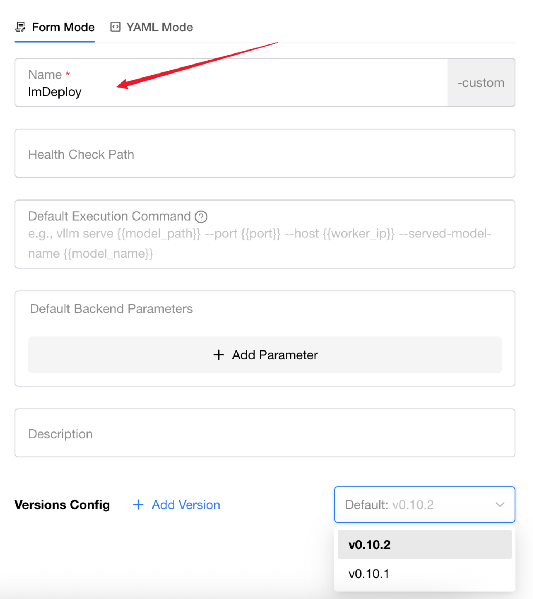
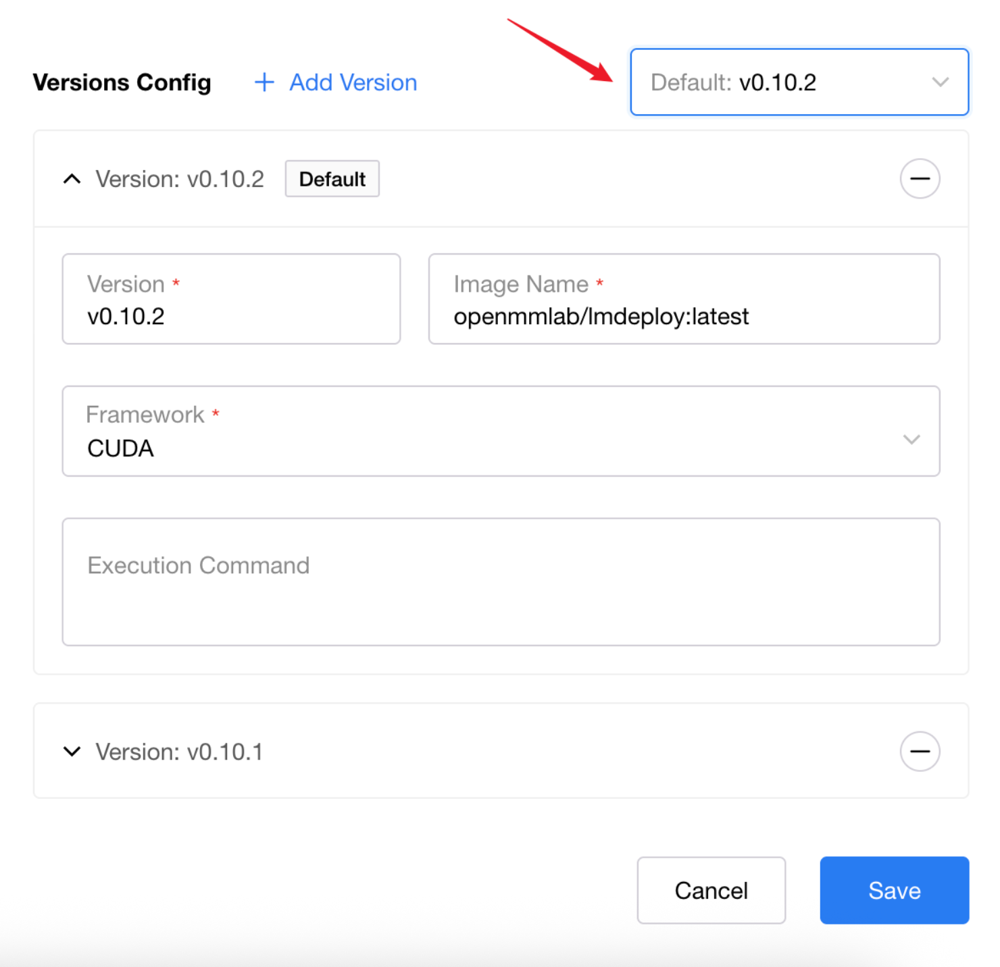
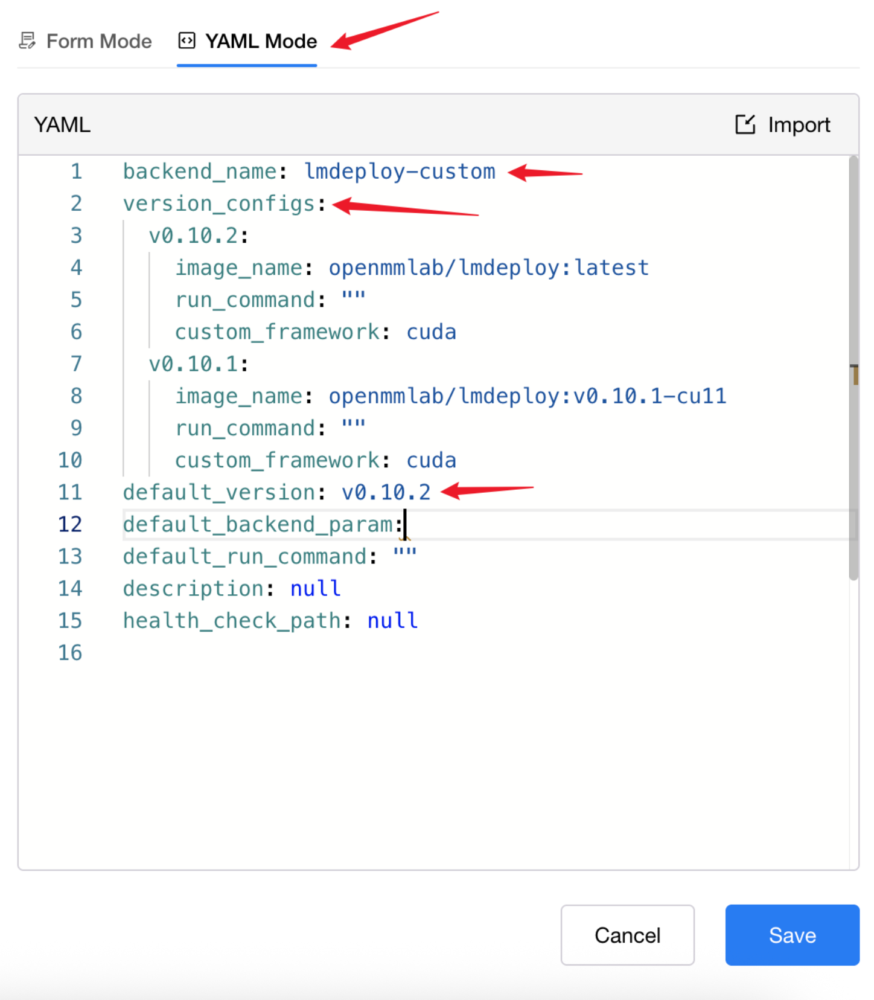
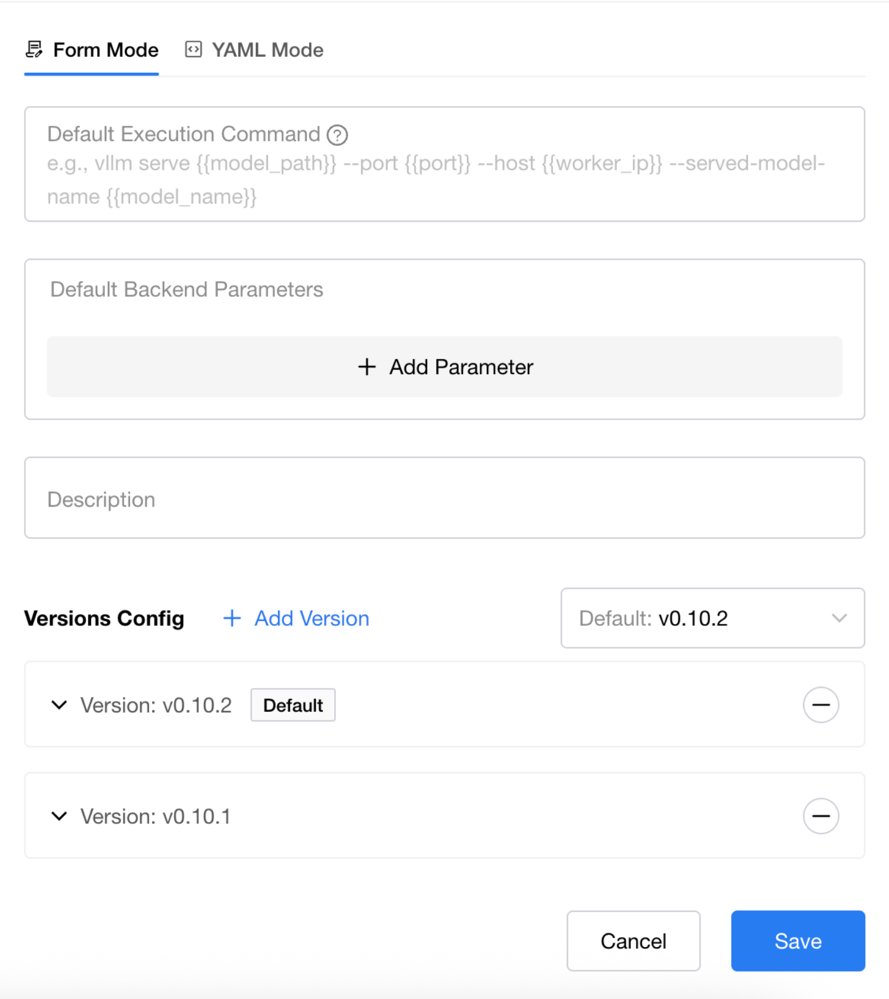
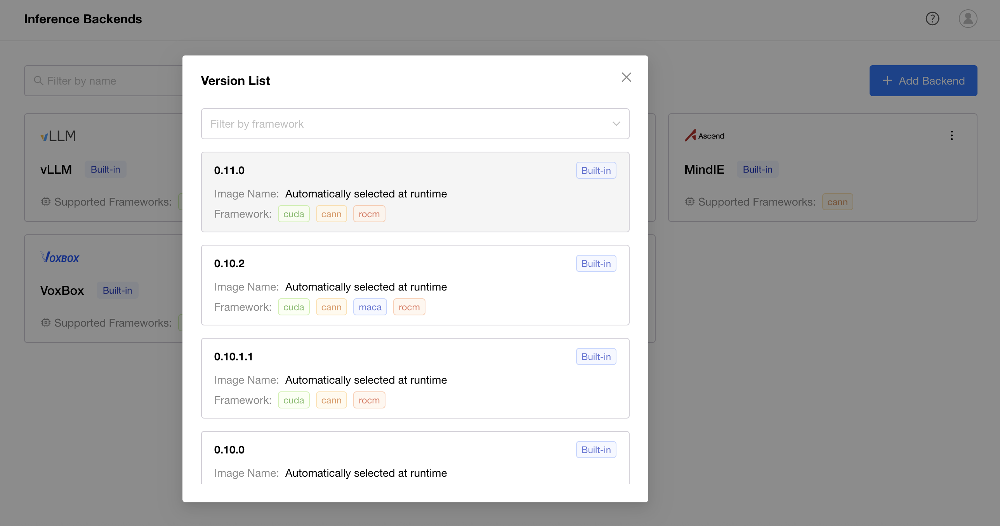
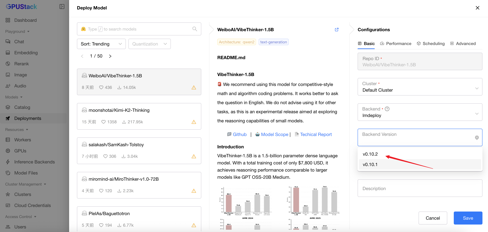

# Inference Backend Management

This article serves as an operational guide for the Inference Backend page. For supported built-in backends and their capabilities, see [Built-in Inference Backends](built-in-inference-backends.md).

For guidelines for configuring custom backends and examples of custom backends that have been verified to work, see [Custom Inference Backends](../tutorials/using-custom-backends.md).

## Parameter Description

| Parameter Name             | Description                                                                                                                                                                                                                                                                                                                                                                                              | Required |
|----------------------------|----------------------------------------------------------------------------------------------------------------------------------------------------------------------------------------------------------------------------------------------------------------------------------------------------------------------------------------------------------------------------------------------------------|----------|
| Name                       | Inference backend name                                                                                                                                                                                                                                                                                                                                                                                   | Yes      |
| Health Check Path          | Health check path used to verify the backend is up and responding. Default: /v1/models (OpenAI-compatible).                                                                                                                                                                                                                                                   | No       |
| Default Execution Command  | Container startup command/args. For example (vLLM): `vllm serve {{model_path}} --port {{port}} --served-model-name {{model_name}} --host {{worker_ip}}`. The placeholders `{{model_path}}`, `{{model_name}}`, `{{port}}`, and `{{worker_ip}}` are automatically substituted when the deployment is scheduled to a worker. | No       |
| Default Backend Parameters | Pre-populate the Advanced Backend Parameters section during deployment; you can adjust them before launching                                                                                                                                                                                                                                                                                             | No       |
| Description                | Description                                                                                                                                                                                                                                                                                                                                                                                              | No       |
| Version Configs            | Configure available versions of this backend                                                                                                                                                                                                                                                                                                                                                             | Yes      |
| Default Version            | Preselected during deployment. If you don’t choose a version, its image is used                                                                                                                                                                                                                                                                                                                          | No       |

Version Configs parameter description:

| Parameter Name                  | Description                                         | Required |
|---------------------------------|-----------------------------------------------------|----------|
| Version                         | Version name shown in the Backend Version dropdown during deployment | Yes      |
| Image Name                      | Container image name for the backend (e.g., `ghcr.io/org/image:tag`) | Yes      |
| Framework (custom_framework) | Backend framework (internal identifier: `custom_framework`). Deployment and scheduling are filtered by supported frameworks | Yes      |
| Execution Command               | Version-specific startup command. If omitted, the Default Execution Command is used | No       |

## Inference Backends List

You can browse and manage inference backends on the `Inference Backends` page.
The list supports filtering by inference backend name.

The screenshot below shows the `Inference Backends` page:

## Flexible Testing Deployment
Use this mode to quickly verify or tweak the image and startup command without editing the backend definition.

1. Navigate to the Deployments page, click the "Deploy Model" button, and choose any model source.
2. In the Basic tab, open the "Backend" dropdown and select "Custom" under the "Built-in" section.
3. Two fields appear: `image_name` and `run_command`. These override the backend configuration for this deployment only.
4. Review the remaining required settings and submit the deployment.

## Create Inference Backend

1. Navigate to the `Inference Backends` page.
2. Click `Add Backend`.
3. Choose between **Form Mode** and **YAML Mode**.
4. Newly created inference backend automatically append the suffix **-custom**.
5. Every inference backend must contain at least one version.

### Form Mode

1. Fill the inference backend `Name` and add at least one `Version`.

**Add Versions**

1. Specify the `Version` and its corresponding `Image Name`.
2. Select a `Framework` that is supported by the image and appropriate for the target device.
3. When multiple versions exist, you may designate one as the **default version**.
4. Click the `Save` button.

### Yaml Mode

Click the `Yaml Mode` tab at the top of the modal.

1. Fill in the `backend_name` and `version_configs` fields. default_version is optional.
2. The inference backend name must be endwith **-custom**.
2. Click the `Save` button.

## Update Custom Inference Backend

1. Navigate to the `Inference Backends` page.
2. Find the inference backend you want to edit.
3. Hover over the card's dropdown button.
3. Click the `Edit` button in the dropdown.
4. Update the editable attributes in **Form Mode** or **YAML Mode**.
5. Click the `Save` button.

## Update Built-in Inference Backend

1. Navigate to the `Inference Backends` page.
2. Find the inference backend you want to edit.
3. Hover over the card's dropdown button.
3. Click the `Edit` button in the dropdown.
4. Update the editable attributes in **Form Mode** or **YAML Mode**:

    - For built-in inference backends, adding versions is optional.
    - However, built-in inference backends cannot set a default version.

5. Click the `Save` button.

## Delete Inference Backend

1. Navigate to the `Inference Backends` page.
2. Find the inference backend you want to delete.(Built-in inference backends cannot be deleted.)
3. Hover over the card’s dropdown button.
3. Click the `Delete` button in the dropdown.
4. Confirm the deletion.

## View Versions

1. Navigate to the `Inference Backends` page.
2. Click the inference backend card you want to inspect.
3. Filter versions by framework if needed.
4. For built-in inference backends, both built-in and custom-added versions will be displayed.

## Use Inference Backend

1. Navigate to the `Deployments` page.
2. Click the `Deploy Model`, then select `Hugging Face` in the dropdown.
3. Search the model you want to deploy.
4. In the Backend dropdown, you will see two groups:
    - **Built-in**
    - **User-defined** (your custom inference backends)
5. Select a backend version if needed. The version list includes both built-in and custom versions.

