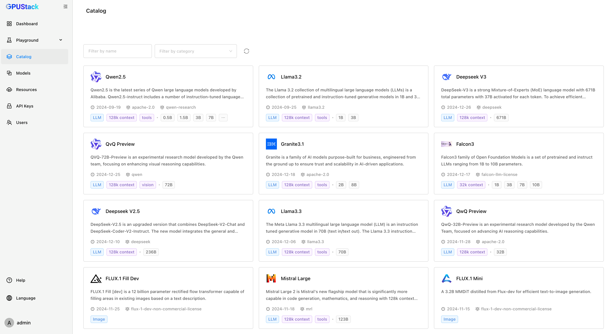

# Model Catalog

The Model Catalog is an index of popular models to help you quickly find and deploy models.

## Browse Models

You can browse the Model Catalog by navigating to the `Catalog` page. You can filter models by name and category. The following screenshot shows the Model Catalog page:



## Deploy a Model from the Catalog

You can deploy a model from the Model Catalog by clicking the model card. A model deployment configuration page will appear. You can review and customize the deployment configuration and click the `Save` button to deploy the model.

## Customize Model Catalog

You can customize the Model Catalog by providing a YAML file via GPUStack server configuration using the `--model-catalog-file` flag. It accepts either a local file path or a URL. You can refer to the built-in model catalog file [here](https://github.com/gpustack/gpustack/blob/main/gpustack/assets/model-catalog.yaml) for the schema. It contains a list of model sets, each with model metadata and templates for deployment configurations.

The following is an example model set in the model catalog file:

```yaml
- name: Deepseek R1 0528
  description: DeepSeek-R1-0528 is a minor version of the DeepSeek R1 model that features enhanced reasoning depth and inference capabilities. These improvements are achieved through increased computational resources and algorithmic optimizations applied during post-training. The model delivers strong performance across a range of benchmark evaluations, including mathematics, programming, and general logic, with overall capabilities approaching those of leading models such as O3 and Gemini 2.5 Pro.
  home: https://www.deepseek.com
  icon: /static/catalog_icons/deepseek.png
  categories:
    - llm
  capabilities:
    - context/128K
  size: 671
  licenses:
    - mit
  release_date: "2025-05-28"
  specs:
    - mode: throughput
      quantization: FP8
      gpu_filters:
        vendor: nvidia
        compute_capability: ">=9.0" # Hopper or later
      source: huggingface
      huggingface_repo_id: deepseek-ai/DeepSeek-R1-0528
      backend: SGLang
      backend_parameters:
        - --enable-dp-attention
        - --context-length=32768
    - mode: standard
      quantization: FP8
      source: huggingface
      huggingface_repo_id: deepseek-ai/DeepSeek-R1-0528
      backend: vLLM
      backend_parameters:
        - --max-model-len=32768
```

### Using Model Catalog in Air-Gapped Environments

The built-in model catalog sources models from either Hugging Face or ModelScope. If you are using GPUStack in an air-gapped environment without internet access, you can customize the model catalog to use a local-path model source. Here is an example:

```yaml
- name: Deepseek R1 0528
  description: DeepSeek-R1-0528 is a minor version of the DeepSeek R1 model that features enhanced reasoning depth and inference capabilities. These improvements are achieved through increased computational resources and algorithmic optimizations applied during post-training. The model delivers strong performance across a range of benchmark evaluations, including mathematics, programming, and general logic, with overall capabilities approaching those of leading models such as O3 and Gemini 2.5 Pro.
  home: https://www.deepseek.com
  icon: /static/catalog_icons/deepseek.png
  categories:
    - llm
  capabilities:
    - context/128K
  size: 671
  licenses:
    - mit
  release_date: "2025-05-28"
  specs:
    - mode: throughput
      quantization: FP8
      gpu_filters:
        vendor: nvidia
        compute_capability: ">=9.0" # Hopper or later
      source: local_path
      local_path: /path/to/DeepSeek-R1-0528
      backend: SGLang
      backend_parameters:
        - --enable-dp-attention
        - --context-length=32768
    - mode: standard
      quantization: FP8
      source: local_path
      # assuming you have /path/to/DeepSeek-R1-0528 directory
      local_path: /path/to/DeepSeek-R1-0528
      backend: vLLM
      backend_parameters:
        - --max-model-len=32768
```

### Template Variables

The following template variables are available for the deployment configuration:

- `{size}`: Model size in billion parameters.
- `{quantization}`: Quantization method of the model.
- `{data_dir}`: GPUStack data directory path.
