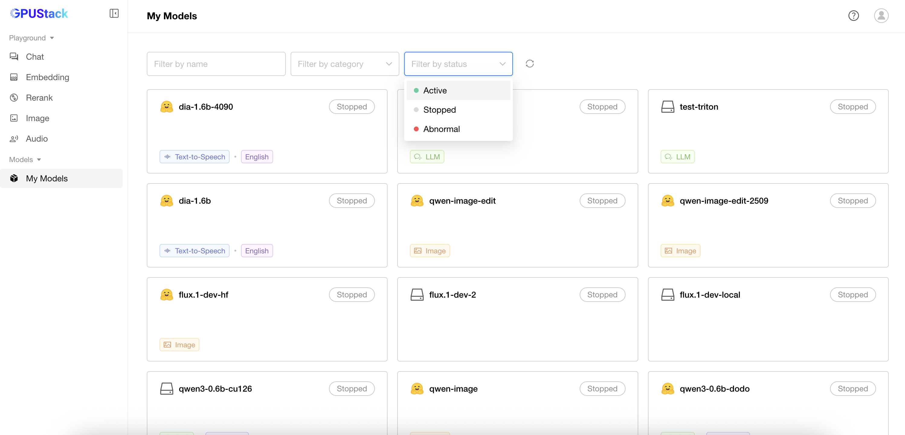

# My Models

Non-admin users can view all models they have permission to access. The model list supports filtering by name, category, and status.

There are three status:

  - **Ready**: The model is running normally.
  - **Stopped**: The model is not running.
  - **Not Ready**: The model has not finished starting and may be in states such as Starting, Downloading, or other in-progress statuses.

