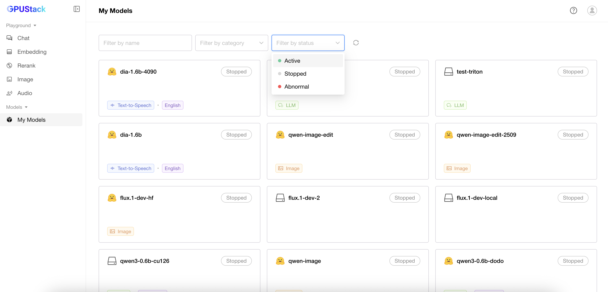

# My Models

Non-admin users can view all models they have permission to access. The model list supports filtering by name, category, and status.

There are three status:
  - **Active**: The model is running normally.
  - **Stopped**: The model is not running.
  - **Abnormal**: The number of ready replicas does not match the configured replicas.

