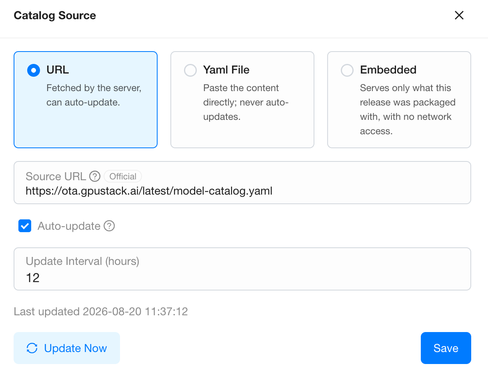
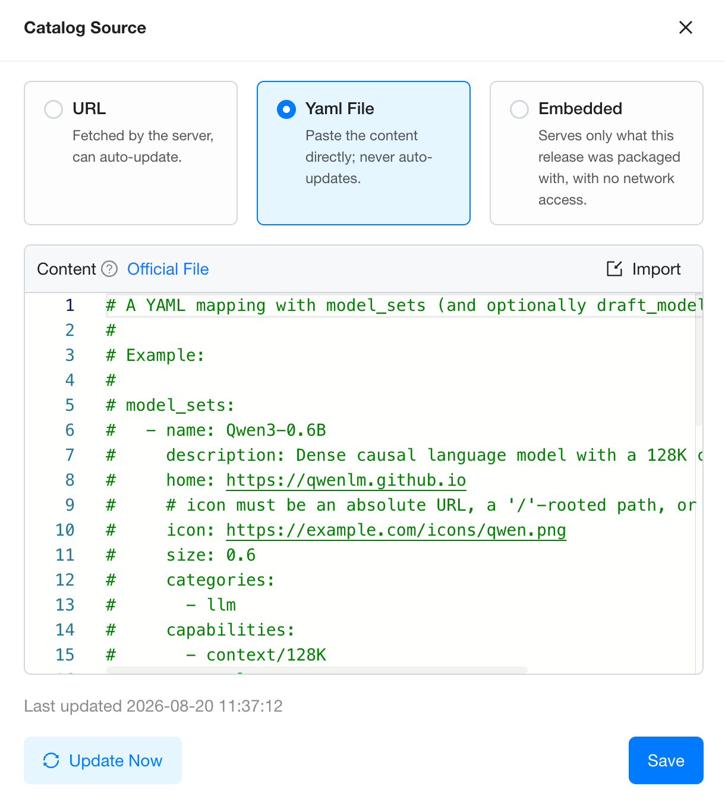
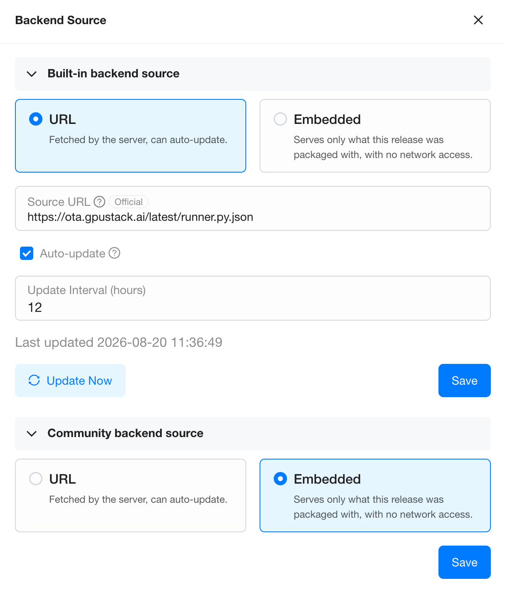

# OTA Content Updates

GPUStack fetches its model catalog, Community Backend Marketplace and built-in backend versions from an official OTA server, so new models and backend versions reach a running GPUStack service without an upgrade or a restart.

Updates are on by default, and the content comes from a single host, `https://ota.gpustack.ai/latest`. If your GPUStack service runs in a restricted network, allowing that one host is enough. You can also switch to a file you maintain yourself that is reachable from that network. A third option is to host your own copy of the OTA server and point GPUStack at it at startup with `--ota-server-url`. All three kinds of content still update automatically, they just read from your copy. See [start](../cli-reference/start.md).

Sources are configured on the page that serves the content. The catalog is on the `Model Service > Catalog` page, and both kinds of backend content are on the `Model Service > Inference Backends` page. Both use the `Manage Sources` button, which only platform admins can see.

## What Updates Over the Air

| Content | What the OTA server publishes |
| --- | --- |
| Model catalog | New and revised catalog entries |
| Community Backend Marketplace | New and revised community backend definitions |
| Built-in backend versions | New versions, and their images, for built-in backends such as vLLM and SGLang |

Each kind is served by one **source** at a time, and one source file carries all of that content. On save it replaces what that kind currently serves instead of adding to it, so any entry missing from the new file is taken out of service with it.

| Source | Serves | Auto-updates |
| --- | --- | --- |
| `URL` | A file the server fetches and stores. | Optional |
| `Yaml File` | A file you paste in. Model catalog only. | No |
| `Embedded` | Only what this release was packaged with. No network access. | No |

Leave a source empty and that kind keeps following the OTA server, tagged `Official` in the UI. Once you configure a URL or a Yaml file of your own, that kind stops following the OTA server and uses what you provide.

A `Source URL` of your own has to meet these conditions:

- It must be `http(s)`, and it must not carry credentials.
- It must point at the file itself, not at a repository page.
- The file must be no larger than 4 MB, and it must be UTF-8.

The file is fetched by the server, so no worker needs access to that address.

## Configure the Catalog Source

1. Navigate to the `Model Service > Catalog` page.
2. Click the `Manage Sources` button.
3. In the `Catalog Source` drawer, choose one of the two source types:

    - `URL`: fill in `Source URL`.

        

    - `Yaml File`: paste the content into `Content`, or click `Import` to load a file into the editor.

        

4. Click `Save`.

!!! note

    Start from the content that is already there, not from an empty file. In `Yaml File`, click `Official File` to download what the OTA server currently serves. In `URL`, the `Source URL` box is already filled in with the address it currently follows, so you can copy it from there.

## Configure the Backend Sources

The two kinds of backend content update independently, and each has its own source. One drawer configures both, as panels:

1. Navigate to the `Model Service > Inference Backends` page.
2. Click the `Manage Sources` button.
3. In the `Backend Source` drawer, expand the panel you need:
    - `Built-in backend source`: the versions and images of the built-in backends (vLLM, SGLang, MindIE, VoxBox).
    - `Community backend source`: the Community Backend Marketplace.
4. Choose `URL` and fill in `Source URL`. Both kinds support a URL only, not pasted content.
5. Click the `Save` button in that panel. Each panel saves on its own.

!!! warning

    If an update would remove a backend version that a deployment still uses, the save is refused and the message lists the models. Scale those models to zero first, or move them onto a version the new file still carries, then save again.

!!! note

    A community backend the new file no longer carries is kept as a custom backend when it is enabled or carries a version you added by hand, so the models on it keep running. A source that publishes it again turns it back into a community backend, though you enable it again yourself. One that is disabled and untouched is removed instead, so a `default_env` you had edited on it is not restored when it comes back.

## Control the Update Schedule

Each source has its own update settings:

- `Auto-update`: whether to check for updates automatically at a fixed interval. It is on by default while a kind follows the OTA server. After you switch to a `URL` of your own it is off by default, so select it yourself.
- `Update Interval (hours)`: appears once `Auto-update` is selected. It is the interval between automatic checks, 12 hours by default, and you can change it.
- `Update Now`: check once immediately, without waiting for the interval.

After you change `Source URL`, click `Save`. It stores the new address and fetches it right away. Nothing is downloaded again when the content has not changed.

!!! note

    An OTA server that is temporarily unreachable does not affect service. The content already fetched keeps being served, the error is recorded, and the next attempt follows within the hour. A cluster that has never reached the OTA server serves the embedded content. That content is complete, it just does not include anything published after your current GPUStack version.

## Stop Updates and Serve Embedded Content

Clearing `Auto-update` only stops the checks, and the content already fetched is still served. To stop serving fetched content altogether, choose `Embedded` and save. That kind then serves only what the release was packaged with, the same as a fresh offline install.

Switch to `Embedded` when, for example, a catalog entry does not suit your cluster, or the images of some backend versions cannot be pulled in your environment.

- **No configuration is lost.** The URL and the content you entered are kept, they are only taken out of service. Choose `URL` or `Yaml File` again to restore them.
- **No network is needed.** You can switch to `Embedded` even when the file you want to stop using is already unreachable.
- It affects this one kind of content, takes effect immediately on every server, and needs no restart.
- Click `Reset to Official Source` to go back to following the OTA server. This clears what you entered.

!!! warning

    Switching to `Embedded` leaves fewer backend versions available, so it can be refused in the same way. Before switching, check that no deployment still uses a version that only the fetched content carries.
