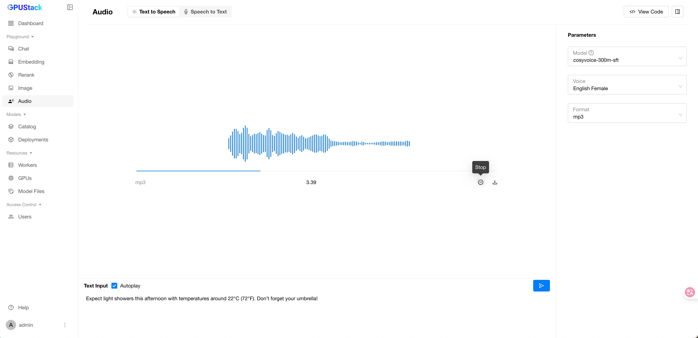

# Audio Playground

The Audio Playground is a dedicated space for testing and experimenting with GPUStack’s text-to-speech (TTS) and speech-to-text (STT) APIs. It allows users to interactively convert text to audio and audio to text, customize parameters, and review code examples for seamless API integration.

## Text to Speech

Switch to the "Text to Speech" tab to test TTS models.

### Text Input

Enter the text you want to convert, then click the `Submit` button to generate the corresponding speech.

### Clear Text

Click the `Clear` button to reset the text input and remove the generated speech.

### Select Model

Select an available TTS model in GPUStack by clicking the model dropdown at the top-right corner of the playground UI.

### Customize Parameters

Customize the voice and format of the audio output.

!!! tip

    Supported voices may vary between models.

### View Code

After experimenting with input text and parameters, click the `View Code` button to see how to call the API with the same input. Code examples are provided in `curl`, `Python`, and `Node.js`.

## Speech to Text

Switch to the "Speech to Text" tab to test STT models.

### Provide Audio File

You can provide audio for transcription in two ways:

1. **Upload an audio file**.
2. **Record audio online**.

!!! note

    If the online recording is not available, it could be due to one of the following reasons:

    1. For HTTPS or `http://localhost` access, microphone permissions must be enabled in your browser.
    2. For access via `http://{host IP}`, the URL must be added to your browser's trusted list.

          **Example:**
          In Chrome, navigate to `chrome://flags/`, add the GPUStack URL to "Insecure origins treated as secure," and enable this option.

### Select Model

Select an available STT model in GPUStack by clicking the model dropdown at the top-right corner of the playground UI.

### Copy Text

Copy the transcription results generated by the model.

### Customize Parameters

Select the appropriate language for your audio file to optimize transcription accuracy.

### View Code

After experimenting with audio files and parameters, click the `View Code` button to see how to call the API with the same input. Code examples are provided in `curl`, `Python`, and `Node.js`.
