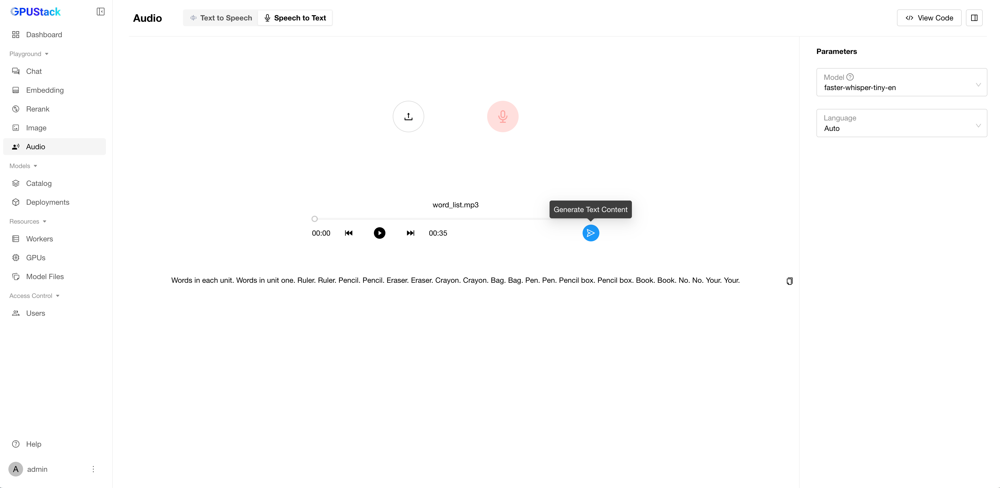

# Audio Playground

You can test the model's text-to-speech and speech-to-text features in this section.

## Text to Speech

Switch to the "Text to Speech" tab to test text-to-speech models.

### Text Input

Enter the text you want to convert, then click the `Submit` button to generate the corresponding speech.

### Clear Text

Click the `Clear` button to reset the text input and remove the generated speech.

### Select Model

You can select available models in GPUStack by clicking the model dropdown at the top-left corner of each model panel.

### Customize Parameters

Customize the voice and format of the audio output.

!!! warning
    
    Supported voices may vary between models.

### View Code

Once you've done experimenting with the input text and parameters, you can click the `View Code` button to check how you can call the API with the same input by code. Code examples in `curl`, `Python`, and `Node.js` are provided.

## Speech to Text

Switch to the "Speech to Text" tab to test speech-to-text models.

### Provide Audio File

You can provide the audio for conversion in two ways:

1. **Upload an audio file**.
2. **Record audio online**.

!!! warning
    If the online recording is not available, it could be due to one of the following reasons:

    1. For HTTPS or `http://localhost` access, microphone permissions must be enabled in your browser.  
    2. For access via `http://{host IP}`, the URL must be added to your browser's trusted list.  

          **Example:** In Chrome, go to `chrome://flags/`, add the GPUStack URL to "Insecure origins treated as secure," and enable this option.  

### Select Model

You can select available models in GPUStack by clicking the model dropdown at the top-left corner of each model panel.

### Copy Text

Copy the generated transcription results.

### Customize Parameters

Select the appropriate language for your audio file.

### View Code

Once you've done experimenting with the input text and parameters, you can click the `View Code` button to check how you can call the API with the same input by code. Code examples in `curl`, `Python`, and `Node.js` are provided.
