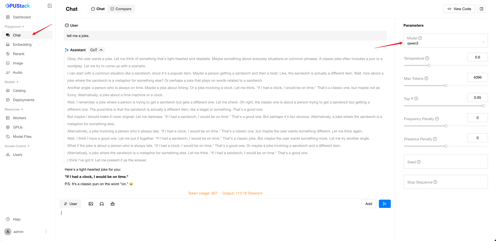

## Chat Playground

Interact with the chat completions API. The following is an example screenshot:

### Prompts

You can adjust the prompt messages on the left side of the playground. There are three role types of prompt messages: system, user, and assistant.

- **System**: Typically a predefined instruction or guidance that sets the context, defines the behavior, or imposes specific constraints on how the model should generate its responses.
- **User**: The input or query provided by the user (the person interacting with the LLM).
- **Assistant**: The response generated by the LLM.

#### Edit System Message

You can add and edit the system message at the top of the playground.

#### Edit User and Assistant Messages

To add a user or assistant message, click the `Add` button.

To remove a user or assistant message, click the minus button at the right corner of the message.

To change the role of a message, click the `User` or `Assistant` text at the beginning of the message.

### Upload Image

You can add images to the prompt by clicking the `Upload Image` button.

### Upload Audio

You can add audio files to the prompt by clicking the `Upload Audio` button.

### Clear Prompts

Click the `Clear` button to clear all the prompts.

### Select Model

You can select available models in GPUStack by clicking the model dropdown at the top-right corner of the playground. Please refer to [Model Deployment Management](../model-deployment-management.md) to learn about how to deploy models.

### Customize Parameters

You can customize completion parameters in the `Parameters` section.

### Do Completion

You can do a completion by clicking the `Submit` button or pressing Enter.

### View Code

Once you've done experimenting with the prompts and parameters, you can click the `View Code` button to check how you can call the API with the same input by code. Code examples in `curl`, `Python`, and `Node.js` are provided.

## Compare Playground

You can compare multiple models in the playground. The following is an example screenshot:

### Comparison Mode

You can choose the number of models to compare by clicking the comparison view buttons, including 2, 3, 4 and 6-model comparison.

### Prompts

You can adjust the prompt messages similar to the chat playground.

### Upload Image

You can add images to the prompt by clicking the `Upload Image` button.

### Upload Audio

You can add audio files to the prompt by clicking the `Upload Audio` button.

### Clear Prompts

Click the `Clear` button to clear all the prompts.

### Select Model

You can select available models in GPUStack by clicking the model dropdown at the top-left corner of each model panel.

### Customize Parameters

You can customize completion parameters by clicking the settings button of each model.
