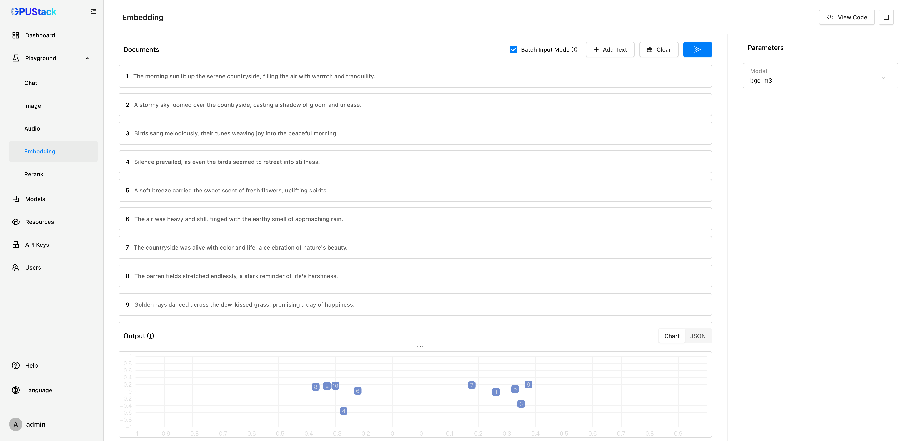

# Embedding Playground

The Embedding Playground lets you test the model’s ability to convert text into embeddings. It allows you to experiment with multiple text inputs, visualize embeddings, and review code examples for API integration.

## Add Text

Add at least two text entries and click the `Submit` button to generate embeddings.

## Batch Input Text

Enable `Batch Input Mode` to automatically split multi-line text into separate entries based on line breaks. This is useful for processing multiple text snippets in a single operation.

## Visualization

Visualize the embedding results using PCA (Principal Component Analysis) to reduce dimensions and display them on a 2D plot. Results can be viewed in two formats:

1. **Chart** - Display PCA results visually.
2. **JSON** - View raw embeddings in JSON format.

In the chart, the distance between points represents the similarity between corresponding texts. Closer points indicate higher similarity.

## Clear

Click the `Clear` button to reset text entries and clear the output.

## Select Model

You can select available models in GPUStack by clicking the model dropdown at the top-right corner of the playground UI.

## View Code

After experimenting with the text inputs, click the `View Code` button to see how you can call the API with the same input. Code examples are provided in `curl`, `Python`, and `Node.js`.
