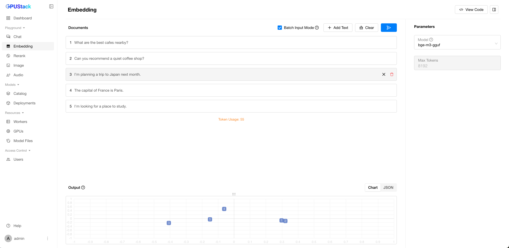

# Embedding Playground

You can test the model's ability to transform text into embeddings in this section.

## Add Text

Add at least two text entries and click the `Submit` button.

## Batch Input Text

Enable `Batch Input Mode` to automatically split multi-line text into separate entries based on line breaks.

## Visualization

Visualize the embedding results using PCA to reduce dimensions and display them on a 2D plot. Results can be viewed in two ways:

1. **Chart** - Display PCA results.
2. **JSON** - View raw embeddings for copying.

In the chart, the distance between points represents the similarity between the corresponding texts. Closer points indicate higher similarity.

## Clear

Click the `Clear` button to reset documents and output.

## Select Model

You can select available models in GPUStack by clicking the model dropdown at the top-left corner of each model panel.

## View Code

Once you've done experimenting with the input text and parameters, you can click the `View Code` button to check how you can call the API with the same input by code. Code examples in `curl`, `Python`, and `Node.js` are provided.
