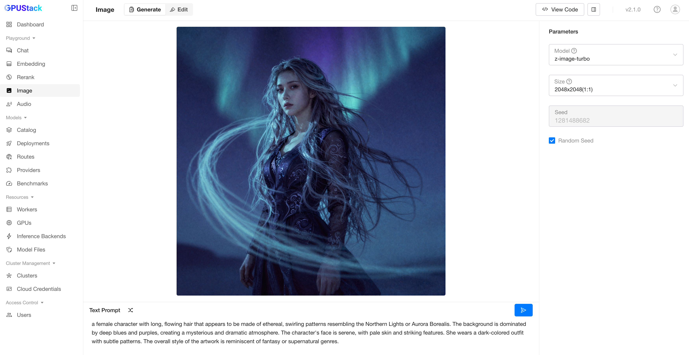
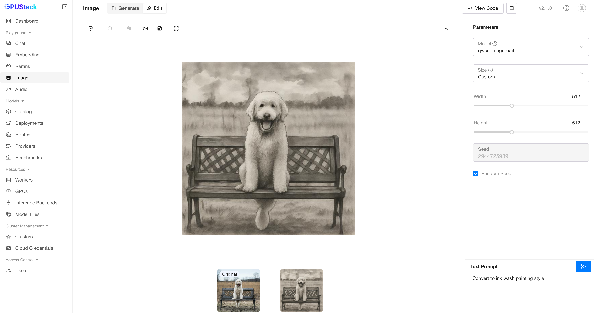

# Image Playground

The Image Playground is a dedicated space for testing and experimenting with GPUStack’s image generation APIs. It allows users to interactively explore the capabilities of different models, customize parameters, and review code examples for seamless API integration.

## Generate Image

### Prompt

You can input or randomly generate a prompt, then click the `Submit` button to generate an image.

## Edit Image

Upload an image and highlight the areas you want to modify by painting over them. Then, enter a prompt and `Submit`. If no areas are painted, the entire image will be modified.

### Save Mask

Click `Save Mask` to save the painted areas as a separate image.

### Download Image

Click `Download Image` to save the edited image.

## Select Model

You can select available models in GPUStack by clicking the model dropdown at the top-right corner of the playground UI.

## Parameters

| Parameter         | Default    | Description                                                                                                                                                         |
| ----------------- | ---------- | ------------------------------------------------------------------------------------------------------------------------------------------------------------------- |
| `Size`            | `512x512`  | The size of the generated image in 'widthxheight' format.                                                                                                           |
| `Seed`            | (empty)    | Random seed.                                                                                                                                                        |

## View Code

After experimenting with prompts and parameters, click the `View Code` button to see how to call the API with the same inputs. Code examples are provided in `curl`, `Python`, and `Node.js`.
