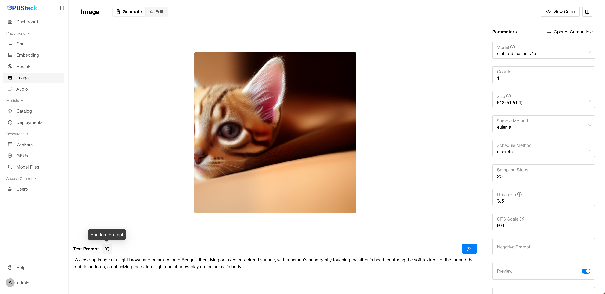
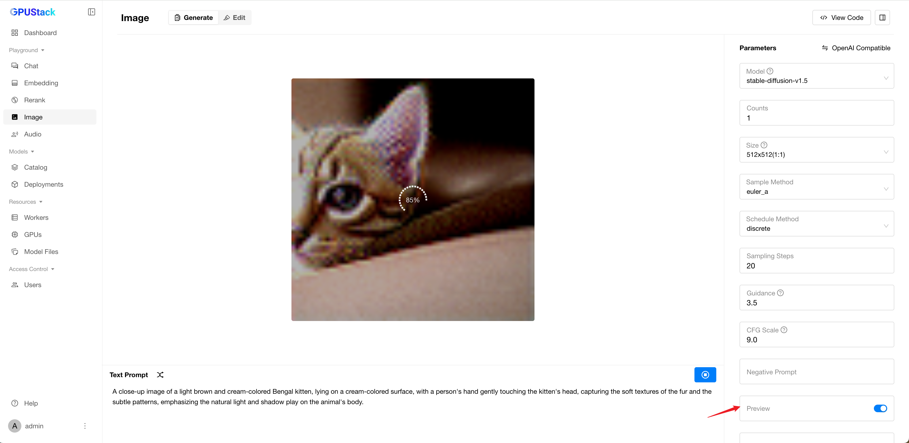
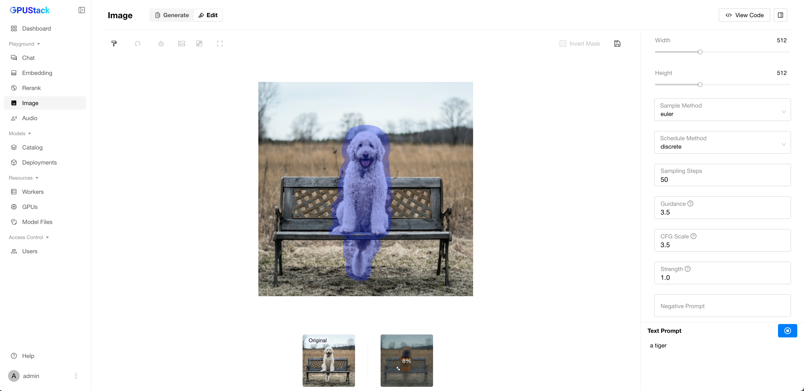
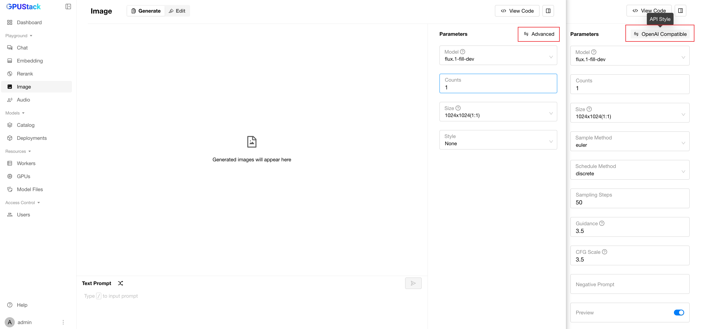

# Image Playground

The Image Playground is a dedicated space for testing and experimenting with GPUStack’s image generation APIs. It allows users to interactively explore the capabilities of different models, customize parameters, and review code examples for seamless API integration.

## Generate Image

## Prompt

You can input or randomly generate a prompt, then click the Submit button to generate an image.

## Clear Prompt

Click the `Clear` button to reset the prompt and remove the generated image.

## Preview

Select the `Faster` option for the `Preview` parameter to see the image generation progress in real-time.

## Edit Image

Upload an image and highlight the areas you want to modify by painting over them. Then, enter a prompt and `submit`. If no areas are painted, the entire image will be modified.

## Save Mask

Click `Save Mask` to save the painted areas as a separate image.

## Download Image

Click `Download Image` to save the edited image.

## Preview

You can enable `Preview` while editing images to see the changes in real-time.

## Select Model

You can select available models in GPUStack by clicking the model dropdown at the top-right corner of the playground UI.

## Customize Parameters

You can customize the image generation parameters by switching between two API styles:

1. **OpenAI-compatible mode**.
2. **Advanced mode**.

### Advanced Parameters

| Parameter         | Default    | Description                                                                                                                                                         |
| ----------------- | ---------- | ------------------------------------------------------------------------------------------------------------------------------------------------------------------- |
| `Counts`          | `1`        | Number of images to generate.                                                                                                                                       |
| `Size`            | `512x512`  | The size of the generated image in 'widthxheight' format.                                                                                                           |
| `Sample Method`   | `euler_a`  | The sampler algorithm for image generation. Options include 'euler_a', 'euler', 'heun', 'dpm2', 'dpm++2s_a', 'dpm++2m', 'dpm++2mv2', 'ipndm', 'ipndm_v', and 'lcm'. |
| `Schedule Method` | `discrete` | The noise scheduling method.                                                                                                                                        |
| `Sampling Steps`  | `10`       | The number of sampling steps to perform. Higher values may improve image quality at the cost of longer processing time.                                             |
| `Guidance`       | `3.5`      | The scale for classifier-free guidance. A higher value increases adherence to the prompt.                                                                           |
| `CFG Scale`      | `4.5`      | The scale for classifier-free guidance. A higher value increases adherence to the prompt.                                                                           |
| `Negative Prompt` | (empty)    | A negative prompt to specify what the image should avoid.                                                                                                           |
| `Preview`         | `Faster`   | Controls how the image generation process is displayed. Options include 'Faster', 'Normal', 'None'.                                                                                                    |
| `Seed`            | (empty)    | Random seed.                                                                                                                                                        |

!!! note

    The maximum image size is restricted by the model's deployment settings. See the diagram below:

## View Code

After experimenting with prompts and parameters, click the `View Code` button to see how to call the API with the same inputs. Code examples are provided in `curl`, `Python`, and `Node.js`.
