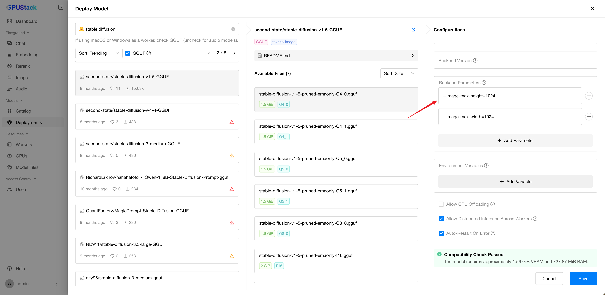

# Image Playground

You can test the model's image generation capabilities in this section.

## Prompt

You can input or randomly generate a prompt, then click the Submit button to generate an image.

## Clear Prompt

Click the `Clear` button to reset the prompt and remove the generated image.

## Select Model

You can select available models in GPUStack by clicking the model dropdown at the top-left corner of each model panel.

## Customize Parameters

You can customize the image generation parameters by switching between two styles:

1. **OpenAI-compatible mode**.
2. **Advanced mode**.

For details on advanced mode parameters, refer to the [documentation](https://github.com/gpustack/llama-box)。

!!! warning

    The maximum image size is restricted by the model's deployment settings. See the diagram below:

## View Code

Once you've done experimenting with the prompts and parameters, you can click the `View Code` button to check how you can call the API with the same input by code. Code examples in `curl`, `Python`, and `Node.js` are provided.
