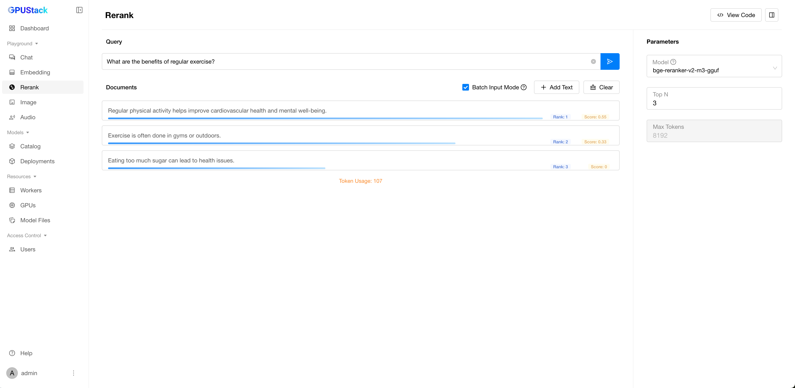

# Rerank Playground

The Rerank Playground allows you to test reranker models that reorder multiple texts based on their relevance to a query. Experiment with various input texts, customize parameters, and review code examples for API integration.

## Add Text

Add multiple text entries to the document for reranking.

## Bach Input Text

Enable `Batch Input Mode` to split multi-line text into separate entries based on line breaks. This is useful for processing multiple text snippets efficiently.

## Clear

Click the `Clear` button to reset the document and query results.

## Query

Input a query and click the `Submit` button to get a ranked list of texts based on their relevance to the query.

## Select Model

Select an available reranker model in GPUStack by clicking the model dropdown at the top-right corner of the playground UI.

## Customize Parameters

In the parameter section, set `Top N` to specify the number of matching texts to retrieve.

## View Code

After experimenting with the input text and query, click the `View Code` button to see how to call the API with the same input. Code examples are provided in `curl`, `Python`, and `Node.js`.
