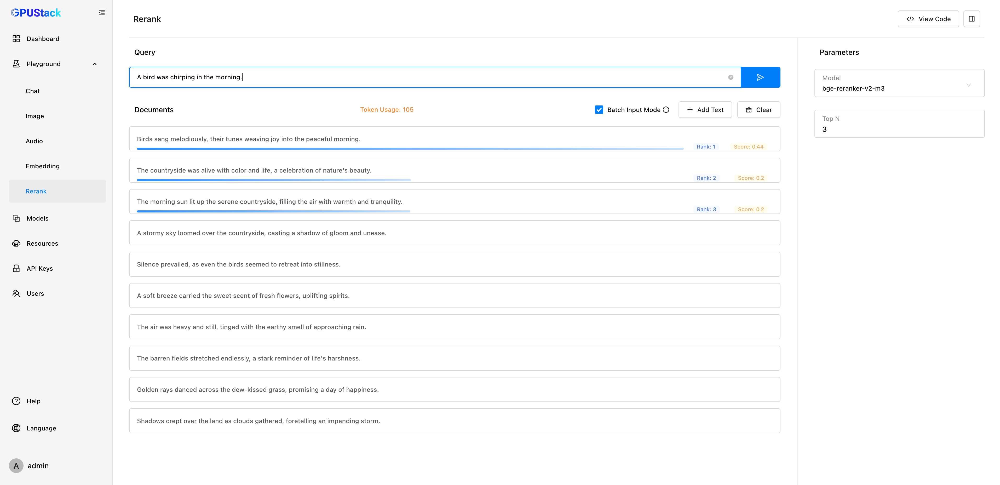

# Rerank Playground

You can test rerank models to reorder multiple texts based on relevance in this section.

## Add Text

Add text entries to the document.

## Bach Input Text

Enable `Batch Input Mode` to split multi-line text into separate entries based on line breaks.

## Clear

Click the `Clear` button to reset the document and query results.

## Query

Input a query and click `Submit` to get a ranked list of similar texts along with their scores.

## Select Model

You can select available models in GPUStack by clicking the model dropdown at the top-left corner of each model panel.

## Customize Parameters

In the parameter section, set `Top N` to specify the number of matching texts to retrieve.

## View Code

Once you've done experimenting with the input text and parameters, you can click the `View Code` button to check how you can call the API with the same input by code. Code examples in `curl`, `Python`, and `Node.js` are provided.
