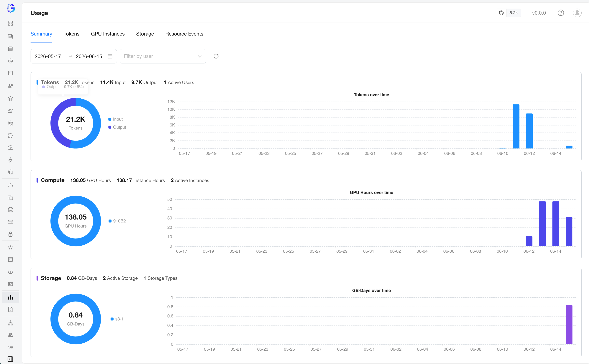
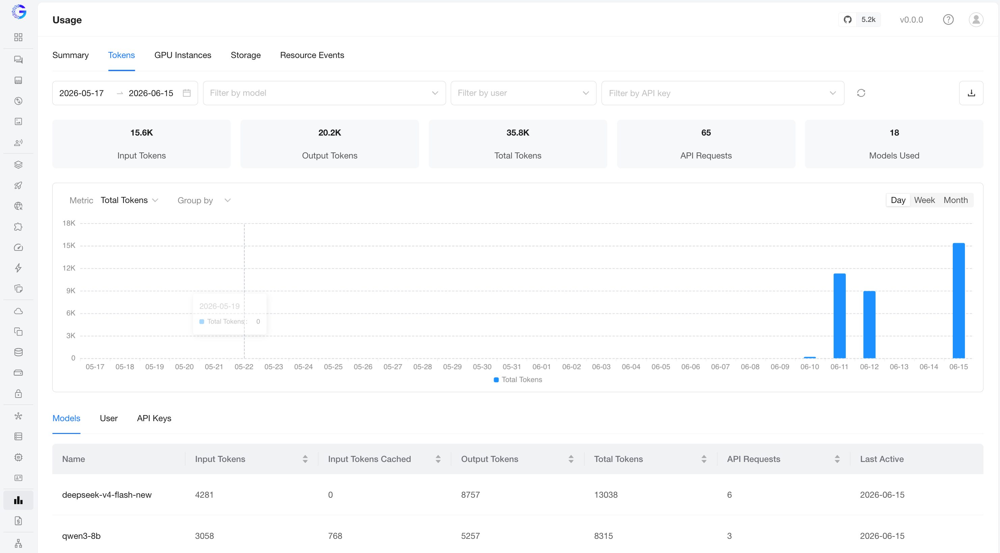
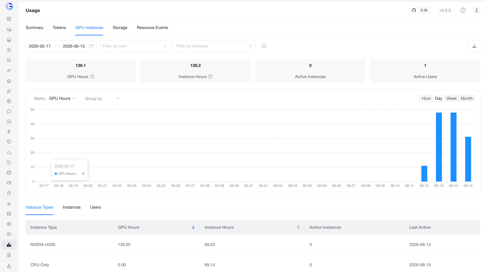
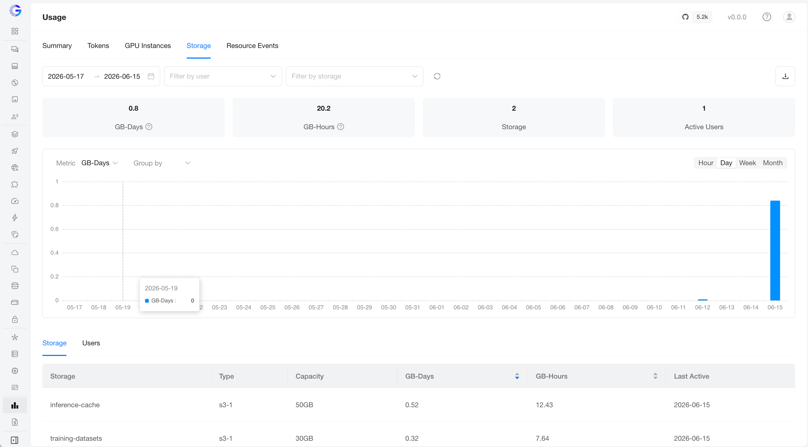
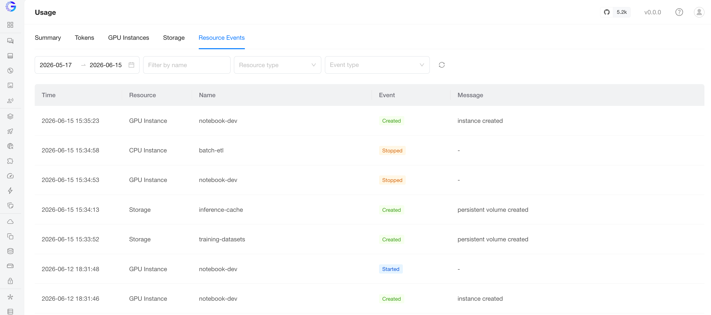

# Usage

The **Usage** page reports how your GPUStack resources are consumed over time — LLM
tokens, GPU/CPU instance runtime, and storage capacity — so you can track adoption,
attribute consumption to users, and reason about cost.

## Accessing the Usage Page

1. Navigate to the `Usage` page from the left navigation (the bar-chart icon).
2. Select a tab — `Summary`, `Tokens`, `GPU Instances`, `Storage`, or `Resource Events`.
3. Set the `date range` (and any other filters) to scope the report.

The tabs are:

- **Summary** — a one-glance overview of tokens, compute, and storage.
- **Tokens** — LLM token consumption, broken down by model / user / API key.
- **GPU Instances** — GPU/CPU instance runtime, broken down by instance type / instance / user.
- **Storage** — storage capacity usage, broken down by storage / user.
- **Resource Events** — the lifecycle audit log behind the compute/storage numbers.

## What gets metered

| Resource          | Metered while…                                                                                   | Bucket granularity |
| ----------------- | ------------------------------------------------------------------------------------------------ | ------------------ |
| Tokens            | An inference request is served through the gateway.                                              | Daily              |
| GPU/CPU instances | The instance is in a running (metered) phase. A **Stopped** or deleted instance does not accrue. | Hourly             |
| Storage           | From creation to deletion — capacity is metered regardless of whether it is attached.            | Hourly             |

## Visibility

GPUStack has two roles — **Admin** and **User** (see [User Management](user-management.md)):

- **Admin** — can view usage across all users, and narrow the view with the **Filter by user**
  control.
- **User** — can view only their own usage; per-user breakdowns are not available.

## Common controls

Every tab (except Resource Events, which has its own filters) shares the same controls:

- **Date range** — the reporting window. Defaults to the last 30 days.
- **Filter by user** — restrict to specific users (admins only).
  The Tokens tab additionally offers **Filter by model** and **Filter by API key**.
- **Refresh** — re-fetch with the current filters.
- **Metric** — which value the trend chart and KPI sort use (e.g. GPU Hours vs Instance Hours).
- **Group by** — split the trend chart into one series per group (e.g. per instance type).
- **Granularity** — the trend bucket. GPU Instances and Storage support
  **Hour / Day / Week / Month**; Tokens supports **Day / Week / Month** only (token usage is a
  daily rollup, so it has no hourly bucket).
- **Export** (download icon, available on Tokens / GPU Instances / Storage) — opens a preview
  of the current filtered breakdown and lets you download it.

## Metric definitions

| Metric                                                        | Meaning                                                                                                             |
| ------------------------------------------------------------- | ------------------------------------------------------------------------------------------------------------------- |
| **Input Tokens**                                              | Prompt tokens. **Input Cached Tokens** is the subset served from the prompt cache.                                  |
| **Output Tokens**                                             | Completion tokens generated.                                                                                        |
| **Total Tokens**                                              | Input + Output.                                                                                                     |
| **Instance Hours**                                            | Wall-clock instance runtime: Σ(uptime) regardless of how many cards the instance holds.                             |
| **GPU Hours**                                                 | Accelerator runtime: Σ(uptime × GPU card count). A 2-GPU instance run for 1 hour = 2 GPU Hours but 1 Instance Hour. |
| **GB-Days**                                                   | Provisioned storage over time: capacity (GB) × days held.                                                           |
| **GB-Hours**                                                  | Same as GB-Days, expressed per hour.                                                                                |
| **Active Instances** / **Active Storages** / **Active Users** | Resources that are still live (not **Deleted**) within the window.                                                  |
| **Last Active**                                               | The most recent bucket in which the resource accrued usage.                                                         |

!!! note

    Deleted resources keep their historical usage — a deleted model, instance, or storage
    still appears in the tables (flagged **Deleted**) and contributes to the totals, but it is
    no longer counted as **Active**.

## Summary

The Summary tab stacks three sections — **Tokens**, **Compute**, and **Storage**. Each shows a
headline stat line, a breakdown donut (by type), and a trend chart over the selected
range, giving you a quick read across all three resource kinds without switching tabs.

## Tokens

Token consumption from LLM inference. KPIs across the top: **Input / Output / Total Tokens**,
**API Requests**, and **Models Used**.

The bottom section groups the detail table three ways:

- **Models** — per model: Input Tokens / Input Cached Tokens / Output Tokens / Total Tokens, API Requests, Last Active.
- **Users** — per user (admins only).
- **API Keys** — per API key.

## GPU Instances

GPU and CPU instance runtime. KPIs: **GPU Hours**, **Instance Hours**, **Active Instances**,
**Active Users**. Choose **GPU Hours** or **Instance Hours** as the chart metric, and group the
trend by **instance type**, **instance**, or **user**.

The detail table groups by:

- **Instance Types** — per instance type: GPU Hours, Instance Hours, Active Instances, Last Active.
- **Instances** — per individual instance.
- **Users** — per user (admins only).

!!! note

    CPU instances have no accelerator, so they contribute to **Instance Hours** but
    not to **GPU Hours**.

## Storage

Storage capacity usage. KPIs: **GB-Days**, **GB-Hours**, **Active Storages**,
**Active Users**. Choose **GB-Days** or **GB-Hours** as the chart metric and group by **storage**
or **user**.

The detail table groups by:

- **Storage** — per volume: Type, Capacity, GB-Days, GB-Hours, Last Active.
- **Users** — per user (admins only).

!!! note

    Because storage is metered from creation to deletion regardless of attachment, storage that
    exists but is idle still accrues GB-Days/GB-Hours.

## Resource Events

The lifecycle audit log behind the compute and storage numbers — one row per metering-relevant
transition. Useful for explaining why a number looks the way it does.

Filters: **date range**, **resource type** (GPU Instance / Storage), **event type**, and a fuzzy
**resource name** search.

## Timezone

All dates and times on the Usage page — trend buckets, **Last Active**, and resource-event
times — are shown in a single configurable **rollup timezone**, so every tab lines up on the same
calendar boundaries. It is controlled by the `GPUSTACK_TIMEZONE` server environment
variable (the legacy `GPUSTACK_USAGE_ROLLUP_TIMEZONE` still works as a deprecated alias) and
defaults to the server's OS local timezone. See
[Environment Variables](../environment-variables.md#usage-tracking-configuration) for details,
including the note on Daylight Saving Time.

## Data retention

Token, compute, and storage rollups are retained for about 13 months, after which they are moved
to archive tables by a background job. Retention windows and archive schedules are configurable
via the `GPUSTACK_*_RETENTION_MONTHS` and `GPUSTACK_*_ARCHIVE_CRON` environment variables.
