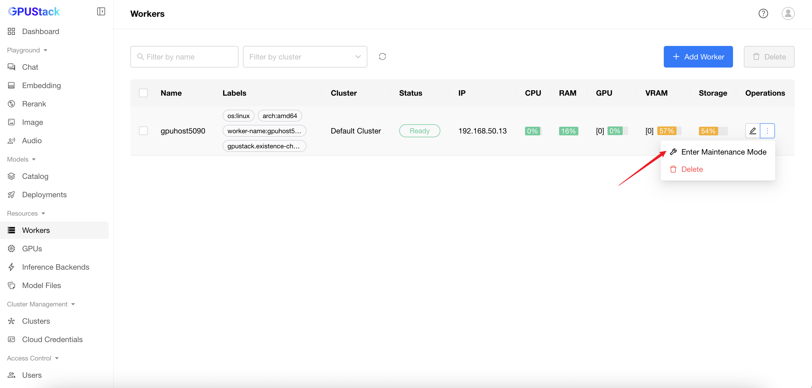

# Worker Maintenance Mode

**Maintenance Mode** is a state where a worker stops accepting new deployment tasks, allowing safe updates or troubleshooting. Existing running instances are not affected and continue to operate normally.

## Enter Maintenance Mode

1. Navigate to the `Workers` page.
2. Click the `Enter Maintenance Mode` button in the `Operations` column.
3. Optionally add a Remark to describe the maintenance purpose.
4. Click the `Save` button.

!!! note
    When a worker enters maintenance mode, it will stop accepting new model deployment tasks. Existing running instances will continue to operate without interruption.

## Exit Maintenance Mode

1. Navigate to the `Workers` page.
2. Click the `Exit Maintenance Mode` button in the `Operations` column.
3. The worker will then return to normal operation.
