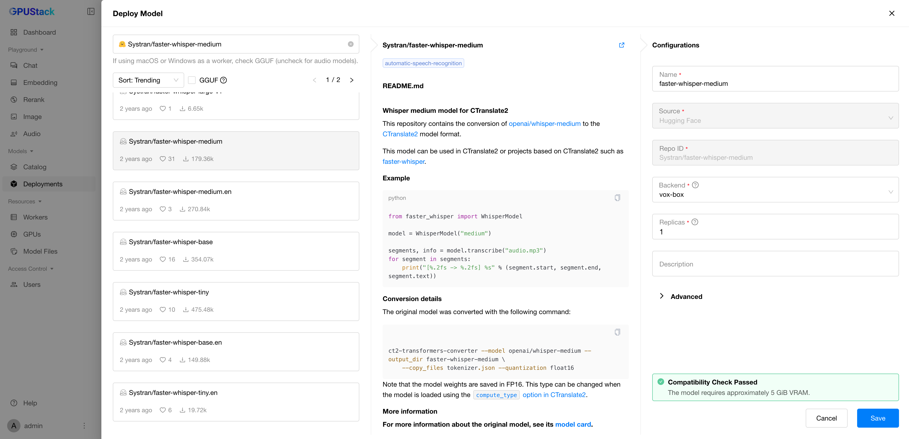
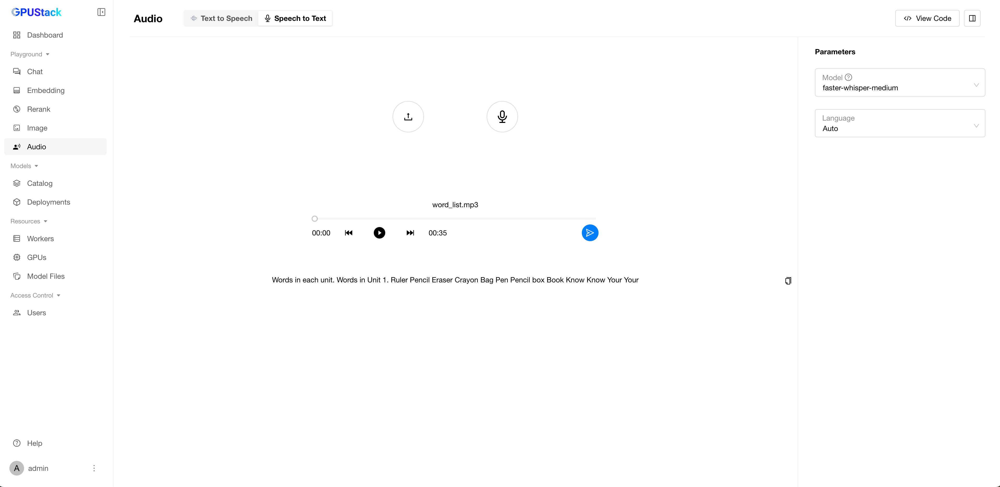
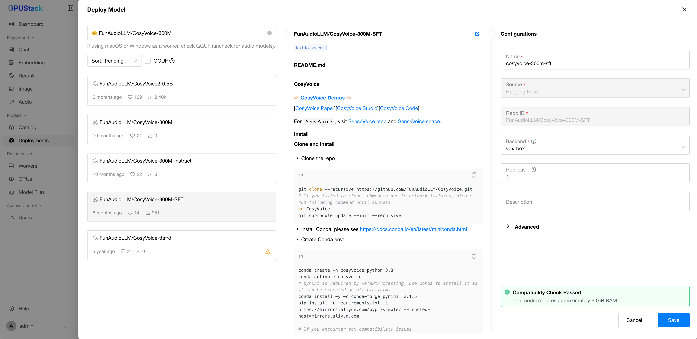

# Using Audio Models

GPUStack supports running both Speech-to-Text and Text-to-Speech models. Speech-to-Text models convert audio inputs in various languages into written text, while Text-to-Speech models transform written text into natural and expressive speech.

In this guide, we will walk you through deploying and using Speech-to-Text and Text-to-Speech models in GPUStack.

## Prerequisites

Before you begin, ensure that you have the following:

- GPUStack is installed and running. If not, refer to the [Quickstart Guide](../quickstart.md).
- Access to Hugging Face or ModelScope for downloading the model files.

## Running Speech-to-Text Model

### Step 1: Deploy Speech-to-Text Model

Follow these steps to deploy the model from the Model Catalog:

1. Navigate to the `Model Catalog` page in the GPUStack UI.
2. Select `Speech-to-Text` in the category filter, then select the `Whisper-Large-V3-Turbo` model.
3. Leave everything as default and click the `Save` button to deploy the model.



After deployment, you can monitor the model deployment's status on the `Deployments` page. Once the deployment is successful, click the ellipsis icon of the deployment and select `Open in Playground` to start using the model in the Playground.


### Step 2: Interact with Speech-to-Text Model

In the `Speech to Text` playground,

1. Click the `Upload` button to upload an audio file, or click the `Microphone` button to record audio.
2. Click the `Generate Text Content` button to generate the transcription.



### Step 3: Streaming Output via API

You can also use the API to get streaming transcriptions. Here's an example using curl:

```bash
# Replace ${SERVER_URL} with your GPUStack server URL and ${YOUR_GPUSTACK_API_KEY} with your API key.
curl ${SERVER_URL}/v1/audio/transcriptions \
  -H "Content-Type: multipart/form-data" \
  -H "Authorization: Bearer ${YOUR_GPUSTACK_API_KEY}" \
  -F model="whisper-large-v3-turbo" \
  -F file="@/path/to/audio-file;type=audio/mpeg" \
  -F language="en" \
  -F stream="true"
```

This will return streaming transcription results as they become available.

## Running Text-to-Speech Model

### Step 1: Deploy Text-to-Speech Model

Follow these steps to deploy the model from the Model Catalog:

1. Navigate to the `Model Catalog` page in the GPUStack UI.
2. Select `Text-to-Speech` in the category filter, then select the `Qwen3-TTS-12Hz-1.7B-CustomVoice` model.
3. Leave everything as default and click the `Save` button to deploy the model.



After deployment, you can monitor the model deployment's status on the `Deployments` page. Once the deployment is successful, click the ellipsis icon of the deployment and select `Open in Playground` to start using the model in the Playground.


### Step 2: Interact with Text-to-Speech Model

In the `Text to Speech` playground,

1. Select the desired voice from the `Voice` dropdown.
2. (Optional) Provide `Instructions` to guide the model to generate the desired style of speech.
3. Enter the text you want to convert to speech.
4. Click the `Submit` button to generate the audio.


## Voice Cloning Using Qwen3-TTS

GPUStack also supports voice cloning with Text-to-Speech models. Here's how to use it:

### Step 1: Deploy Voice Cloning Model

1. Navigate to the `Model Catalog` page in the GPUStack UI.
2. Select `Text-to-Speech` in the category filter, then select the `Qwen3-TTS-12Hz-1.7B-Base` model.
3. Leave everything as default and click the `Save` button to deploy the model.

### Step 2: Use Voice Cloning in Playground

Once the deployment is successful, click the ellipsis icon of the deployment and select `Open in Playground` to start using the model in the Playground. Then follow these steps:

1. In the `Reference Audio` field, upload an audio file or input an audio URL to provide the reference voice for cloning. For example, you can input the URL `https://qianwen-res.oss-cn-beijing.aliyuncs.com/Qwen3-TTS-0115/APS-en_33.wav`.
2. Check the `Use Speaker Embedding Only (no ICL)` option.
3. Enter the text to be synthesized, for example: `Good one. Okay, fine, I'm just gonna leave this sock monkey here. Goodbye.`
4. Click the `Submit` button to generate the speech with the cloned voice.


