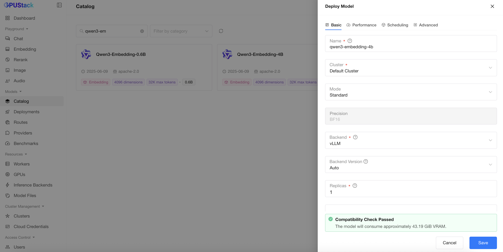
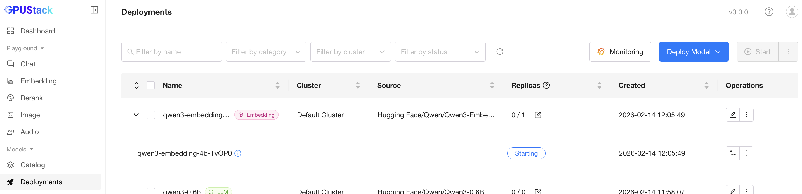

# Using Embedding Models

**Text embeddings** are numerical representations of text that capture semantic meaning, enabling machines to understand relationships and similarities between different pieces of text. In essence, they transform text into vectors in a continuous space, where texts with similar meanings are positioned closer together. Text embeddings are widely used in applications such as natural language processing, information retrieval, and recommendation systems.

In this guide, we will demonstrate how to deploy embedding models in GPUStack and generate text embeddings using the deployed models.

## Prerequisites

Before you begin, ensure that you have the following:

- GPUStack is installed and running. If not, refer to the [Quickstart Guide](../quickstart.md).
- Access to Hugging Face for downloading the model files.

## Step 1: Deploy the Model

Follow these steps to deploy the model from Hugging Face:

1. Navigate to the `Deployments` page in the GPUStack UI.
2. Click the `Deploy Model` button.
3. In the dropdown, select `Hugging Face` as the source for your model.
4. Enable the `GGUF` checkbox to filter models by GGUF format.
5. Use the search bar in the top left to search for the model name `CompendiumLabs/bge-small-en-v1.5-gguf`.
6. Leave everything as default and click the `Save` button to deploy the model.



After deployment, you can monitor the model deployment's status on the `Deployments` page.



## Step 2: Generate an API Key

We will use the GPUStack API to generate text embeddings, and an API key is required:

1. Hover over the user avatar and navigate to the `API Keys` page.
2. Click the `New API Key` button.
3. Enter a name for the API key and click the `Save` button.
4. Copy the generated API key. You can only view the API key once, so make sure to save it securely.

## Step 3: Generate Text Embeddings

With the model deployed and an API key, you can generate text embeddings via the GPUStack API. Here is an example script using `curl`:

```bash
export SERVER_URL=<your-server-url>
export GPUSTACK_API_KEY=<your-api-key>
curl $SERVER_URL/v1-openai/embeddings \
  -H "Authorization: Bearer $GPUSTACK_API_KEY" \
  -H "Content-Type: application/json" \
  -d '{
    "input": "The food was delicious and the waiter...",
    "model": "bge-small-en-v1.5",
    "encoding_format": "float"
  }'
```

Replace `<your-server-url>` with the URL of your GPUStack server and `<your-api-key>` with the API key you generated in the previous step.

Example response:

```json
{
  "data": [
    {
      "embedding": [
        -0.012189436703920364, 0.016934078186750412, 0.003965042531490326,
        -0.03453584015369415, -0.07623119652271271, -0.007116147316992283,
        0.11278388649225235, 0.019714849069714546, 0.010370955802500248,
        -0.04219457507133484, -0.029902394860982895, 0.01122555136680603,
        0.022912170737981796, 0.031186765059828758, 0.006303929258137941,
        # ... additional values
      ],
      "index": 0,
      "object": "embedding"
    }
  ],
  "model": "bge-small-en-v1.5",
  "object": "list",
  "usage": { "prompt_tokens": 12, "total_tokens": 12 }
}
```
