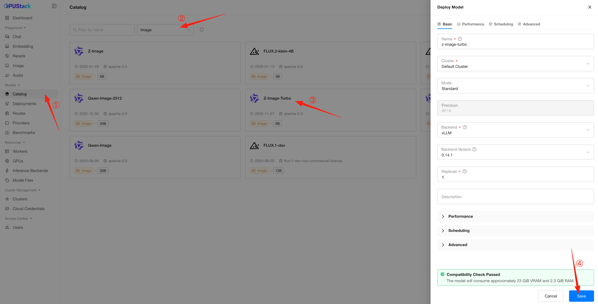
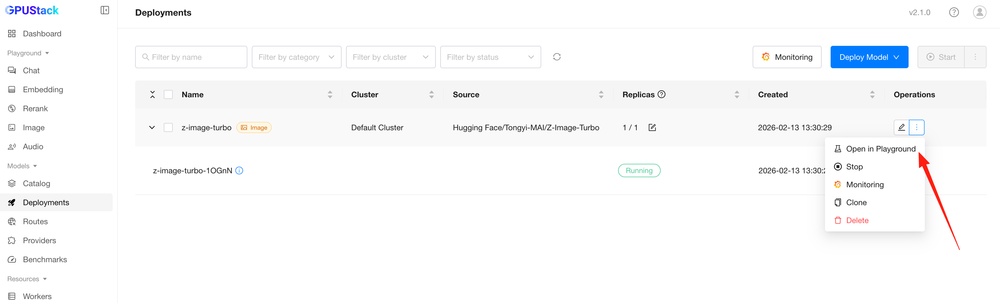
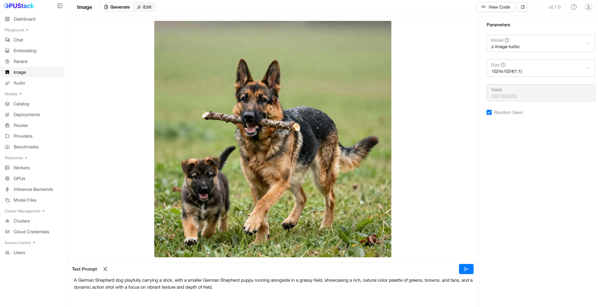

# Using Image Generation Models

GPUStack supports deploying and running **Image Generation Models**. This guide walks you through deploying the **Z-Image-Turbo** text-to-image model and generating images from textual prompts in the GPUStack UI.

## Prerequisites

Before you begin, ensure that you have the following:

- A GPU with at least 24 GB of VRAM, e.g., NVIDIA RTX 4090.
- GPUStack installed and running. If not, refer to the [Quickstart Guide](../quickstart.md).
- Access to Hugging Face or ModelScope to download the model files.

## Step 1: Deploy the Z-Image-Turbo Model

Follow these steps to deploy the model:

1. Navigate to the `Model Catalog` page in the GPUStack UI.
2. Select `Image` in the category filter.
3. Click the `Z-Image-Turbo` model card to open the deployment page.
4. Keep the default settings and click the `Save` button to deploy.

After deployment, you can monitor the status on the `Deployments` page. Once the deployment is successful, click the ellipsis icon of the deployment and select `Open in Playground` to start using the model in the Playground.

## Step 2: Use the Model for Image Generation

In the `Image` playground:

1. Select the `Size` dropdown and choose the desired image resolution.
2. Enter a prompt describing the image you want to generate. You can click the `Random Prompt` button to get a random prompt for inspiration.
3. Click the `Submit` button to create the image.

The generated image will be displayed in the UI. Results vary with randomness, seeds, and prompt details.

## Conclusion

With this setup, you can generate unique and visually compelling images from textual prompts using the Z-Image-Turbo model. Experiment with different prompts and settings to create a wide variety of images!
