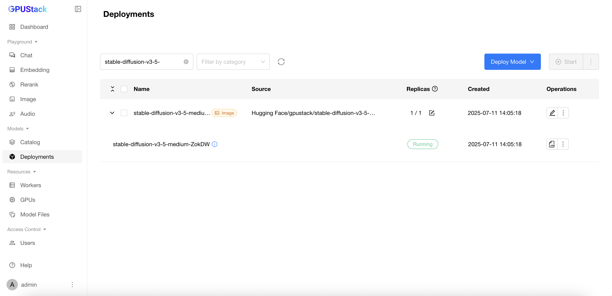

# Using Image Generation Models

GPUStack supports deploying and running **Image Generation Models**. In this guide, you deploy and use the Qwen-Image text-to-image model via the SGLang backend, then generate images from textual prompts in the GPUStack UI.

## Prerequisites

Before you begin, ensure that you have the following:

- A GPU with at least 55 GB of VRAM.
- Access to Hugging Face or ModelScope to download the `Qwen/Qwen-Image` repository.
- GPUStack is installed and running. If not, refer to the [Quickstart Guide](../quickstart.md).

## Step 1: Deploy the Qwen-Image Model

Follow these steps to deploy the model from Hugging Face:

1. Navigate to the `Deployments` page in the GPUStack UI.
2. Click the `Deploy Model` button.
3. In the dropdown, select `Hugging Face` as the source for your model.
4. Use the search bar in the top-left to search for the repository `Qwen/Qwen-Image`.
5. Keep the default settings and click the `Save` button to deploy. GPUStack will start the SGLang backend for Qwen-Image and download the required files.


After deployment, you can monitor the model deployment's status on the `Deployments` page.



## Step 2: Use the Model for Image Generation

1. Navigate to the `Playground` > `Image` page in the GPUStack UI.
2. Verify that the deployed `qwen-image` model is selected from the top-right `Model` dropdown.
3. Enter a prompt describing the image you want to generate. For example:

```
a female character with long, flowing hair that appears to be made of ethereal, swirling patterns resembling the Northern Lights or Aurora Borealis. The background is dominated by deep blues and purples, creating a mysterious and dramatic atmosphere. The character's face is serene, with pale skin and striking features. She wears a dark-colored outfit with subtle patterns. The overall style of the artwork is reminiscent of fantasy or supernatural genres.
```

4. If your UI shows a `Sampler` dropdown and `Sample Steps`, keep the defaults. Qwen-Image uses a Diffusers-based flow matching scheduler under SGLang; GPUStack maps UI settings to appropriate parameters.
5. Click the `Submit` button to create the image.

The generated image will be displayed in the UI. Results vary with randomness, seeds, and prompt details.


After completing an image generation task, memory usage typically increases from ~45 GB (weights only) to ~54 GB due to additional VRAM consumption by diffusion models. If additional models like LoRA are used, VRAM consumption will further increase.


## Conclusion

With this setup, you can generate unique and visually compelling images from textual prompts using Qwen-Image served by SGLang. Experiment with different prompts and settings to push the boundaries of what’s possible.
