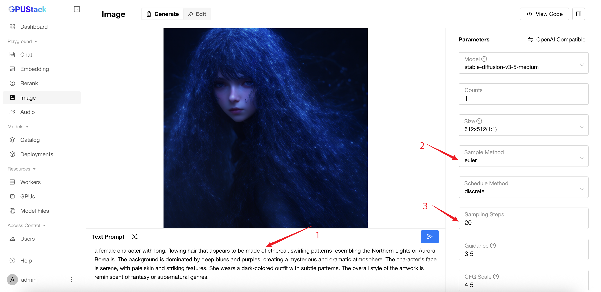

# Using Image Generation Models

GPUStack supports deploying and running state-of-the-art **Image Generation Models**. These models allow you to generate stunning images from textual descriptions, enabling applications in design, content creation, and more.

In this guide, we will walk you through deploying and using image generation models in GPUStack.

## Prerequisites

Before you begin, ensure that you have the following:

- A GPU that has at least 12 GB of VRAM.
- Access to Hugging Face for downloading the model files.
- GPUStack is installed and running. If not, refer to the [Quickstart Guide](../quickstart.md).

## Step 1: Deploy the Stable Diffusion Model

Follow these steps to deploy the model from Hugging Face:

1. Navigate to the `Deployments` page in the GPUStack UI.
2. Click the `Deploy Model` button.
3. In the dropdown, select `Hugging Face` as the source for your model.
4. Use the search bar in the top left to search for the model name `gpustack/stable-diffusion-v3-5-medium-GGUF`.
5. In the `Available Files` section, select the `stable-diffusion-v3-5-medium-Q4_0.gguf` file.
6. Leave everything as default and click the `Save` button to deploy the model.


After deployment, you can monitor the model deployment's status on the `Deployments` page.


## Step 2: Use the Model for Image Generation

1. Navigate to the `Playground` > `Image` page in the GPUStack UI.
2. Verify that the deployed model is selected from the top-right `Model` dropdown.
3. Enter a prompt describing the image you want to generate. For example:

```
a female character with long, flowing hair that appears to be made of ethereal, swirling patterns resembling the Northern Lights or Aurora Borealis. The background is dominated by deep blues and purples, creating a mysterious and dramatic atmosphere. The character's face is serene, with pale skin and striking features. She wears a dark-colored outfit with subtle patterns. The overall style of the artwork is reminiscent of fantasy or supernatural genres.
```

4. Select `euler` in the `Sampler` dropdown.
5. Set the `Sample Steps` to `20`.
6. Click the `Submit` button to create the image.

The generated image will be displayed in the UI. Your image may look different given the seed and randomness involved in the generation process.



## Conclusion

With this setup, you can generate unique and visually compelling images from textual prompts. Experiment with different prompts and settings to push the boundaries of what’s possible. For more details, refer to [Recommended Parameters for Image Generation Models](./recommended-parameters-for-image-generation-models.md)
