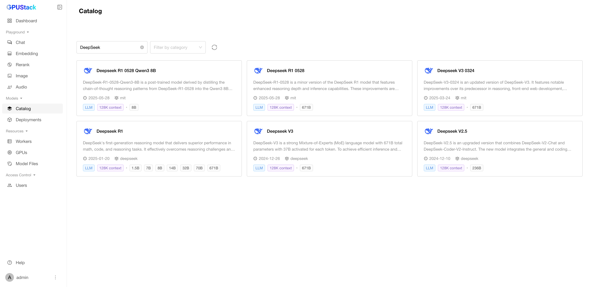
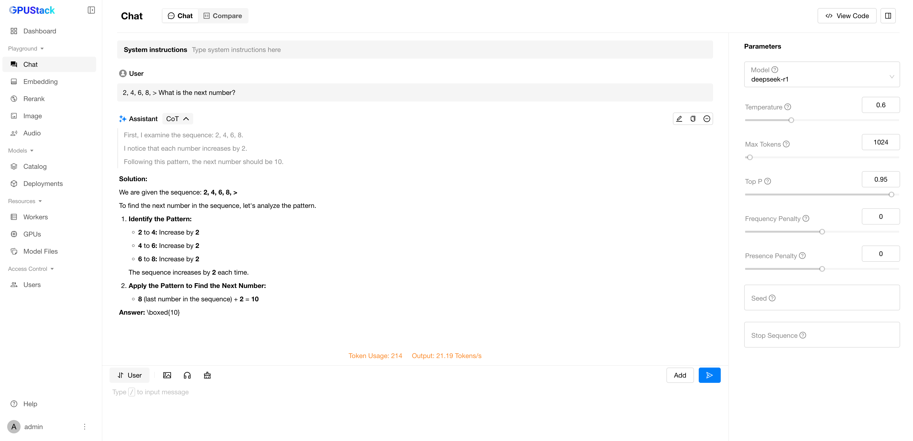

# Using Large Language Models

**Large Language Models (LLMs)** are powerful AI models capable of understanding and generating human-like text, making them essential for applications such as chatbots, content generation, code completion, and more.

In this guide, you will learn how to deploy and interact with LLMs in GPUStack.

## Prerequisites

Before you begin, ensure that you have the following:

- A Linux machine with one or more GPUs that has at least 30 GB of VRAM in total. We will use the vLLM backend which only supports Linux.
- Access to [Hugging Face](https://huggingface.co/) or [ModelScope](https://www.modelscope.cn/) for downloading the model files.
- GPUStack installed and running. If not, refer to the [Quickstart Guide](../quickstart.md).

## Step 1: Deploy Large Language Models

### Deoloy from Catalog

Large language models in the catalog are marked with the `LLM` category. When you select a large language model from the catalog, the default configurations should work as long as you have enough GPU resources and the backend is compatible with your setup (e.g., vLLM backend requires an amd64 Linux worker).

Here, we take the deployment of `DeepSeek R1` as an example.

1. Navigate to the `Deployments` page in the GPUStack UI.
2. Click the `Deploy Model` button.
3. In the dropdown, select `Catalog` as the source for your model.
4. In the catalog list page, use the search bar in the top left to search for the model keyword `DeepSeek`.
5. Review the model description, maximum context length and supported sizes.



#### Deployment Using llama-box

1. Select the `Deepseek R1` from the catalog.
2. Select `7B` in Size.
3. Click the `Save` button to deploy the model.


After deployment, you can monitor the model deployment's status on the `Deployments` page and wait for it to start running.

#### Deployment Using vLLM

1. Select the `Deepseek R1` from the catalog.
2. Since the model name is the access ID and cannot be the same as a previously created one, change the default model name to `deepseek-r1-vllm`.
3. Select the `vLLM` backend.
4. Select `7B` in Size.
5. Click the `Save` button to deploy the model.


After deployment, you can monitor the model deployment's status on the `Deployments` page and wait for it to start running.

## Step 2: Use the LLMs for Text Generation

1. Navigate to the `Playground` > `Chat` page in the GPUStack UI.
2. Verify that the deployed model is selected from the top-right `Model` dropdown.
3. Provide a prompt for the text generation. For example:

```
2, 4, 6, 8, > What is the next number?
```

4. Adjust the `Parameters` on the right based on your needs.
5. Click the `Submit` button to generate the text.

The generated chain of thought and result will be displayed in the UI.



By following these steps, you can leverage LLMs for AI-powered text generation and natural language tasks in GPUStack. Experiment with different prompts and settings to explore the full capabilities of LLMs!
