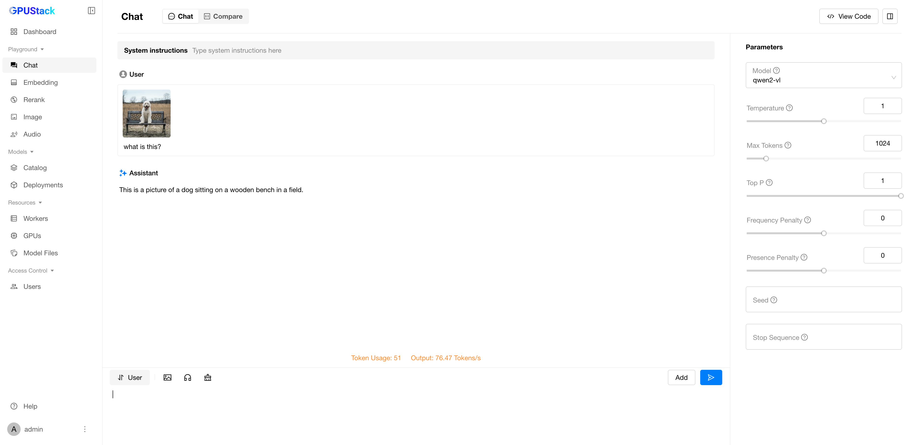

# Using Vision Language Models

**Vision Language Models** can process both visual (image) and language (text) data simultaneously, making them versatile tools for various applications, such as image captioning, visual question answering, and more. In this guide, you will learn how to deploy and interact with Vision Language Models (VLMs) in GPUStack.

The procedure for deploying and interacting with these models in GPUStack is similar. The main difference is the parameters you need to set when deploying the models. For more information on the parameters you can set, please refer to [Backend Parameters](../user-guide/inference-backends.md#parameters-reference_1) .

In this guide, we will cover the deployment of the following models:

- **Llama3.2-Vision**
- **Qwen2-VL**
- **Pixtral**
- **Phi3.5-Vision**

## Prerequisites

Before you begin, ensure that you have the following:

- A Linux machine with one or more GPUs that has at least 30 GB of VRAM in total. We will use the vLLM backend which only supports Linux.
- Access to Hugging Face and a [Hugging Face API key](https://huggingface.co/settings/tokens) for downloading the model files.
- You have been granted access to the above models on Hugging Face. [Llama3.2-VL](https://huggingface.co/meta-llama/Llama-3.2-11B-Vision-Instruct) and [Pixtral](https://huggingface.co/mistralai/Pixtral-12B-2409) are gated models, and you need to request access to them.

!!! note

    An Ubuntu node equipped with one H100 (80GB) GPU is used throughout this guide.

## Step 1: Install GPUStack

Please ensure [Docker](https://docs.docker.com/engine/install/) and [NVIDIA Container Toolkit](https://docs.nvidia.com/datacenter/cloud-native/container-toolkit/install-guide.html) are installed on your system. Then, run the following command to start the GPUStack server.

```bash
docker run -d --name gpustack \
      --restart=unless-stopped \
      --gpus all \
      --network=host \
      --ipc=host \
      -v gpustack-data:/var/lib/gpustack \
      gpustack/gpustack \
      --huggingface-token <Hugging Face API Key>
```

Replace `<Hugging Face API Key>` with your [Hugging Face API key](https://huggingface.co/settings/tokens). GPUStack will use this key to download the model files.

For more details on the installation or other GPU hardware platforms, please refer to the [Installation Documentation](installation/installation-requirements.md).

## Step 2: Log in to GPUStack UI

After the server starts, run the following command to get the default admin password:

```bash
docker exec gpustack cat /var/lib/gpustack/initial_admin_password
```

Open your browser and navigate to `http://your_host_ip` to access the GPUStack UI. Use the default username `admin` and the password you retrieved above to log in.

## Step 3: Deploy Vision Language Models

### Deoloy from Catalog

Vision language models in the catalog are marked with the `vision` capability. When you select a vision language model from the catalog, the default configurations should work as long as you have enough GPU resources and the backend is compatible with your setup(e.g., vLLM backend requires an amd64 Linux worker).


### Example of Custom Deployment Using llama-box

When deploying GGUF VLM models with llama-box, GPUStack automatically handles the multi-modal projector file and it should work out of the box.

1. Navigate to the `Deployments` page in the GPUStack UI and click the `Deploy Model` button. In the dropdown, select `Hugging Face` as the source for your model.
2. Enable the `GGUF` checkbox to filter models by GGUF format.
3. Use the search bar to find the `bartowski/Qwen2-VL-2B-Instruct-GGUF` model.
4. Use the GGUF `Q4_K_M` quantization format.
5. Click the `Save` button to deploy the model.


### Example of Custom Deployment Using vLLM

#### Deploy Llama3.2-Vision

1. Navigate to the `Deployments` page in the GPUStack UI.
2. Click on the `Deploy Model` button, then select `Hugging Face` in the dropdown.
3. Search for `meta-llama/Llama-3.2-11B-Vision-Instruct` in the search bar.
4. Expand the `Advanced` section in configurations and scroll down to the `Backend Parameters` section.
5. Click on the `Add Parameter` button multiple times and add the following parameters:

- `--enforce-eager`
- `--max-num-seqs=16`
- `--max-model-len=8192`

6. Click the `Save` button.


#### Deploy Qwen2-VL

1. Navigate to the `Deployments` page in the GPUStack UI.
2. Click on the `Deploy Model` button, then select `Hugging Face` in the dropdown.
3. Search for `Qwen/Qwen2-VL-7B-Instruct` in the search bar.
4. Click the `Save` button. The default configurations should work as long as you have enough GPU resources.

#### Deploy Pixtral

1. Navigate to the `Deployments` page in the GPUStack UI.
2. Click on the `Deploy Model` button, then select `Hugging Face` in the dropdown.
3. Search for `mistralai/Pixtral-12B-2409` in the search bar.
4. Expand the `Advanced` section in configurations and scroll down to the `Backend Parameters` section.
5. Click on the `Add Parameter` button multiple times and add the following parameters:

- `--tokenizer-mode=mistral`
- `--limit-mm-per-prompt=image=4`

6. Click the `Save` button.

#### Deploy Phi3.5-Vision

1. Navigate to the `Deployments` page in the GPUStack UI.
2. Click on the `Deploy Model` button, then select `Hugging Face` in the dropdown.
3. Search for `microsoft/Phi-3.5-vision-instruct` in the search bar.
4. Expand the `Advanced` section in configurations and scroll down to the `Backend Parameters` section.
5. Click on the `Add Parameter` button and add the following parameter:

- `--trust-remote-code`

6. Click the `Save` button.

## Step 4: Interact with Vision Language Models

1. Navigate to the `Chat` page in the GPUStack UI.
2. Select the deployed model from the top-right dropdown.
3. Click on the `Upload Image` button above the input text area and upload an image.
4. Enter a prompt in the input text area. For example, "Describe the image."
5. Click the `Submit` button to generate the output.


