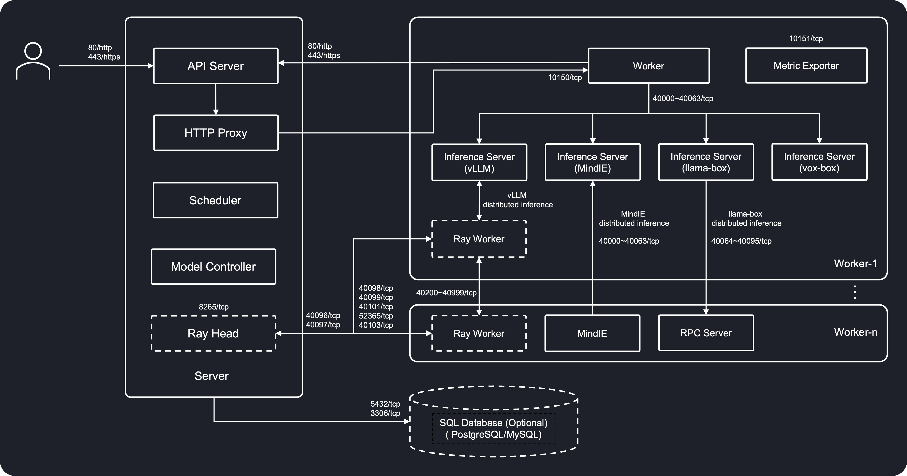

# 安装要求

本页描述将在其上安装 GPUStack 的节点所需的软件与网络要求。

## 操作系统要求

GPUStack 支持以下操作系统：

- [x] Linux
- [x] macOS
- [x] Windows

GPUStack 已在以下操作系统上测试并验证可正常运行：

| 操作系统   | 版本            |
| ---------- | --------------- |
| Ubuntu     | \>= 20.04       |
| Debian     | \>= 11          |
| RHEL       | \>= 8           |
| Rocky      | \>= 8           |
| Fedora     | \>= 36          |
| OpenSUSE   | \>= 15.3 (leap) |
| OpenEuler  | \>= 22.03       |
| macOS      | \>= 14          |
| Windows    | 10, 11          |

!!! note

    在 Linux 系统上安装 GPUStack worker 需要 GLIBC 版本为 2.29 或更高。如果你的系统使用的 GLIBC 版本较低，建议改用 `Docker Installation` 方法作为替代。

    使用以下命令检查 GLIBC 版本：

    ```
    ldd --version
    ```

<a id="supported-architectures"></a>

### 支持的架构

GPUStack 同时支持 **AMD64** 和 **ARM64** 架构，注意以下事项：

- 在 Linux 和 macOS 上，当使用低于 3.12 的 Python 版本时，请确保安装的 Python 发行版与系统架构一致。
- 在 Windows 上，请使用 Python 的 AMD64 发行版，因为某些依赖的 wheel 包在 ARM64 上不可用。若使用 `conda` 等工具，这将由其自动处理，因为 conda 默认安装 AMD64 发行版。

## 加速器运行时要求

GPUStack 支持以下加速器：

- [x] NVIDIA CUDA（[计算能力](https://developer.nvidia.com/cuda-gpus) 6.0 及以上）
- [x] Apple Metal（M 系列芯片）
- [x] AMD ROCm
- [x] Ascend CANN
- [x] Hygon DTK
- [x] Moore Threads MUSA
- [x] Iluvatar Corex
- [x] Cambricon MLU

在安装 GPUStack 之前，确保系统已安装所有必要的驱动与库。

### NVIDIA CUDA

要使用 NVIDIA CUDA 作为加速器，请确保已安装以下组件：

- [NVIDIA Driver](https://www.nvidia.com/en-us/drivers/)
- [NVIDIA CUDA Toolkit 12](https://developer.nvidia.com/cuda-toolkit)（可选，非 Docker 安装时需要）
- [NVIDIA cuDNN 9](https://developer.nvidia.com/cudnn)（可选，不使用 Docker 时运行音频模型需要）
- [NVIDIA Container Toolkit](https://docs.nvidia.com/datacenter/cloud-native/container-toolkit)（可选，Docker 安装时需要）

### AMD ROCm

要使用 AMD ROCm 作为加速器，请确保已安装以下组件：

- [ROCm](https://rocm.docs.amd.com/en/docs-6.2.4/)

### Ascend CANN

将 Ascend CANN 用作加速器时，请确保已安装以下组件：

- [Ascend NPU 驱动与固件](https://www.hiascend.com/hardware/firmware-drivers/community)
- [Ascend CANN 工具包与内核](https://www.hiascend.com/developer/download/community/result?module=cann&cann=8.2.RC1)（可选，非 Docker 安装时需要）

### Hygon DTK

要使用 Hygon DTK 作为加速器，请确保已安装以下组件：

- [DCU 驱动](https://developer.sourcefind.cn/tool/)
- [DCU 工具包](https://developer.sourcefind.cn/tool/)

### Moore Threads MUSA

要使用 Moore Threads MUSA 作为加速器，请确保已安装以下组件：

- [MUSA SDK](https://developer.mthreads.com/sdk/download/musa)
- [MT Container Toolkits](https://developer.mthreads.com/sdk/download/CloudNative)（可选，docker 安装时需要）

### Iluvatar Corex

要使用 Iluvatar Corex 作为加速器，请确保已安装以下组件：

- [Corex 驱动](https://support.iluvatar.com/#/ProductLine?id=2)
- [Corex 工具包](https://support.iluvatar.com/#/ProductLine?id=2)

### Cambricon MLU

要使用 Cambricon MLU 作为加速器，请确保已安装以下组件：

- Cambricon 驱动

## 网络要求

### 网络架构

下图展示了 GPUStack 的网络架构：



### 连通性要求

为保证 GPUStack 正常工作，需要满足以下网络连通性：

**服务器到 Worker：** 服务器必须能够访问各个 Worker，以代理推理请求。

**Worker 到服务器：** Worker 必须能够访问服务器以进行注册并发送更新。

**Worker 到 Worker：** 在多个 Worker 之间进行分布式推理时所必需。

<a id="port-requirements"></a>

### 端口要求

GPUStack 使用以下端口进行通信：

#### 服务器端口

| 端口     | 说明                                                         |
| -------- | ------------------------------------------------------------ |
| TCP 80   | GPUStack UI 和 API 端点的默认端口                            |
| TCP 443  | GPUStack UI 和 API 端点的默认端口（启用 TLS 时）             |

当启用 Ray 以在多个 Worker 之间进行分布式 vLLM 时，GPUStack 服务器将使用以下端口：

| Ray 端口 | 说明                                         |
| -------- | -------------------------------------------- |
| TCP 40096 | Ray（GCS server）的默认端口                 |
| TCP 40097 | Ray Client Server 的默认端口                |
| TCP 40098 | Ray node manager 的默认端口                 |
| TCP 40099 | Ray object manager 的默认端口               |
| TCP 40100 | Ray runtime env agent 的默认端口            |
| TCP 8265  | Ray dashboard 的默认端口                    |
| TCP 40101 | Ray dashboard agent gRPC 监听的默认端口     |
| TCP 52365 | Ray dashboard agent HTTP 监听的默认端口     |
| TCP 40103 | Ray 指标导出的默认端口                      |

有关 Ray 端口的更多信息，请参阅 [Ray 文档](https://docs.ray.io/en/latest/ray-core/configure.html#ports-configurations)。

#### Worker 端口

| 端口            | 说明                                     |
| --------------- | ---------------------------------------- |
| TCP 10150       | GPUStack Worker 的默认端口               |
| TCP 10151       | 用于暴露指标的默认端口                   |
| TCP 40000-40063 | 为推理服务分配的端口范围                 |
| TCP 40064-40095 | 为 llama-box RPC 服务器分配的端口范围    |

当启用 Ray 以在多个 Worker 之间进行分布式 vLLM 时，GPUStack Worker 将使用以下端口：

| Ray 端口        | 说明                                         |
| --------------- | -------------------------------------------- |
| TCP 40098       | Ray node manager 的默认端口                  |
| TCP 40099       | Ray object manager 的默认端口                |
| TCP 40101       | Ray dashboard agent gRPC 监听的默认端口      |
| TCP 52365       | Ray dashboard agent HTTP 监听的默认端口      |
| TCP 40103       | Ray 指标导出的默认端口                       |
| TCP 40200-40999 | Ray worker 进程使用的端口范围                |