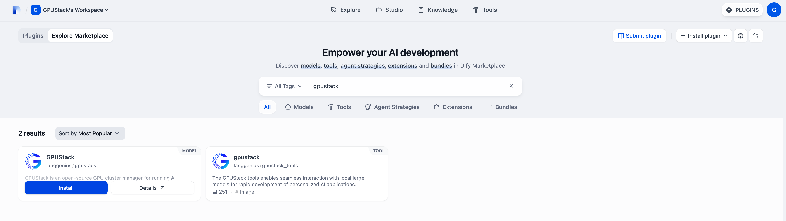
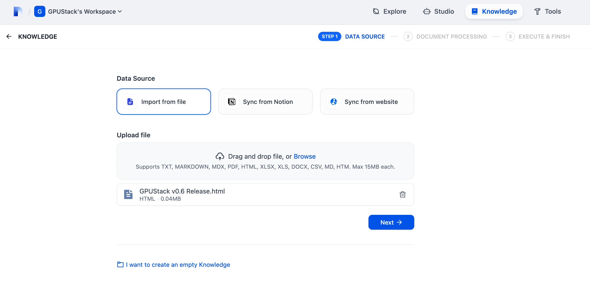

# 与 Dify 集成

Dify 可与 GPUStack 集成，以利用本地部署的 LLM、向量嵌入、重排序、图像生成、语音转文本（STT）与文本转语音（TTS）等能力。

## 部署模型

1. 在 GPUStack 界面中，进入 `Deployments` 页面，点击 `Deploy Model` 部署所需模型。以下是一些示例模型：

- qwen3-8b
- qwen2.5-vl-3b-instruct
- bge-m3
- bge-reranker-v2-m3


2. 在该模型的 Operations 中，打开 `API Access Info` 以查看如何与该模型集成。


## 创建 API Key

1. 将鼠标悬停在用户头像上，进入 `API Keys` 页面，点击 `New API Key`。

2. 填写名称后，点击 `Save`。

3. 复制 API Key，并妥善保存以备后用。

## 在 Dify 中集成 GPUStack

1. 打开 Dify 界面，点击右上角 `PLUGINS`，选择 `Install from Marketplace`，搜索 GPUStack 插件并安装。



2. 安装完成后，前往 `Settings > Model Provider > GPUStack`，选择 `Add Model` 并填写：

- Model Type：根据实际模型选择类型。
- Model Name：名称必须与 GPUStack 上部署的模型名称一致。
- Server URL：`http://your-gpustack-url`。不要使用 `localhost`，它指向容器的内部网络。若使用自定义端口，请一并填写。此外，请确保该 URL 能从 Dify 容器内部访问（可用 `curl` 测试）。
- API Key：输入前面步骤中复制的 API Key。

点击 `Save` 添加模型：


按需继续添加其他模型，然后在 `System Model Settings` 中选择已添加的模型并保存：


现在你可以在 `Studio` 与 `Knowledge` 中使用这些模型，下面是一个简单示例：

1. 前往 `Knowledge` 创建一个知识库，并上传你的文档：



2. 配置 Chunk Settings 与 Retrieval Settings。使用向量嵌入模型生成文档向量，用重排序模型进行检索排序。


3. 文档导入成功后，在 `Studio` 中创建一个应用，添加之前创建的知识库，选择聊天模型并进行交互：


4. 将模型切换为 `qwen2.5-vl-3b-instruct`，移除先前添加的知识库，启用 `Vision`，在对话中上传图片以启用多模态输入：


---

## 使用 Docker Desktop 安装的 Dify 注意事项

若 GPUStack 运行在主机上，而 Dify 运行在 Docker 容器内，必须确保两者之间的网络可达。

### 正确配置

在 Dify 中添加 GPUStack 模型时：

| 字段           | 值                                                                       |
| -------------- | ------------------------------------------------------------------------ |
| **Server URL** | `http://host.docker.internal:80/v1-openai` <br>(适用于 macOS/Windows)<br> |
| **API Key**    | 来自 GPUStack 的 API Key                                                 |
| **Model Name** | 必须与 GPUStack 中已部署的模型名称一致（例如 `qwen3`）                   |

### 连接性测试（在 Dify 容器内）

你可以在 Dify 容器内测试连接：

```bash
docker exec -it <dify-container-name> curl http://host.docker.internal:80/v1-openai/models
```

若返回模型列表，则说明集成成功。

### 注意

- 在 macOS 或 Windows 上，从 Docker 容器访问主机服务应使用 `host.docker.internal`。
- `localhost` 或 `0.0.0.0` 在 Docker 容器内不可用，除非 Dify 与 GPUStack 运行在同一容器中。

### 快速参考

| <div style="width:220px">场景</div>                 | 服务器 URL                                                                                           |
| -------------------------------------------------- | ---------------------------------------------------------------------------------------------------- |
| 主机上部署 GPUStack <br>(macOS/Windows)           | `http://host.docker.internal:80/v1-openai`                                                           |
| GPUStack 运行在 Docker 中                          | 使用 `--network=host`（Linux），或将端口映射到主机（macOS/Windows），并使用合适的主机地址            |

> 💡 如果在安装 GPUStack 时未指定 `--port` 参数，默认端口为 `80`。因此，Server URL 应设置为 `http://host.docker.internal:80/v1-openai`。