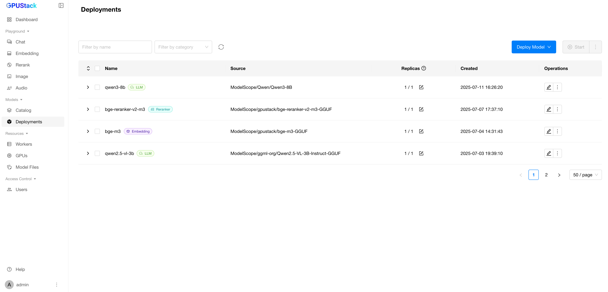
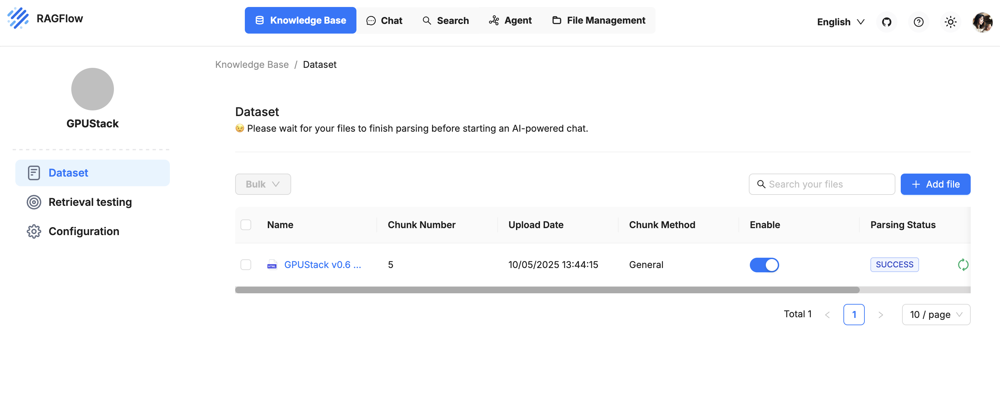
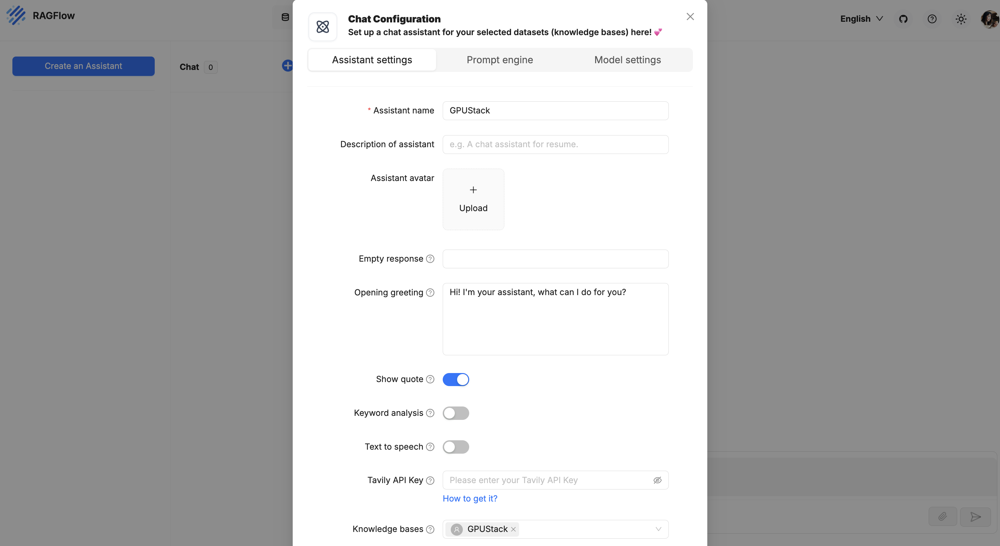
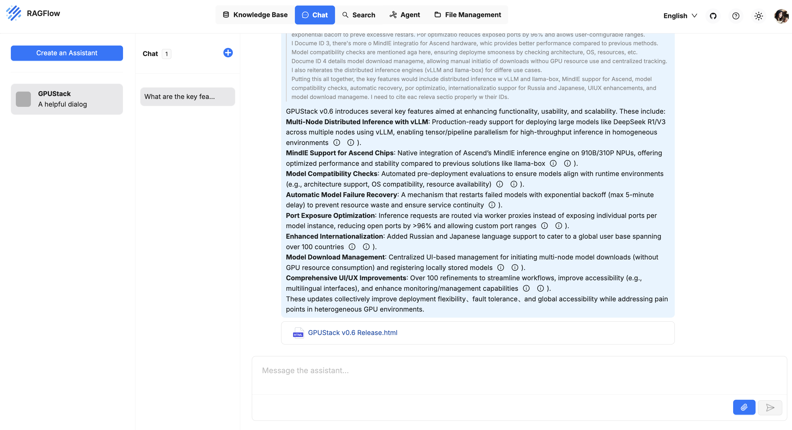
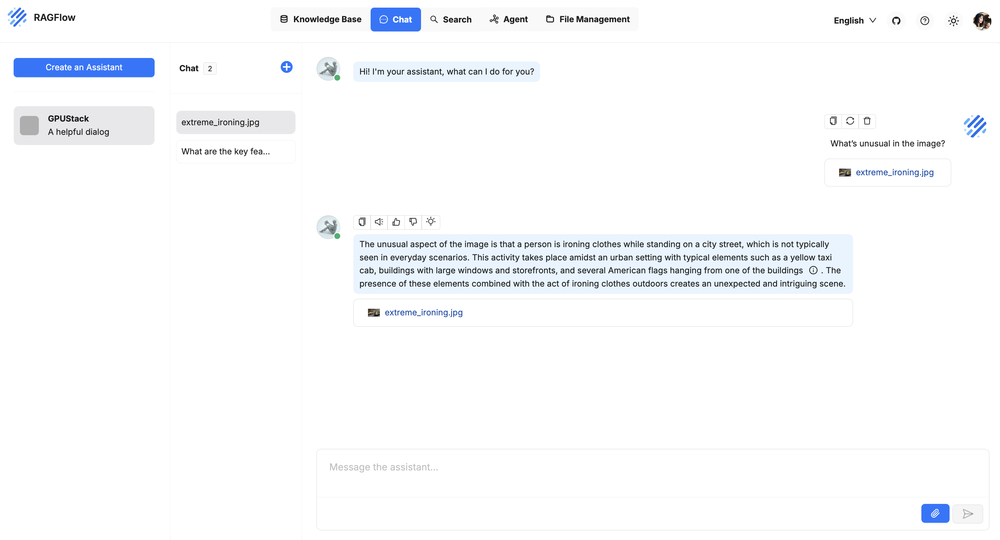

# 与 RAGFlow 集成

RAGFlow 可与 GPUStack 集成，以利用本地部署的 LLM、Embedding、重排序、语音转文字（STT）和文字转语音（TTS）能力。

## 部署模型

1. 在 GPUStack 的 UI 中，进入 `Deployments` 页面并点击 `Deploy Model` 来部署所需模型。以下是一些示例模型：

- qwen3-8b
- qwen2.5-vl-3b-instruct
- bge-m3
- bge-reranker-v2-m3

2. 在模型的操作中，打开 `API Access Info` 以了解如何与该模型集成。

## 创建 API 密钥

1. 鼠标悬停在用户头像上，进入 `API Keys` 页面，然后点击 `New API Key`。

2. 填写名称后，点击 `Save`。

3. 复制 API 密钥并保存备用。

## 将 GPUStack 集成到 RAGFlow

1. 进入 RAGFlow 的 UI，点击右上角头像，选择 `Model Providers > GPUStack`，然后选择 `Add the model` 并填写：

- 模型类型：根据模型选择对应的类型。
- 模型名称：必须与 GPUStack 上部署的模型名称完全一致。
- 基础 URL：`http://your-gpustack-url`，URL 不应包含路径，且不要使用 `localhost`，因为它指向容器的内部网络。如果使用自定义端口，请一并填写。另外，请确保该 URL 能从 RAGFlow 容器内部访问（可用 `curl` 测试）。
- API-Key：输入前面复制的 API 密钥。
- 最大 Token：填写当前模型配置所支持的最大 token 数。

点击 `OK` 添加模型：

2. 按需添加其他模型，然后在 `Set default models` 中选择已添加的模型并保存：

现在可以在 `Chat` 和 `Knowledge Base` 中使用这些模型，下面是一个简单示例：

1. 进入 `Knowledge base` 新建知识库并添加你的文件：

2. 进入 `Retrieval testing`，将重排序模型设置为 `bge-reranker-v2-m3`：

3. 在 `Chat` 中创建助手，关联之前创建的知识库，并选择一个对话模型：

4. 创建会话后即可与模型互动并查询知识库：

5. 编辑该助手并将模型切换为 `qwen2.5-vl-3b-instruct`。保存后，新建会话并上传图片以启用多模态输入：

