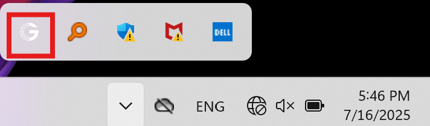

# 快速开始

<p align="left">
  <a href="https://github.com/gpustack/gpustack/blob/main/LICENSE" target="_blank">
    
  </a>
  <a href="https://discord.gg/VXYJzuaqwD" target="_blank">
    
  </a>
  <a href="../../assets/wechat-group-qrcode.jpg" target="_blank">
    
  </a>
</p>

<p align="left">
  <script async defer src="https://buttons.github.io/buttons.js"></script>
  <a class="github-button" href="https://github.com/gpustack/gpustack" data-show-count="true" data-size="large" aria-label="Star">Star</a>
  <a class="github-button" href="https://github.com/gpustack/gpustack/subscription" data-icon="octicon-eye" data-size="large" aria-label="Watch">Watch</a>
  <a class="github-button" href="https://github.com/gpustack/gpustack/fork" data-show-count="true" data-icon="octicon-repo-forked" data-size="large" aria-label="Fork">Fork</a>
</p>

## 安装 GPUStack

=== "Linux"

    如果你使用的是 NVIDIA GPU，请确保系统已安装 [Docker](https://docs.docker.com/engine/install/) 和 [NVIDIA Container Toolkit](https://docs.nvidia.com/datacenter/cloud-native/container-toolkit/install-guide.html)。然后运行以下命令启动 GPUStack 服务端。
    
    ```bash
    docker run -d --name gpustack \
          --restart=unless-stopped \
          --gpus all \
          --network=host \
          --ipc=host \
          -v gpustack-data:/var/lib/gpustack \
          gpustack/gpustack
    ```
    
    关于安装的更多细节或其他 GPU 硬件平台的支持，请参考[安装文档](installation/installation-requirements.md)。
    
    服务器启动后，运行以下命令获取默认管理员密码：
    
    ```bash
    docker exec gpustack cat /var/lib/gpustack/initial_admin_password
    ```
    
    在浏览器中访问 `http://your_host_ip` 打开 GPUStack 界面。使用默认用户名 `admin` 以及上一步获取的密码登录。

=== "macOS"

    下载并运行[安装包](https://gpustack.ai/download/gpustack.pkg)以安装 GPUStack。
    
    !!! note
    
        **支持的平台：** Apple Silicon（M 系列），macOS 14 或更高版本
    
    安装完成后，状态栏会出现 GPUStack 图标。点击状态栏中的 GPUStack 图标并选择 `Web Console`，即可在浏览器中打开 GPUStack 界面。
    
    {width=30%}

=== "Windows"

    下载并运行[安装包](https://gpustack.ai/download/GPUStackInstaller.msi)以安装 GPUStack。
    
    !!! note
    
        **支持的平台：** Windows 10 和 Windows 11
    
    安装完成后，系统托盘会出现 GPUStack 图标。点击系统托盘中的 GPUStack 图标并选择 `Web Console`，即可在浏览器中打开 GPUStack 界面。
    
    {width=30%}

## 部署模型

1. 在 GPUStack 界面进入 `Catalog` 页面。

2. 从可用模型列表中选择 `Qwen3` 模型。

3. 部署兼容性检查通过后，点击 `Save` 按钮开始部署模型。


4. GPUStack 将开始下载模型文件并部署模型。当部署状态显示 `Running` 时，表示模型已成功部署。


5. 点击导航菜单中的 `Playground - Chat`，确认右上角 `Model` 下拉框已选择模型 `qwen3`。现在你可以在 UI 的 Playground 中与模型对话。


## 通过 API 使用模型

1. 将鼠标悬停在用户头像上并进入 `API Keys` 页面，然后点击 `New API Key` 按钮。

2. 填写 `Name` 并点击 `Save` 按钮。

3. 复制生成的 API key 并妥善保存。请注意，它只会在创建时显示一次。

4. 现在你可以使用该 API key 访问 GPUStack 提供的与 OpenAI 兼容的 API 端点。例如，使用 curl 如下：

```bash
# 将 `your_api_key` 和 `your_gpustack_server_url`
# 替换为你的实际 API key 和 GPUStack 服务器 URL。
export GPUSTACK_API_KEY=your_api_key
curl http://your_gpustack_server_url/v1/chat/completions \
  -H "Content-Type: application/json" \
  -H "Authorization: Bearer $GPUSTACK_API_KEY" \
  -d '{
    "model": "qwen3",
    "messages": [
      {
        "role": "system",
        "content": "你是一名乐于助人的助手。"
      },
      {
        "role": "user",
        "content": "给我讲个笑话。"
      }
    ],
    "stream": true
  }'
```

## 清理

使用完已部署的模型后，你可以前往 GPUStack 界面的 `Deployments` 页面删除该模型以释放资源。