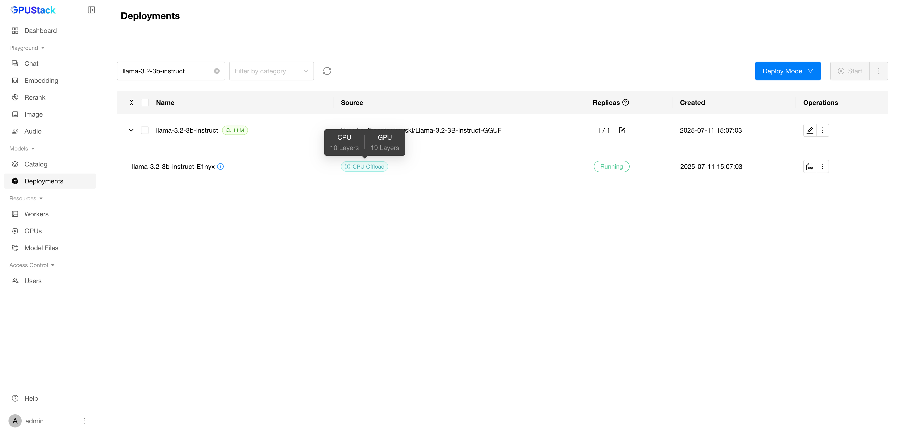

# 在 CPU 上进行推理

当 GPU 资源有限或模型大小超过可用显存时，GPUStack 支持在 CPU 上进行推理，提供更大的灵活性。可用的 CPU 推理模式包括：

- **CPU+GPU 混合推理**：当显存容量不足时，将大型模型的部分层卸载到 CPU，从而实现部分加速。
- **纯 CPU 推理**：在没有可用 GPU 资源时，完全由 CPU 执行推理。

!!! note

    使用 llama-box 后端时支持 CPU 推理。

若要部署启用 CPU 卸载的模型，请在部署配置中启用 `Allow CPU Offloading` 选项（该设置默认启用）。

部署完成后，可以查看被卸载到 CPU 的模型层数量。

